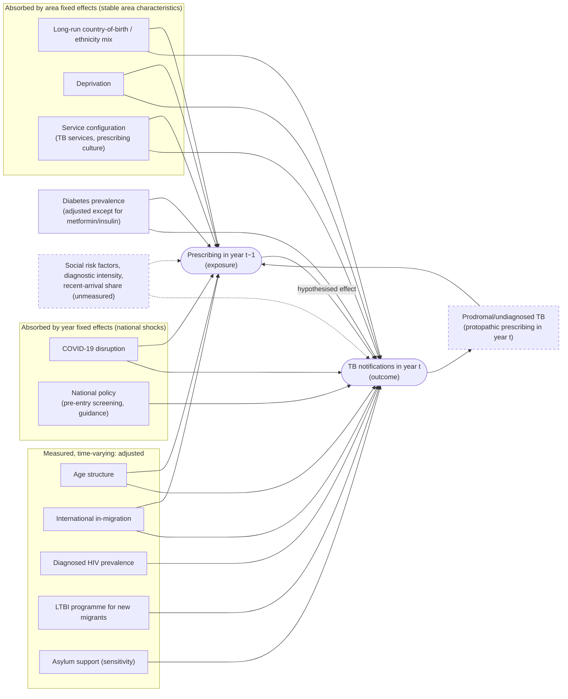

### Figure (causal diagram). Assumed causal structure for area-level prescribing and TB notifications

Nodes and arrows encode the assumptions behind the panel models. Solid boxes are measured and
adjusted for; dashed boxes are absorbed by fixed effects or unmeasured.

**Legend.**
- **Fixed effects.** Area fixed effects remove confounding by stable area characteristics without
  measuring them. Year fixed effects remove national shocks.
- **Diabetes prevalence.** It confounds most drug groups, but for metformin and insulin it lies on
  the pathway from diagnosis to prescribing. It is therefore not adjusted for in those models.
- **Total prescribing volume.** It is not adjusted for. It shares a component with each drug group
  and produced spurious associations, including for the negative-control exposure.
- **Protopathic bias.** Prescribing for undiagnosed TB (e.g. glucocorticoids or antibacterials for
  respiratory symptoms) creates reverse arrows in the same year. For this reason the primary exposure
  is year t−1.
- **Unmeasured confounders.** Social risk factors, diagnostic intensity and the changing share of
  recent arrivals may confound within-area changes. We assess this with:
  - negative-control exposures (levothyroxine; hospital low-TB-risk biologics and levetiracetam);
  - falsification tests (prescribing in year t+1);
  - area-specific trends.
- **Cross-level bias.** Effects and baseline risks that differ between people within an area (e.g.
  older UK-born steroid users vs younger non-UK-born people with TB) cannot be represented in, or
  removed by, an area-level model.
