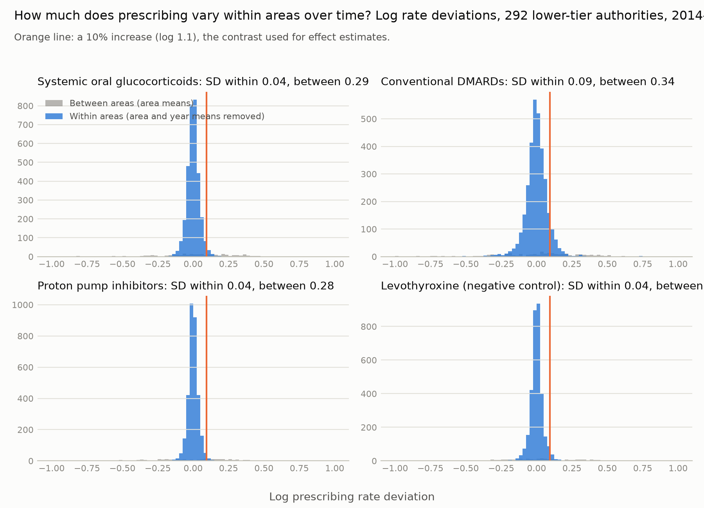
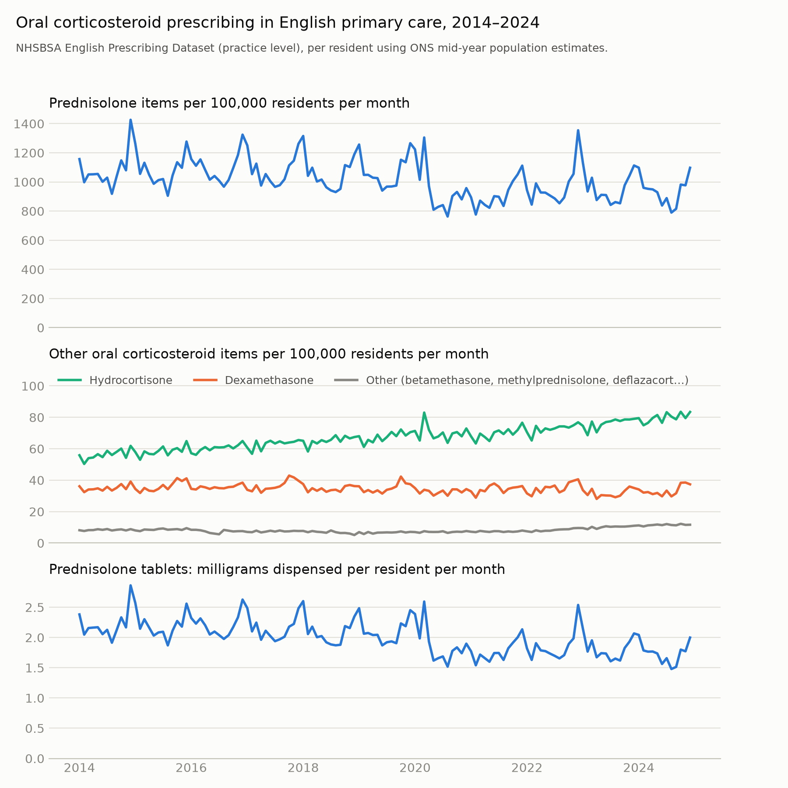
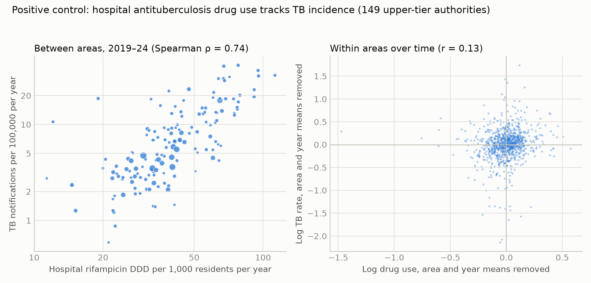
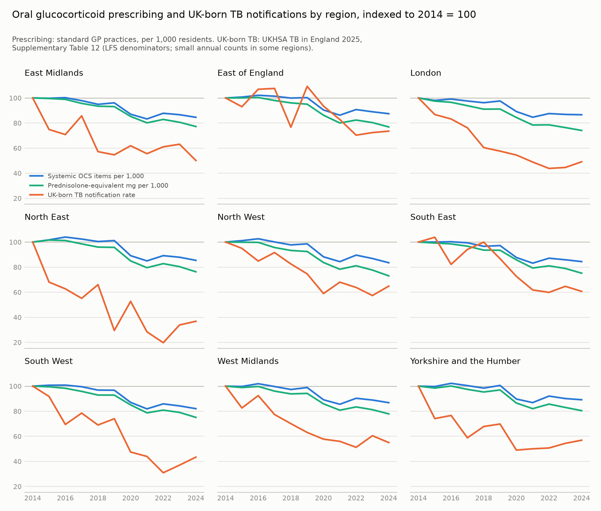

## Abstract

**Background.**
- Corticosteroids, biologics and other immunosuppressants increase individual risk of tuberculosis (TB).
- Openly published English prescribing and TB surveillance data could, in principle, be linked to study these relationships at population level.
- We assessed whether such ecological analyses can detect associations between medicines and TB, and why they might not.

**Methods.**
- **Exposures.**
  - Primary care prescribing, 2011–2024: practice-level data apportioned to local authorities by where registered patients live. Drug groups were defined at presentation level (systemic oral glucocorticoids, conventional DMARDs, transplant immunosuppressants and others), including a negative-control exposure.
  - Hospital medicines, 2019–2024: NHS Secondary Care Medicines Data in WHO defined daily doses, apportioned by trust catchment. Controls were a disease-specific positive control (active-TB treatment) and negative-control exposures.
- **Outcomes.** Annual UKHSA TB notifications for 294 lower-tier and 151 upper-tier authorities, and by region, place of birth and age.
- **Analysis.**
  - Poisson panel models with area and year fixed effects, exposure in the previous year, and falsification (lead) tests.
  - Regional models with randomisation inference.
  - Minimum detectable effects (MDE), compared with expected population effects derived from published relative risks and UKHSA-recorded drug-associated TB.
  - A permutation-based power simulation on the real notification counts.

**Results.**
- **Linkage.** Hospital active-TB treatment tracked TB notifications between areas (Spearman ρ = 0.81) and within areas in the same year (incidence rate ratio [IRR] 1.035, 95% CI 1.009–1.061, per 10% increase). The within-area elasticity was only 0.36–0.40, indicating substantial attenuation even for a disease-specific drug.
- **Primary care.** No drug group was associated with notifications in the following year after correction for multiple testing. For systemic oral glucocorticoids the IRR was 0.969 (0.929–1.012) per 10% within-area increase.
- **Hospital medicines.** TNF inhibitors (0.989, 0.972–1.007), JAK inhibitors and other immunosuppressants were null. Hospital systemic glucocorticoids had a small nominal association (1.024, 1.001–1.046) that was not robust to clustering by trust and was absent for oral forms alone.
- **Falsification and negative control.** The negative-control exposure showed inverse estimates similar in size to metformin, and following-year prescribing was inversely associated with notifications for several groups, including when same-year prescribing was added. The pattern is compatible with residual confounding by area-specific trends.
- **Power.**
  - For oral glucocorticoids, the MDE (6.3% per 10% increase) was about 18 times the effect expected from published relative risks (0.34%), and about 70–140 times that implied by UKHSA-recorded steroid-associated TB (0.04–0.09%).
  - In simulations on the real counts, the null hypothesis was rejected for the published effect in 8.3% of replicates, no more often than with no effect (7.8%); simulated power exceeded analytic power at the real standard error.
- **UK-born TB.** A regional association between prednisolone dose and UK-born TB was implausibly large, not significant by randomisation inference, dependent on London, and accompanied by failed negative-control and falsification tests.

**Conclusions.**
- Hospital medicines data could be linked to TB notifications only with heavy attenuation, and no working positive control was available for primary care. Ecological analyses of these data cannot detect plausible population-level effects of medicines on TB.
- Apparent associations are compatible with residual confounding, chance or measurement error, not with drug effects of plausible size.
- Causal questions require individual-level linked data analysed with target trial emulation. Surveillance of drug-associated TB is better served by more complete recording of immunosuppression in national TB surveillance.

## Introduction

Tuberculosis (TB) remains a public health problem in England.

**Recent trends.**
- **Decline:** notifications fell by 44% between 2011 and 2018 (8,282 to 4,609). For 2011–2015,
  most of the fall reflected declining TB rates in almost all populations, with smaller
  contributions from fewer recent non-EU migrants and from pre-entry screening of long-stay visa
  applicants from high-incidence countries [Thomas 2018; Aldridge 2016].
- **2020:** notifications dropped to 4,123 during the COVID-19 pandemic, a fall thought to reflect
  service disruption rather than less disease [UKHSA 2021; Morrison 2023].
- **2021–2024 rise:** notifications then increased, reaching 5,490 in 2024 (9.4 per 100,000).
  - 81.9% were in people born outside the UK [UKHSA 2025, Supplementary Table 12].
  - 41% of those were notified within five years of arrival [UKHSA 2025].
  - The rise has been attributed mainly to migration from higher-incidence countries [UKHSA 2025].
- **2025:** national data show 5,424 notifications, with 2024 revised to 5,487 [UKHSA 2026].

**TB in UK-born people.** UK-born notifications fell by 48% between 2014 and 2022 (1,756 to 916),
then rose to 995 in 2024, still 43% below 2014 [UKHSA 2025]. UK-born TB is heterogeneous: it
includes reactivation in older adults and transmission linked to social risk factors [Davidson 2018].

**Medicines that change TB risk.** Host factors also modify TB risk, and several are shaped by
commonly prescribed medicines.
- **Oral glucocorticoids:** current use is associated with an odds ratio of about 5 for active TB,
  higher at doses ≥15 mg/day [Jick 2006].
- **Inhaled corticosteroids and conventional DMARDs:** smaller increases [Brassard 2011;
  Castellana 2019; Brassard 2006].
- **Anti-TNF biologics:** TB typically presents within months of starting treatment [Keane 2001].
  Latent infection screening before treatment greatly reduces this risk [BTS 2005; Carmona 2005].
- **Proton pump inhibitors:** associations with increased risk [Song 2019].
- **Statins and metformin:** associations with lower risk [Li 2020; Zhang 2020].

Many of these estimates come from high-incidence settings or designs vulnerable to confounding
by indication and protopathic bias.

**Open data and their problems.** England publishes monthly prescribing for every general
practice, hospital medicines use by NHS trust, and TB notifications by local authority. Linking
these offers a low-cost way to generate or test hypotheses about medicines and TB. Such ecological
analyses face well-known problems:
- confounding by area characteristics;
- cross-level bias, which covariate adjustment cannot remove when effects differ between groups
  [Greenland 1989; Morgenstern 1995];
- limited power, which depends on the number of areas [Sheppard 1996].

The data carry specific problems too:
- practice lists are inflated in ways that track population mobility [Hudson 2025;
  Venkatesan 2025];
- practice locations do not match where patients live;
- prescribing is patterned by deprivation and was disrupted by COVID-19 [Richards 2025];
- hospital-prescribed medicines are recorded separately from primary care [Bacon 2020].

**The gap.** We found no previous study linking area-level prescribing to TB. In analogous
settings, drugs with large individual effects produced weak population signals [Hermans 2015], and
between-area and within-area associations had opposite signs [Költringer 2023].

**This study.** We asked whether open English prescribing data can detect associations between
medicines and TB notifications at population level, and why they might not. We combined:
- cross-sectional and fixed-effects panel designs at two geographic scales;
- primary care prescribing apportioned to where registered patients live;
- hospital medicines apportioned by trust catchment, with a disease-specific positive control;
- negative-control exposures and falsification tests [Lipsitch 2010; Prasad 2013];
- regional analyses of TB in UK-born and older people.

We compared the smallest effects these designs could detect, both analytically and by simulation,
with the population effects implied by published individual-level relative risks and by UKHSA
surveillance records of drug-associated TB.

## Methods

### Design and reporting

This study uses aggregate, openly published data in three linked ecological designs:

- a cross-sectional analysis;
- a longitudinal panel analysis of local authorities with area and year fixed effects;
- regional analyses by place of birth and age.

It was reported with reference to the RECORD and STROBE guidance. All data were public, aggregate
and anonymised, so ethical approval was not required. Code, processed data and outputs are
available at https://github.com/drcjar/tb-prescribing-england.

**Pre-specification.** The analysis developed in stages, and we report the chronology.

1. **First pass.** Before any results were seen, we specified the drug groups, including a
   negative-control exposure (levothyroxine) and a positive control (primary care antituberculosis
   prescribing), and the cross-sectional design. The first panel design was specified after the
   cross-sectional results but before any panel results; it used three-year rolling notifications
   and exposure in years *t*−5 to *t*−3. The pre-specified positive control failed: primary care
   antituberculosis prescribing did not track notifications, because TB treatment is delivered by
   specialist services. It was reclassified as descriptive.
2. **Later additions, made after those analyses gave null results:**
   - annual outcomes;
   - lower-tier authorities;
   - hospital medicines and their controls;
   - regional analyses by birthplace and age;
   - power simulation;
   - spatial diagnostics.
3. **Revisions after peer review:**
   - drug groups redefined;
   - prescribing apportioned by patient residence;
   - exposure in year *t*−1 as primary;
   - lag and lead estimated jointly;
   - randomisation inference;
   - additional covariates;
   - after the second round: correction of the GP practice restriction, redefinition of the
     hospital positive control and glucocorticoid exposure, joint models of previous, same and
     following years, and randomisation inference on the *t* statistic.

All analyses after the first pass are exploratory. Estimates from the original panel design are
given in the supplement.

### Assumed causal structure

Figure 1 sets out the assumed causal structure. It shows which factors are absorbed by area and year
fixed effects, which are measured and adjusted for, and which remain unmeasured. The primary
exposure is prescribing in the year before the outcome year, because same-year prescribing may be
prescribing for undiagnosed TB (protopathic bias).

### TB notifications

TB notifications are cases reported to UKHSA surveillance: the Enhanced TB Surveillance system
(ETS) until 2021, and the National TB Surveillance System (NTBS) since, into which data from 2018
onwards were migrated. Cases are culture-confirmed or clinically diagnosed, and are assigned to
areas by residential postcode at notification.

We used four sources:

1. **Annual counts by local authority, 2001–2024.**
   - *Source:* UKHSA TB regional reports 2024, supplementary tables.
   - *Coverage:* upper-tier authorities (UTLAs) and lower-tier authorities (LTLAs) on April 2023
     boundaries. UKHSA combines the City of London with Hackney and the Isles of Scilly with
     Cornwall. We combined population, covariates and prescribing in the same way at both levels,
     giving 151 UTLAs and 294 LTLAs.
   - *Consistency:* summed over three years, these counts matched the Fingertips three-year counts
     (r = 0.996). Local authority sums slightly exceed national totals (5,539 vs 5,490 in 2024),
     possibly reflecting different extract dates or residence-assignment rules.
   - *Details not given in the tables:* counts are by year of notification. How people without a
     residential postcode (for example, no fixed abode) are assigned is not described. Area-years
     with no notifications were retained.
2. **Region × place of birth × year, 2000–2024**, with Labour Force Survey denominators: *TB in
   England 2025*, Supplementary Table 12.
3. **Region × place of birth × age group × year**: regional reports, Table 9.
4. **National notifications with recorded immunosuppression by cause, 2024**: *TB in England 2025*,
   chapter 1.

The 2020 fall in notifications is thought to reflect service disruption rather than a true
reduction in incidence.

### Primary care prescribing

**Sources.**
- **2010–2013:** HSCIC practice-level prescribing (PDPI), August 2010–December 2013.
- **2014–2024:** NHSBSA English Prescribing Dataset (EPD).

Both record items dispensed in the community from primary care prescriptions. We aggregated each
month to practice level using identical drug-group rules. For the EPD this was done with
server-side SQL.

**Practices included.** We restricted to standard GP practices: practices with NHS ODS
prescribing setting RO76, plus practice codes absent from the current ODS file (which omits
practices closed before 2017) that have the standard GP practice code format (a letter and five
digits; this format matches 94% of RO76 codes and few codes in other settings). Without this
addition, prescribing by practices that later closed would have been dropped unevenly over time:
3.4% of items in 2011, 1.7% in 2014 and none from 2016.

**Drug groups.** Groups were defined at BNF presentation level:

| Group | Definition |
|---|---|
| Systemic oral glucocorticoids | Prednisolone, prednisone, methylprednisolone, deflazacort and dexamethasone. Injectables, hydrocortisone (mainly replacement therapy) and betamethasone soluble tablets excluded. Oral hydrocortisone and oral dexamethasone are also reported separately. |
| Inhaled corticosteroids | — |
| Conventional DMARDs | Rheumatology methotrexate (including subcutaneous), leflunomide, azathioprine, mercaptopurine. |
| Transplant immunosuppressants | Tacrolimus, ciclosporin, mycophenolate, sirolimus, everolimus. |
| Other groups | Proton pump inhibitors; statins; metformin; insulins; fluoroquinolones; all antibacterials; vitamin D. |
| Descriptive only | Antituberculosis drugs: TB treatment in England is delivered by specialist services, so primary care prescribing of these drugs is not a valid positive control. |
| Negative control exposure | Levothyroxine. |

Eye, ear, nose and skin preparations were excluded.

**Exposure measures.**
- Items per 1,000 residents per year (primary).
- Prednisolone-equivalent milligrams for systemic oral glucocorticoids: strength × quantity ×
  potency, with dexamethasone 6.67, methylprednisolone 1.25 and deflazacort 0.83.
- Average daily quantities (ADQ) for the groups where the EPD populates them.

**Apportionment to areas.** Each practice's annual prescribing was shared across local authority
districts in proportion to where its registered patients lived, using NHS Digital counts of
patients registered at each practice by LSOA:
- April releases from 2014 to 2024 were used, each practice-year taking that practice's nearest
  release in time (so 2014 shares were applied to 2011–2013);
- practices in no release (closed before April 2014) were assigned to the district of their
  postcode;
- LSOAs were mapped to April 2023 districts.

Assigning each practice to the district containing its postcode (ONS Postcode Directory, August
2025) was a sensitivity analysis. In
2024, 7.3% of registered patients lived outside the district of their practice.

**Denominators.** ONS mid-year resident population estimates.

### Hospital medicines

**Source and period.** NHS Secondary Care Medicines Data (SCMD; NHSBSA), which gives trust × month ×
product quantities. We used January 2019 to December 2024.

**Classification.** Products were grouped by mechanism, with quantities converted to DDD-years using
WHO defined daily doses (DDD), or documented maintenance doses where WHO gives none. The groups
were:

- TNF inhibitors;
- IL-6 inhibitors and abatacept;
- JAK inhibitors used in rheumatology (ruxolitinib reported separately);
- rituximab;
- calcineurin and mTOR inhibitors;
- antiproliferatives;
- systemic glucocorticoids (prednisolone and methylprednisolone), measured in prednisolone-equivalent
  mg and excluding intra-articular, depot and topical forms. Dexamethasone and hydrocortisone, used
  mainly in oncology, as antiemetics, for COVID-19 [RECOVERY 2021] and for acute illness, were
  reported separately as a descriptive group. A sensitivity analysis restricted the candidate
  exposure to oral forms, excluding intravenous methylprednisolone pulses.

**Controls.**
- **Positive control:** active-TB treatment, measured as pyrazinamide defined daily doses (1.5 g)
  from all pyrazinamide-containing products, including the fixed-dose combinations Rifater and
  Voractiv, so that a day of intensive-phase treatment counts once whatever the formulation.
- **Reported separately:** rifamycin and isoniazid products, which are also used for latent TB and,
  in the case of rifampicin, other infections.
- **Negative-control exposures:** IL-17, IL-12/23 and α4β7 inhibitors and anakinra (low TB risk),
  and levetiracetam.

**Trust mergers.** Trusts that merged during 2019–2024 were reassigned to their successors using
NHS ODS records. With this, 98–100% of DDD in every group and year came from trusts with catchment
data.

**Apportionment to areas.** Trust quantities were shared across local authorities using OHID acute
trust catchment populations (2024, all admissions). Elective-admission catchments were a
sensitivity analysis.

### Covariates

**Time-varying (panel analyses):**
- ONS mid-year population estimates by age (% aged ≥65; % aged 15–44);
- international in-migration per 1,000 (ONS components of population change);
- diagnosed HIV prevalence;
- QOF diabetes prevalence;
- the latent TB infection (LTBI) testing and treatment programme for new migrants, introduced from
  2015/16 through primary care in high-incidence areas for recent entrants aged 16–35 from
  high-incidence countries [Loutet 2018; Berrocal-Almanza 2022]. We used an indicator of programme
  activity, mapped from CCGs to local authorities (active in 83 LTLAs). Area-level reporting ended
  in 2019/20, so the indicator was carried forward unchanged and disruption in 2020 was not
  modelled. Because the programme targets young recent entrants, an all-age area indicator is a
  weak control for it;
- people receiving asylum support per 1,000 (Home Office; available from 2014, so used for outcome
  years from 2015).

**Cross-sectional analyses:**
- Census 2021 percentage born outside the UK.

### Statistical analysis

Supplementary tables report the primary care sensitivity analyses (Table S1), distributed-lag and
joint lag models (Tables S2 and S2b), hospital expected effects and sensitivity analyses (Tables S3
and S3b), the power simulation (Table S4), regional models (Tables S5 and S6), hospital data
coverage (Table S7), the original panel design (Table S8) and drug group definitions (Table S9).

**Panel analyses.**
- **Model:** Poisson pseudo-maximum-likelihood regression [Santos Silva 2006] of annual notifications, with area and
  year fixed effects, a log population offset and SEs clustered by area.
- **Primary exposure:** log prescribing rate in year *t*−1. Drug-associated TB typically presents
  within months of exposure [Keane 2001], and same-year prescribing is affected by prescribing for
  undiagnosed TB (protopathic bias).
- **Outcome years:** 2014–2024.
- **Covariates:** the time-varying set above. Diabetes prevalence was not adjusted for in the
  metformin and insulin models.
- **Effect measure:** incidence rate ratio (IRR) per 10% within-area increase in prescribing, with
  Benjamini–Hochberg false discovery rate (FDR) correction across the 13 non-control drug groups in
  the primary model, including the descriptive groups (oral hydrocortisone, oral dexamethasone, all
  antibacterials, vitamin D). Levothyroxine and antituberculosis drugs were excluded.
- **Falsification:** prescribing in years *t*−1 and *t*+1 estimated jointly on a common sample,
  and again with year *t* added, with a Wald test of the difference between the *t*−1 and *t*+1
  coefficients. A true effect should load on *t*−1. Because prescribing in adjacent years is
  correlated within areas, the two-year model can produce opposite signs through collinearity; the
  model with year *t* added and the correlation of the estimates are reported to check this.
- **Sensitivity analyses:**
  - no covariates;
  - a distributed lag (*t*, *t*−1, *t*−2);
  - the original three-year window (*t*−3 to *t*−1);
  - area-specific linear trends;
  - log population as a covariate instead of an offset (shared-denominator bias);
  - adjustment for the LTBI programme;
  - adjustment for asylum support;
  - excluding outcome years 2020–21 and exposure years 2020–21;
  - outcome years 2018–2024 only (NTBS-era data);
  - outcome years 2015–2024 only, so that all exposure comes from the EPD (splice sensitivity);
  - ADQ instead of items, for groups where the EPD populates ADQ;
  - practice-postcode apportionment;
  - UTLA geography.
- **Spatial dependence:** Moran's I of year-specific Pearson residuals (5-nearest-neighbour weights,
  999 permutations).
- **Missing data:** complete-case analysis. Area-years with missing covariates, or with zero
  exposure (log undefined), were excluded model by model; the numbers excluded are recorded in the
  result files.
- **Bounds:** for each estimate, the largest population attributable fraction compatible with the
  upper 90% confidence limit and the largest prevented fraction compatible with the lower limit
  (relevant for drugs expected to protect), both under the model used for expected effects. As a
  sensitivity analysis, the upper limit was divided by the negative control's estimate from the
  same model, as if its bias applied equally to every drug.

**Hospital analyses.** The same model was fitted for 2019–2024, with exposure in:
- the same year (for the positive control, where treatment follows diagnosis);
- the previous year (for candidate drugs);
- the following year.

SEs were also clustered by each area's principal trust, because apportioned exposures share trust-level
variation. The within-area elasticity of the positive control (log IRR per log unit of exposure)
was used as an attenuation factor.

**Regional analyses.**
- **Units:** 9 regions × year.
- **Outcomes:** all TB notifications; UK-born and non-UK-born notifications; UK-born notifications at
  age ≥65 (denominator: all residents aged ≥65).
- **Model:** Poisson regression with region and year fixed effects, exposure lagged or led 1–3
  years, adjusted for in-migration and age structure.
- **Inference:** with only nine clusters, cluster-robust *t*(8) intervals and randomisation
  p-values. The randomisation test compared the cluster-robust *t* statistic with 499 permutations
  of whole regional exposure histories across regions; it is valid under exchangeability of those
  histories, and p = (1 + count)/(1 + 499).
- **Falsification:** lag 2 and lead 2 estimated jointly, with London excluded as a sensitivity
  analysis for UK-born notifications.
- **Long differences:** across UTLAs with at least 10 notifications in each period, change in log
  prescribing (2014–16 to 2019–21) against change in log notification rate (2014–16 to 2022–24),
  weighted by notifications and adjusted for change in in-migration.

**Cross-sectional analyses.** Negative binomial regression of TB notifications on standardised log
prescribing rates for the same period, adjusted for percentage born outside the UK, age structure,
in-migration, HIV and diabetes prevalence.

**Expected effects and minimum detectable effects (MDEs).**

*Expected effects.* The population effect of a 10% increase in use was calculated as
[1 + 1.1*p*(RR − 1)] / [1 + *p*(RR − 1)], where *p* is prevalence of use and RR the individual-level
relative risk (odds ratios where only these were available). The calculation assumes that:

1. prevalence of use scales with the prescribing measure;
2. extra prescribing reaches new users rather than lengthening existing courses;
3. baseline risk is homogeneous;
4. timing is aligned.

Assumptions 3 and 4 favour detection. The direction of any bias from assumptions 1 and 2 is
unknown: prednisolone-equivalent mg per item fell over time, so prescribing volume and the number
of people treated need not move together. Alternative expected effects came from three sources:

- recorded drug-associated notifications, converted to attributable fractions (exposed share ×
  (RR − 1)/RR), assuming complete recording or 50% recording;
- stratification by age (the same age-specific prevalence of use for UK-born and non-UK-born people);
- SCMD-derived prevalence of hospital drug use, including screening-attenuated relative risks for
  TNF inhibitors and attenuation by the positive-control elasticity.

*MDEs.* The MDE was calculated as exp(2.80 × SE). For each MDE we report:

- the minimum detectable population attributable fraction (PAF);
- the largest PAF compatible with the upper 90% confidence limit.

*Power simulation.* A permutation-based simulation kept the real TB counts, so real overdispersion,
serial correlation and trends were preserved. Whole exposure trajectories were permuted across
areas, and known effects were injected by adding cases. This gave 500 null and 300 effect replicates
per scenario, including scenarios where the effect acts through same-year exposure. We also report
analytic power for each scenario at the real-data standard error.

Analyses used Python 3.14 (pandas 3.0, statsmodels).

## Results

### Prescribing, TB notifications and within-area variation

**TB notifications in England**
- Fell from 6,474 in 2014 to a low of 4,123 in 2020 (Fingertips national series).
- Rose to 5,490 in 2024, when 81.9% of people notified were born outside the UK.

**Within-area variation in prescribing**
- Once prescribing was apportioned by where patients live, it varied little within areas over time.
- For systemic oral glucocorticoids, the SD of the log rate after removing area and year means was 0.042, against 0.29 between areas; after removing area and year means, 95% of area-years were within ±9%.
- PPIs (0.036), metformin (0.041) and levothyroxine (0.042) were similar; conventional DMARDs varied more (0.088). Prednisolone-equivalent mg (0.041) and ADQ measures (0.026–0.097) varied as little as items.
- A 10% within-area change in prescribing is therefore at the edge of the observed data (Figure 2).

### Primary care prescribing and TB notifications (panel analyses)

**Primary analysis** (294 lower-tier authorities, 3,233 area-years, outcome years 2014–2024)
- No drug group was associated with notifications in the following year after correction for multiple testing (Table 1; all FDR q ≥ 0.51).
- Systemic oral glucocorticoids: IRR 0.969 (95% CI 0.929–1.012) per 10% within-area increase.

Other groups (same scale, 95% CI):

| Drug group | IRR |
|---|---|
| Oral hydrocortisone | 0.998 (0.985–1.011) |
| Inhaled corticosteroids | 0.966 (0.920–1.014) |
| Conventional DMARDs | 1.002 (0.983–1.021) |
| Transplant immunosuppressants | 0.999 (0.993–1.005) |
| Proton pump inhibitors | 0.996 (0.955–1.039) |
| Statins | 0.992 (0.952–1.034) |
| Metformin | 0.966 (0.934–0.998) |
| Levothyroxine (negative control) | 0.962 (0.933–0.992) |

- Metformin (nominal p = 0.04) was inversely associated to the same extent as the negative control, levothyroxine (p = 0.01), which has no plausible effect on TB.

**Table 1. Primary care prescribing and TB notifications: incidence rate ratio per 10% within-area increase (95% CI)**

| Drug group | Previous year: LTLA, residence (294 areas, 2014-2024) | Previous year: UTLA, residence | Previous year: LTLA, practice postcode | Joint model: previous year (t−1) | Joint model: following year (t+1) | p, t−1 vs t+1 | Largest compatible PAF / prevented fraction (PAF after negative-control shift) |
|:---|---:|---:|---:|---:|---:|---:|---:|
| Antituberculosis (descriptive) | 1.000 (0.997–1.003) | 1.000 (0.996–1.004) | 1.001 (0.998–1.003) | 1.000 (0.996–1.003) | 1.002 (0.998–1.005) | 0.423 | 3% / 2% (42%) |
| Systemic oral glucocorticoids | 0.969 (0.929–1.012) | 0.974 (0.928–1.023) | 0.974 (0.939–1.010) | 0.990 (0.941–1.041) | 0.952 (0.912–0.994) | 0.334 | 5% / 39% (44%) |
| Oral hydrocortisone | 0.998 (0.985–1.011) | 0.999 (0.985–1.014) | 0.999 (0.987–1.011) | 0.995 (0.978–1.012) | 1.007 (0.991–1.023) | 0.416 | 9% / 11% (49%) |
| Oral dexamethasone | 1.003 (0.992–1.014) | 1.004 (0.992–1.016) | 1.001 (0.991–1.011) | 1.002 (0.991–1.013) | 1.003 (0.993–1.013) | 0.907 | 12% / 6% (52%) |
| Inhaled corticosteroids | 0.966 (0.920–1.014) | 0.965 (0.916–1.017) | 0.973 (0.934–1.014) | 1.058 (0.995–1.126) | 0.879 (0.840–0.921) | 0.000 | 7% / 42% (46%) |
| Conventional DMARDs | 1.002 (0.983–1.021) | 1.001 (0.978–1.023) | 1.004 (0.987–1.021) | 1.011 (0.982–1.042) | 0.988 (0.954–1.024) | 0.446 | 18% / 13% (58%) |
| Transplant immunosuppressants | 0.999 (0.993–1.005) | 0.998 (0.992–1.005) | 1.000 (0.995–1.006) | 0.999 (0.990–1.009) | 0.999 (0.992–1.006) | 0.954 | 4% / 6% (44%) |
| Proton pump inhibitors | 0.996 (0.955–1.039) | 0.997 (0.953–1.043) | 0.992 (0.955–1.029) | 1.033 (0.979–1.090) | 0.966 (0.900–1.037) | 0.253 | 32% / 28% (72%) |
| Statins | 0.992 (0.952–1.034) | 0.985 (0.943–1.030) | 0.989 (0.954–1.025) | 0.996 (0.940–1.055) | 0.992 (0.922–1.068) | 0.954 | 27% / 29% (68%) |
| Metformin | 0.966 (0.934–0.998) | 0.958 (0.924–0.992) | 0.964 (0.935–0.994) | 0.967 (0.913–1.024) | 0.999 (0.939–1.062) | 0.576 | 0% / 38% (32%) |
| Insulins | 0.966 (0.929–1.005) | 0.971 (0.929–1.014) | 0.972 (0.940–1.005) | 1.028 (0.974–1.085) | 0.921 (0.866–0.980) | 0.038 | 0% / 39% (38%) |
| Fluoroquinolones | 1.005 (0.992–1.017) | 1.004 (0.991–1.018) | 1.003 (0.991–1.016) | 1.010 (0.995–1.026) | 0.993 (0.979–1.009) | 0.185 | 15% / 6% (55%) |
| All antibacterials | 0.996 (0.955–1.039) | 1.003 (0.957–1.052) | 0.995 (0.958–1.033) | 1.000 (0.957–1.045) | 0.998 (0.967–1.031) | 0.945 | 32% / 28% (73%) |
| Vitamin D | 1.007 (0.987–1.027) | 1.009 (0.987–1.031) | 1.007 (0.988–1.025) | 1.001 (0.975–1.028) | 1.007 (0.980–1.033) | 0.827 | 24% / 9% (64%) |
| Levothyroxine (negative control) | 0.962 (0.933–0.992) | 0.956 (0.926–0.988) | 0.965 (0.939–0.993) | 0.983 (0.928–1.042) | 0.972 (0.908–1.040) | 0.846 | 0% / 38% (26%) |

Poisson PML with area and year fixed effects, adjusted for age structure, international in-migration, HIV and diabetes prevalence (diabetes not adjusted for metformin and insulins); SEs clustered by area. Joint model: prescribing in t−1 and t+1 in one model on a common sample; because the two are highly correlated within areas, their estimates are negatively correlated and opposite signs can arise by chance. PAF, largest population attributable fraction compatible with the upper 90% confidence limit; prevented fraction, the same from the lower 90% limit; in brackets, the PAF after dividing the upper limit by the negative control (levothyroxine) estimate, as if its bias applied to every drug.

**Largest attributable fraction compatible with the data** (upper 90% confidence limit)
- Systemic oral glucocorticoids 5%; conventional DMARDs 18%; transplant immunosuppressants 4%.
- These bounds depend on point estimates that happened to fall below 1, and they are not robust to the bias revealed by the negative control. Dividing each upper limit by the levothyroxine estimate raised them to 44%, 58% and 44%, close to the minimum detectable attributable fractions (Table 2).
- For drugs expected to protect, the data were compatible with prevented fractions of up to 38% (metformin) and 29% (statins).

**Robustness**
- Upper-tier geography (151 areas) gave similar results:
  - systemic oral glucocorticoids 0.974 (0.928–1.023); all FDR q ≥ 0.22
  - the negative control, levothyroxine, was nominally inverse at 0.956 (0.926–0.988), the same size as metformin (0.958, 0.924–0.992). This suggests residual confounding by trends.
- Apportioning prescribing by practice postcode gave similar results: lower-tier oral glucocorticoids 0.974 (0.939–1.010).
- For oral glucocorticoids, estimates were also materially unchanged by (Table S1):
  - a three-year prior exposure window, area-specific linear trends, or log population as a covariate
  - adjustment for the LTBI programme or asylum support
  - excluding COVID-affected years
  - restricting to outcome years 2018–2024 (0.983, 0.941–1.028) or to EPD-era exposure (0.979, 0.939–1.021).
- Inhaled corticosteroids were nominally inverse in several sensitivity analyses (for example 0.938 for outcome years 2018–2024), the direction opposite to any plausible harmful effect.

**Falsification tests** (prescribing in years t−1 and t+1 estimated jointly; Table 1 and Table S2b)
- Following-year prescribing was inversely associated with notifications for some groups:
  - inhaled corticosteroids: t−1 1.058 (0.995–1.126), t+1 0.879 (0.840–0.921); difference p < 0.001
  - insulins: t−1 1.028 (0.974–1.085), t+1 0.921 (0.866–0.980); difference p = 0.04
  - systemic oral glucocorticoids: t−1 0.990 (0.941–1.041), t+1 0.952 (0.912–0.994); difference p = 0.33.
- In the two-year model, the correlation between the t−1 and t+1 estimates ranged from −0.83 to +0.08 across groups (oral glucocorticoids −0.38, inhaled corticosteroids −0.46), so some opposite signs could reflect collinearity.
- With same-year prescribing added, the t−1 and t+1 estimates were almost uncorrelated (−0.23 to +0.17), previous-year terms were null for every group, and following-year terms remained inverse (for example oral glucocorticoids 0.943, 0.898–0.990; inhaled corticosteroids 0.861, 0.809–0.917). Collinearity therefore does not explain the inverse following-year associations, which are more consistent with shared trends in prescribing and notifications.
- Same-year terms were positive in this model but not in the distributed-lag model (Table S2), so we do not interpret their sign.
- Area-specific linear trends gave inhaled corticosteroids 1.033 (0.981–1.087).
- **Multiplicity.** Of all 277 estimates in the lower-tier residence models, 30 were nominally significant. The estimates are overlapping specifications of the same data, and in simulations with no effect the test rejected in 7.8% of replicates, so this count cannot be compared with a nominal 5%. The nominal results were concentrated in the negative control (levothyroxine, 6, all inverse), metformin (5, inverse) and inhaled corticosteroids (8, mostly inverse or following-year terms), a pattern compatible with shared trends rather than drug effects.

**Spatial dependence**
- Raw TB notification rates were strongly spatially clustered in every year (Moran's I 0.25–0.39 lower-tier; 0.40–0.49 upper-tier).
- Residual dependence after the primary model was weak and concentrated in 2014:
  - lower-tier: median I 0.026 (range −0.004 to 0.163), nominally significant in 2 of 11 years (2014, I = 0.163; 2023, I = 0.079)
  - upper-tier: median I 0.009, nominally significant only in 2014 (I = 0.209).
- 2014 is the only outcome year whose previous-year exposure comes from the pre-2014 HSCIC series.

### Oral glucocorticoid prescribing trends and changes in TB notifications

**National trends, 2011–2024** (standard GP practices)
- Systemic oral glucocorticoid items rose from 119 to 132 per 1,000 residents in 2011–2016, then fell to 111 in 2024. Most of the fall came in 2020–21 (Figure 4).
- Prednisolone-equivalent mg per item fell from 225 to 192, so courses became smaller.
- Oral hydrocortisone items, mainly replacement therapy, rose from 5.5 to 9.1 per 1,000.

**Correlation with national TB trends**
- National notification rates and prescribing were not correlated in levels (14 years; r = 0.33, p = 0.25).
- Year-on-year changes were not correlated at lags of 0–2 years.
- At a 3-year lag, one of eight correlations was nominally significant and inverse (r = −0.75).

**Regional and local changes**
- In the regional panel (9 regions, 2012–2024), adjusted estimates were null:
  - items, lag 1: 1.034 (0.774–1.382); randomisation p = 0.80
  - prednisolone mg, lag 1: 1.094 (0.845–1.416); randomisation p = 0.57.
- Across 140 upper-tier authorities, changes in prescribing (2014–16 to 2019–21) and in notifications (2014–16 to 2022–24) were weakly inversely related before adjustment (Spearman ρ = −0.19). After adjustment for change in in-migration they were unrelated (ratio per 10% 0.983, 0.917–1.054).

### Hospital medicines

**Coverage**
- After reassigning merged trusts to their successors, 98–100% of DDD in every drug group and year came from trusts with catchment data, and 95% for levetiracetam (Table S7).

**Positive control: active-TB treatment** (pyrazinamide DDD, upper-tier authorities)
- Between areas: tracked notifications (Spearman ρ = 0.81; adjusted IRR per SD 1.23, 1.10–1.36).
- Within areas, same year: 1.035 (1.009–1.061) per 10% increase.
- Previous year: 1.001 (0.993–1.010). Following year, estimated jointly: 0.997 (0.986–1.007).
- The within-area elasticity was 0.36 (95% CI 0.10–0.62; lower-tier 0.40, 0.14–0.66). It reflects apportionment error and variation in drug volume per person treated, not linkage error alone; the null following-year estimate suggests that treatment spanning calendar years contributes little.
- Rifamycin/isoniazid products, which also cover latent TB and other infections, had a similar elasticity (0.37, 0.22–0.51). The more specific measure did not reduce attenuation, suggesting that drug specificity is not its main source.

**Candidate drugs** (prescribing in the previous year, IRR per 10% increase; Table 3 and Table S3b)

| Drug group | Upper-tier | Lower-tier |
|---|---|---|
| TNF inhibitors | 0.989 (0.972–1.007) | 0.992 (0.976–1.008) |
| IL-6 inhibitors/abatacept | 1.001 (0.992–1.009) | 1.001 (0.993–1.010) |
| JAK inhibitors | 0.994 (0.987–1.002) | 0.995 (0.989–1.002) |
| Rituximab | 0.998 (0.984–1.012) | 1.001 (0.986–1.016) |
| Calcineurin/mTOR inhibitors | 1.008 (0.996–1.020) | 1.008 (0.997–1.020) |
| Antiproliferatives | 0.996 (0.978–1.014) | 0.997 (0.982–1.013) |
| Systemic glucocorticoids (prednisolone-equivalent mg) | 1.024 (1.001–1.046) | 1.021 (1.000–1.043) |
| Dexamethasone and hydrocortisone (descriptive) | 1.008 (0.980–1.036) | 1.010 (0.984–1.036) |

- **Systemic glucocorticoids** were nominally associated with notifications in the following year at upper-tier level. The association:
  - was not robust to clustering by principal trust (1.024, 0.999–1.049), and was similar but imprecise when outcome years 2020–21 were excluded (1.018, 0.969–1.069);
  - was not seen for oral forms alone (1.011, 0.991–1.032; lower-tier 1.015, 0.994–1.036), so it depended on intravenous methylprednisolone pulses, a marker of acute severe disease;
  - would imply, under the model used for expected effects, that hospital glucocorticoids account for about a quarter of all notifications (an IRR of 1.024 per 10% corresponds to an attributable fraction of 24%), whereas steroid-associated immunosuppression was recorded for 0.5% of notifications [UKHSA 2025].
  We interpret it as chance or confounding by hospital activity, not a drug effect.
- The negative controls were null: low-TB-risk biologics 1.002 (0.986–1.018); levetiracetam 1.014 (0.986–1.042).
- Across all 260 within-area hospital estimates at both levels, 22 were nominally significant: 12 for the two TB treatment groups (the expected same-year association), 7 for JAK inhibitors (inverse) and 3 for systemic glucocorticoids.
- Clustering by principal trust or using elective catchments barely changed the other estimates (Table S3b).
- JAK inhibitors showed small inverse estimates (same year 0.993, 0.987–0.999; previous year excluding outcome years 2020–21 0.978, 0.961–0.996), consistent with trends in uptake rather than protection.

**Table 3. Hospital medicines (SCMD) and TB notifications, 2019–2024**

| Level | Drug group | Cross-sectional, adjusted (per SD) | Within-area, same year (per 10%) | Elasticity (same year) | Within-area, previous year (per 10%) | Previous year, SE clustered by principal trust | Following year (joint with previous) |
|:---|---:|---:|---:|---:|---:|---:|---:|
| UTLA | Active-TB treatment (pyrazinamide DDD, including fixed-dose combinations; positive control) | 1.225 (1.101–1.362) | 1.035 (1.009–1.061) | 0.36 | 1.001 (0.993–1.010) | 1.001 (0.993–1.010) | 0.997 (0.986–1.007) |
| UTLA | Rifamycin/isoniazid (active and latent TB, other infections) | 1.158 (1.038–1.292) | 1.036 (1.021–1.050) | 0.37 | 1.005 (0.993–1.018) | 1.005 (0.993–1.018) | 1.018 (0.996–1.041) |
| UTLA | TNF inhibitors | 0.957 (0.907–1.010) | 0.996 (0.979–1.013) | -0.05 | 0.989 (0.972–1.007) | 0.989 (0.970–1.009) | 0.978 (0.949–1.008) |
| UTLA | IL-6 inhibitors and abatacept | 0.971 (0.923–1.022) | 1.000 (0.990–1.010) | -0.00 | 1.001 (0.992–1.009) | 1.001 (0.993–1.009) | 1.001 (0.984–1.018) |
| UTLA | JAK inhibitors (rheumatology) | 0.972 (0.916–1.031) | 0.993 (0.987–0.999) | -0.07 | 0.994 (0.987–1.002) | 0.994 (0.986–1.003) | 0.998 (0.984–1.011) |
| UTLA | Rituximab | 0.942 (0.886–1.002) | 0.992 (0.978–1.005) | -0.09 | 0.998 (0.984–1.012) | 0.998 (0.987–1.009) | 1.006 (0.989–1.024) |
| UTLA | Calcineurin/mTOR inhibitors | 1.049 (0.995–1.106) | 0.994 (0.985–1.004) | -0.06 | 1.008 (0.996–1.020) | 1.008 (0.996–1.020) | 0.985 (0.966–1.005) |
| UTLA | Antiproliferatives | 1.025 (0.970–1.082) | 0.993 (0.978–1.008) | -0.08 | 0.996 (0.978–1.014) | 0.996 (0.979–1.013) | 0.993 (0.974–1.012) |
| UTLA | Systemic glucocorticoids without dexamethasone/hydrocortisone (prednisolone-equivalent mg) | 0.970 (0.929–1.012) | 1.009 (0.986–1.032) | 0.09 | 1.024 (1.001–1.046) | 1.024 (0.999–1.049) | 0.991 (0.953–1.030) |
| UTLA | Systemic glucocorticoids, oral forms only (sensitivity) | 0.971 (0.930–1.012) | 0.997 (0.979–1.016) | -0.03 | 1.011 (0.991–1.032) | 1.011 (0.990–1.033) | 0.983 (0.944–1.023) |
| UTLA | Dexamethasone and hydrocortisone (descriptive) | 0.934 (0.893–0.976) | 1.005 (0.977–1.034) | 0.05 | 1.008 (0.980–1.036) | 1.008 (0.979–1.037) | 0.994 (0.943–1.047) |
| UTLA | Low-TB-risk biologics (negative control) | 1.014 (0.961–1.070) | 1.004 (0.990–1.019) | 0.05 | 1.002 (0.986–1.018) | 1.002 (0.983–1.021) | 1.010 (0.982–1.040) |
| UTLA | Levetiracetam (negative control) | 1.017 (0.970–1.066) | 0.998 (0.975–1.021) | -0.03 | 1.014 (0.986–1.042) | 1.014 (0.986–1.042) | 0.987 (0.948–1.028) |
| LTLA | Active-TB treatment (pyrazinamide DDD, including fixed-dose combinations; positive control) | 1.154 (1.080–1.232) | 1.039 (1.013–1.065) | 0.40 | 1.000 (0.991–1.008) | 1.000 (0.992–1.008) | 0.995 (0.985–1.005) |
| LTLA | Rifamycin/isoniazid (active and latent TB, other infections) | 1.065 (1.000–1.135) | 1.038 (1.025–1.052) | 0.39 | 1.004 (0.992–1.016) | 1.004 (0.992–1.016) | 1.018 (0.997–1.040) |
| LTLA | TNF inhibitors | 0.968 (0.927–1.012) | 0.994 (0.979–1.010) | -0.06 | 0.992 (0.976–1.008) | 0.992 (0.976–1.008) | 0.975 (0.946–1.006) |
| LTLA | IL-6 inhibitors and abatacept | 0.944 (0.906–0.984) | 1.001 (0.991–1.011) | 0.01 | 1.001 (0.993–1.010) | 1.001 (0.993–1.010) | 0.997 (0.981–1.013) |
| LTLA | JAK inhibitors (rheumatology) | 0.948 (0.905–0.992) | 0.994 (0.988–0.999) | -0.06 | 0.995 (0.989–1.002) | 0.995 (0.988–1.003) | 0.998 (0.984–1.012) |
| LTLA | Rituximab | 0.974 (0.929–1.021) | 0.990 (0.976–1.004) | -0.10 | 1.001 (0.986–1.016) | 1.001 (0.988–1.014) | 1.005 (0.988–1.023) |
| LTLA | Calcineurin/mTOR inhibitors | 1.002 (0.959–1.046) | 0.994 (0.985–1.003) | -0.07 | 1.008 (0.997–1.020) | 1.008 (0.998–1.019) | 0.983 (0.961–1.005) |
| LTLA | Antiproliferatives | 0.983 (0.936–1.031) | 0.997 (0.983–1.012) | -0.03 | 0.997 (0.982–1.013) | 0.997 (0.980–1.015) | 0.993 (0.974–1.012) |
| LTLA | Systemic glucocorticoids without dexamethasone/hydrocortisone (prednisolone-equivalent mg) | 0.976 (0.945–1.008) | 1.008 (0.990–1.026) | 0.08 | 1.021 (1.000–1.043) | 1.021 (0.999–1.044) | 0.986 (0.952–1.020) |
| LTLA | Systemic glucocorticoids, oral forms only (sensitivity) | 0.974 (0.943–1.006) | 1.001 (0.982–1.019) | 0.01 | 1.015 (0.994–1.036) | 1.015 (0.994–1.037) | 0.976 (0.939–1.014) |
| LTLA | Dexamethasone and hydrocortisone (descriptive) | 0.978 (0.938–1.019) | 1.008 (0.980–1.037) | 0.08 | 1.010 (0.984–1.036) | 1.010 (0.982–1.037) | 0.989 (0.940–1.041) |
| LTLA | Low-TB-risk biologics (negative control) | 0.991 (0.948–1.036) | 1.005 (0.991–1.019) | 0.05 | 1.003 (0.988–1.019) | 1.003 (0.988–1.019) | 1.012 (0.985–1.040) |
| LTLA | Levetiracetam (negative control) | 1.016 (0.979–1.054) | 1.003 (0.981–1.025) | 0.03 | 1.013 (0.988–1.039) | 1.013 (0.989–1.037) | 0.992 (0.955–1.031) |

Exposure: DDD-years per 1,000 residents (positive control: pyrazinamide DDD including fixed-dose combinations; systemic glucocorticoids: prednisolone-equivalent mg, without dexamethasone and hydrocortisone), apportioned by 2024 acute trust catchments. Cross-sectional: negative binomial regression of 2019–24 notifications on the standardised log mean rate (per SD), adjusted for % born outside the UK, age structure, in-migration, HIV and diabetes prevalence. Within-area: Poisson PML with area and year fixed effects and time-varying covariates, per 10% increase; SEs clustered by area unless stated. Elasticity: log IRR per log unit of exposure in the same-year model, shown for all groups but interpretable as linkage attenuation only for the positive control. Following year: for the positive control an association is possible because treatment continues into the next year; for candidate drugs it is a falsification test.

### Minimum detectable effects and expected population effects

**Primary care, oral glucocorticoids** (lower-tier panel)
- Minimum detectable effect (MDE): 6.3% per 10% increase in prescribing.
- Expected effect under published relative risks and prevalence: 0.34% (Table 2).
  - Stratified by age: 0.29%.
  - Based on UKHSA-recorded steroid-associated notifications, converted to an attributable fraction: 0.043% with complete recording, 0.087% if only half are recorded.
- The design could therefore detect only effects about 18 to 140 times larger than expected.
- The MDE corresponds to a drug responsible for 63% of all notifications.
- For the other candidate groups, MDEs exceeded expected effects by factors of 11 (statins) to 272 (conventional DMARDs).

**Hospital medicines**
- MDEs were smaller (1.0–2.9% per 10% increase), but so were expected effects.
- TNF inhibitors (SCMD DDD-years per resident 0.34%):
  - An illustrative RR of 4 before latent TB screening implies an expected change of 0.10% (MDE 26 times larger at upper-tier level).
  - An RR of 1.5 with screening, which probably overstates post-screening risk, implies 0.017% (MDE 154 times larger).
  - Dividing by the positive-control elasticity widens these gaps to 72 and 426 times (Table S3).
- Across hospital scenarios, MDEs exceeded expected effects by 26 to 520 times at upper-tier level before attenuation (23 to 522 times at lower-tier level).
- UKHSA-recorded biological-therapy notifications imply 0.08–0.16%.

**Simulation** (permutation-based, real notification counts; Table S4)
- **Calibration.** With no effect, the two-sided test rejected in 7.8% of replicates at lower-tier level (7.6% upper-tier), against a nominal 5%. Within the simulation, replicate SEs (median 0.0161) were close to the spread of null estimates (0.0166), so the clustered test was mildly anti-conservative, not conservative.
- **Real-data precision.** The real-data SE (0.0218) was larger than in the simulation, probably because permuting exposure trajectories across areas breaks their alignment with each area's own notification trends. Simulated power is therefore optimistic, so we also give analytic power at the real-data SE.
- **Published glucocorticoid effect (RR 4.9).** Rejection 8.3% (upper-tier 8.0%), no more often than with no effect; power in the correct direction 6.0%, against 3.8% with no effect.
- **Larger individual relative risks.** Rejection 17.7% for RR 25 and 71.0% for RR 100 (analytic power at the real SE for RR 100: 52.1%).
- **Direct population effects.** Rejection 21.7%, 83.0% and 100.0% for IRR 1.02, 1.05 and 1.10 per 10%; analytic power at the real SE 14.3%, 64.6% and 99.4% (upper-tier, IRR 1.05: 51.0%).
- **Effect acting through same-year prescribing** (analysed with previous-year exposure). Rejection 61.7% for 1.05 and 99.3% for 1.10.

**Table 2. Minimum detectable effects (LTLA panel, residence apportionment, exposure t−1) versus expected population effects of a 10% increase in use**

| Drug group | Individual RR/OR | Prevalence of use | PAF (negative: prevented fraction) | SE of log IRR per 10% | Expected change | MDE | MDE ÷ expected | Power | Minimum detectable PAF | RR for 80% power |
|:---|---:|---:|---:|---:|---:|---:|---:|---:|---:|---:|
| Systemic oral glucocorticoids | 4.9 | 0.9% | 3.4% | 0.0218 | 0.34% | 6.3% | 18 | 3.6% | 63% | 190 |
| Inhaled corticosteroids | 1.27 | 5.2% | 1.4% | 0.0249 | 0.14% | 7.2% | 50 | 2.8% | 72% | 51 |
| Conventional DMARDs | 1.2 | 0.5% | 0.1% | 0.0097 | 0.01% | 2.8% | 272 | 2.6% | 28% | 77 |
| Transplant immunosuppressants | 2 | 0.1% | 0.0% | 0.0031 | 0.00% | 0.9% | 172 | 2.6% | 9% | 190 |
| Proton pump inhibitors | 1.28 | 14.2% | 3.8% | 0.0213 | 0.38% | 6.2% | 16 | 3.7% | 62% | 12 |
| Statins | 0.6 | 12.8% | -5.4% | 0.0210 | -0.54% | 6.1% | 11 | 4.4% | 61% | not attainable |
| Metformin | 0.51 | 4.4% | -2.2% | 0.0169 | -0.22% | 4.8% | 21 | 3.4% | 48% | not attainable |

Expected changes use published individual-level relative risks (ORs for oral glucocorticoids and PPIs) and UK prevalence of use, assuming that prevalence of use scales with prescribing, that extra prescribing reaches new users, a homogeneous baseline risk and aligned timing. Negative PAF values are prevented fractions. MDE = exp(2.80 × SE) − 1. The ratio of MDE to expected change is essentially independent of the 10% contrast, because for small changes both scale in proportion to it. Power is one-sided power to detect the expected effect in the correct direction. Benchmarks: recorded cases (steroids), UKHSA 2024, 100% recorded, RR 4.9: 0.043%; recorded cases (steroids), UKHSA 2024, 50% recorded, RR 4.9: 0.087%; recorded cases (biological_therapy), UKHSA 2024, 100% recorded, RR 4.9: 0.078%; recorded cases (biological_therapy), UKHSA 2024, 50% recorded, RR 4.9: 0.157%; age-stratified (oral corticosteroids, RR 4.9): 0.293%; homogeneous (oral corticosteroids, RR 4.9, prevalence 0.9%): 0.339%.

### Regional analyses by place of birth and age

**Precision**
- Regional models were very imprecise. MDEs for glucocorticoid prescribing, calculated from the *t*(8) intervals, were 46–98% per 10% increase for UK-born notifications and 54–119% for UK-born notifications at age ≥65 (Table S5).
- Under the model used for expected effects, a 10% increase in use can raise notifications by at most 10%. The expected effect for UK-born people aged ≥65 (prevalence of use 2.5%, RR 4.9) is 0.9%.
- Any nominally significant regional estimate must therefore reflect chance or bias.

**Non-UK-born notifications**
- Oral glucocorticoid prescribing in earlier years was not associated with notifications (lag 1–3: 0.95–1.03).
- The falsification test failed: prescribing three years later predicted earlier notifications (items 1.49, 1.17–1.89, randomisation p = 0.01; prednisolone mg 1.29, 1.03–1.60, p = 0.04).

**UK-born notifications**
- Prednisolone-equivalent mg: lagged estimates were imprecise positive values (lag 1: 1.25, 0.95–1.65, randomisation p = 0.12; lag 2: 1.33, 0.96–1.84, p = 0.16).
- With lag 2 and lead 2 estimated jointly: lag 1.45 and lead 0.88 (difference p = 0.04; randomisation p for lag = 0.23). Excluding London: 1.12 and 0.90 (difference p = 0.43; randomisation p = 0.73) (Table S6).
- Oral glucocorticoid items: null (joint lag 2: 1.27; randomisation p = 0.46).

**UK-born notifications at age ≥65**
- Glucocorticoid prescribing in earlier years was not associated with notifications.
- The falsification test failed for glucocorticoid items (lead 2: 1.68, 1.04–2.70; randomisation p = 0.04).
- The negative control, levothyroxine, was associated with notifications in the following year (lead 1: 1.38, 1.05–1.80; randomisation p = 0.04), and imprecisely with the previous year (lag 1: 1.23, 1.00–1.51; p = 0.07).

**Summary**
- Of 81 adjusted regional estimates, 4 had randomisation p ≤ 0.05, all of them falsification (lead) terms.
- The UK-born association with prednisolone mg was implausibly large, not significant by randomisation inference, and dependent on London.

## Discussion

### Principal findings

We linked open English data on primary care and hospital prescribing with TB notifications, using several ecological designs at two geographic scales. The linkage worked only partly.

- **The positive control.** Hospital active-TB treatment tracked notifications between areas and, weakly, within areas. Its elasticity of 0.36–0.40, with wide confidence intervals, reflects apportionment error and variation in drug volume per person treated.
- **Candidate drugs.** No medicine plausibly affecting TB risk was robustly associated with subsequent notifications. This held for systemic oral glucocorticoids, inhaled corticosteroids, DMARDs, transplant immunosuppressants, TNF, IL-6 and JAK inhibitors, and rituximab. Hospital systemic glucocorticoids had a small nominal association that was not robust, was absent for oral forms, and implied an implausibly large attributable fraction.
- **Signs of confounding.**
  - The negative-control exposure showed inverse estimates of similar size to some candidate drugs.
  - Following-year prescribing was inversely associated with notifications for several groups, and collinearity between adjacent years did not explain this.
  - The regional association with UK-born TB was implausibly large, not significant by randomisation inference, and dependent on London.

  These patterns are compatible with residual confounding by area-specific trends, chance or measurement error, and not with drug effects of plausible size.
- **Power.** The analytic calculations and the simulation both showed that plausible effects are undetectable: the designs could detect only effects roughly 10 to several hundred times larger than those implied by published relative risks or by UKHSA records of drug-associated TB. Simulated power exceeded analytic power at the real standard error, probably because permuted exposures lost their alignment with local notification trends.

### Why population effects of these medicines are undetectable

**Expected effects are small.** The population effect of a medicine is roughly its attributable fraction scaled by the relative change in use.

- **Oral glucocorticoids.** Current use carries an odds ratio of about 5 [Jick 2006], but only about 1% of people use them at any time [van Staa 2000; Fardet 2011]. A 10% change in use should therefore change TB notifications by about 0.3%.
  - Stratifying by age lowers this to 0.29%, because use is concentrated in older people while most notifications are in younger adults.
  - UKHSA recorded steroid-associated immunosuppression in 30 of 5,490 people notified in 2024 [UKHSA 2025]. Converted to an attributable fraction, that implies 0.04% per 10% increase with complete recording, or 0.09% if only half of drug-associated immunosuppression is recorded.
- **Biologics.** Latent TB screening before anti-TNF therapy has been standard in the UK since 2005 [BTS 2005], and NICE guidance covers testing people who are or will be immunosuppressed [NG33]. In a Spanish registry, TB rates in people with rheumatoid arthritis treated with TNF antagonists were 6.2 times those in untreated people before screening recommendations, and fell by 83% to about the untreated rate afterwards [Carmona 2005]; risk was about seven times higher when the recommendations were not followed [Gómez-Reino 2007]. Growth in biologic use during 2019–2024 therefore took place under screening, so the relative risk relevant to a marginal increase in use is small. Screening is less consistently done before oral glucocorticoids. UKHSA recorded biological-therapy immunosuppression, a category that includes non-TNF biologics, in 54 notifications in 2024; converted to an attributable fraction, that implies 0.08–0.16% per 10% increase in use.

**The data carry little information.**
- **Little within-area variation.** Within-area variation in prescribing was very small (SD of log rate 0.04 for glucocorticoids, against 0.29 between areas), so a 10% change sits at the edge of the observed data. Fixed effects remove the between-area variation where most information lies [Gunasekara 2014].
- **Few areas.** Power in aggregate studies depends mainly on the number of areas [Sheppard 1996], which cannot be increased.
- **Linkage attenuation.** For hospital medicines, the positive control shows that apportionment would shrink any true effect further. No working positive control was available for primary care, so the validity of that linkage is untested. Other hospital drugs have their own sources of error (homecare delivery of biologics, specialist centres, biosimilar switching), and the positive control was analysed in the same year while candidate drugs were analysed in the previous year, so the attenuated ratios are illustrative.
- **Simulation.** Simulations on the real notification counts rejected the null for the published glucocorticoid effect no more often than when there was no effect.

### Confounding, falsification and negative controls

**Crude versus within-area associations.** Crude cross-sectional associations were strongly inverse and were explained by country of birth and age. Within areas, residual confounding remained visible:
- **Negative control.** Levothyroxine, which has no plausible effect on TB, showed inverse estimates (0.96) similar to metformin.
- **Lag and lead patterns.** Following-year prescribing was inversely associated with notifications for inhaled corticosteroids, insulins and oral glucocorticoids. These associations persisted when same-year prescribing was added and the lag and lead estimates were almost uncorrelated, so they are not an artefact of collinearity.
- **Likely cause.** Both patterns are compatible with prescribing and notifications sharing area-specific trends, for example migration-driven changes in the age and origin of the population (with accompanying changes in practice registration and in vitamin D prescribing in South Asian-born communities), changes in diagnostic activity, and prescribing policy. Year fixed effects cannot remove these trends.

**Metformin.** Its estimates should be read against the high prevalence of both diabetes and latent TB infection among South Asian-born people; diabetes itself increases TB risk [Pealing 2015].

**Ecological bias.** Area-level adjustment cannot remove bias arising from effect modification or from differences in baseline risk between people within areas [Greenland 1989; Morgenstern 1995]. For example, steroid users are mostly older and UK-born, whereas most notifications are in younger people born abroad.

**The UK-born association.** Regionally, prednisolone dose in an earlier year was imprecisely associated with UK-born TB (joint lag estimate 1.45 per 10% increase). We do not interpret this as a drug effect:
- The regional MDEs (roughly 50–120% per 10%) are far above the 10% maximum possible under the model used for expected effects, so any significant regional estimate must reflect chance or bias.
- It was not significant by randomisation inference (p = 0.23), and it largely disappeared when London was excluded (1.12).
- The same nine-region design produced failed falsification tests for non-UK-born TB and a failed negative control (levothyroxine) for older UK-born people.
- UK-born TB fell by 48% between 2014 and 2022 [UKHSA 2025], while oral glucocorticoid dosing also declined. Any two declining regional series will tend to correlate, so coincident trends are the most plausible explanation.

**Protopathic bias.** Glucocorticoids and antibacterials prescribed for undiagnosed TB, and glucocorticoids used in treating TB meningitis and pericarditis [Thwaites 2004], create reverse associations in the same year. This is why the primary exposure was prescribing in the previous year. The same bias probably inflates the individual-level estimates used to derive expected effects [Jick 2006]; if so, the true gap between expected and detectable effects is even wider.

### Strengths and limitations

**Strengths.**
- **Open and reproducible.** All data are public, and code and processed data are openly available.
- **Exposure measurement.**
  - Primary care exposure was defined at presentation level, with dose measures, and apportioned by where registered patients live.
  - Hospital medicines were classified by mechanism using defined daily doses, with trust mergers resolved.
- **Checks on validity.**
  - A disease-specific positive control, negative-control exposures and falsification tests estimated jointly.
  - Randomisation inference for the nine-region analyses.
  - Year-specific spatial diagnostics.
  - Power assessed both analytically and by simulation on the real data.
- **Independent peer review.** Three independent reviews prompted substantial revision.

**Limitations: exposure data.**
- **Prescribing measures.** Exposure was measured as prescribing volume per resident, not as people treated.
- **Apportionment.** Apportioning by patient residence used annual April snapshots, with 2014 shares applied to 2011–2013.
- **Pre-2014 data.** The 2011–2013 series come from a different release, and overlap-period concordance could not be assessed. National year-on-year changes were continuous across the 2013/2014 splice for most groups, but not for oral glucocorticoids (+2.8% at the splice against +0.1% in each adjacent year) or all antibacterials (−0.6% against −5.0% and −6.4%). Restricting to EPD-era exposure did not change the conclusions (Table S1).
- **Hospital catchments.** Hospital quantities were apportioned using admission-based catchments, which may misallocate specialist services, and the 2024 catchments were applied to every year from 2019.
- **Hospital data capture.** Capture of homecare-delivered biologics in SCMD could not be verified.
- **Hospital data period.** The hospital series spans only 2019–2024, including the pandemic. Hospital dexamethasone use rose with its adoption for severe COVID-19 [RECOVERY 2021], a marker of COVID-19 severity patterned by deprivation and ethnicity, so dexamethasone and hydrocortisone were separated from the candidate glucocorticoid exposure.
- **Hospital prescriptions dispensed in the community.** Prescriptions written in hospitals and dispensed by community pharmacies (FP10(HP)) are recorded in the English Prescribing Dataset under hospital prescribers, so our restriction to GP practices excluded them, and they are not in SCMD. Some TB treatment and specialist medicines reach patients this way, so they are missing from both exposures as analysed.
- **Drug group definitions.** Conventional DMARDs exclude hydroxychloroquine and sulfasalazine, which carry little TB risk. Mercaptopurine includes leukaemia maintenance therapy, and the primary care "transplant immunosuppressant" group includes shared-care use of mycophenolate and ciclosporin for autoimmune disease. Dexamethasone, despite its high potency, contributed only 5.6–6.7% of prednisolone-equivalent mg in primary care (2015, 2019 and 2024 samples), so it does not drive the dose measure.

**Limitations: outcome and confounder data.**
- **Notifications, not incidence.** The outcome is notified TB, subject to diagnostic delay, residence assignment, the 2021 transition from ETS to NTBS, and 2020 disruption.
- **Birthplace data.** TB by place of birth is published only by region, and UK-born population denominators by age are not published regionally. The model for UK-born notifications at age ≥65 therefore uses all residents aged ≥65 as the denominator, which can create spurious trends as the older non-UK-born population grows.
- **Screening of migrants.** Pre-entry screening of long-stay visa applicants (piloted in selected high-incidence countries from 2005 and extended to all high-incidence countries in 2012–2014) and the LTBI programme for new migrants, whose testing coverage was incomplete [Berrocal-Almanza 2022], both target recent entrants in the areas where they settle. Neither is fully captured by our covariates.
- **Outcome definitions.** We did not analyse culture-confirmed pulmonary TB or drug-resistant TB, which were not available by local authority and year in the published tables we used.
- **Unmeasured confounders.**
  - Social risk factors and diagnostic intensity.
  - The area-level share of recent arrivals.
  - Latent TB programme activity after 2019/20.

**Limitations: design and analysis.**
- **Pre-specification.** Many analyses were added after initial null results and are exploratory.
- **Expected-effect inputs.** Relative risks for PPIs, statins and metformin come mainly from high-incidence settings, and prevalence inputs for hospital drugs are derived or illustrative. Neither would change the conclusions unless the true effects were an order of magnitude larger.
- **Positive control.** The hospital positive control is a disease-specific drug with a large same-year signal. We did not test whether a small lagged effect injected through the apportioned hospital exposure would be recovered, and primary care had no working positive control.

### Implications

**For research.**
- Open prescribing data are valuable for describing prescribing [Bacon 2020; OpenPrescribing 2026] but cannot estimate the effects of medicines on rare outcomes such as TB.
- Ecological studies of rare outcomes should report the following alongside any associations:
  - minimum detectable effects;
  - a positive control with its elasticity;
  - negative controls;
  - falsification tests.
- Causal questions need individual-level linked data analysed with target trial emulation (Box). Even national cohorts give wide intervals for modest relative risks [Pealing 2015]. The only drug–TB target trial emulation we identified concerned DPP-4 inhibitors [Chen 2025].

**For TB programmes.**
- **The null results do not mean these drugs are safe.** Glucocorticoids, biologics and JAK inhibitors remain important for individual patients. Drug-associated TB is serious, often extrapulmonary [Keane 2001], and largely preventable.
- **Surveillance.** Monitoring is better served by more complete and detailed immunosuppression fields in NTBS than by ecological analysis of prescribing. Useful fields would record drug class, time since starting, and whether latent TB screening was done and treated.
- **Audit.** The practical lever is auditing latent TB screening before biologics, JAK inhibitors and high-dose, long-term glucocorticoids.
- **Aggregate data from UKHSA.** Aggregate UKHSA tables would allow population monitoring in the groups where drug-associated reactivation matters, namely:
  - notifications with recorded biologic or steroid immunosuppression;
  - notifications by area, year, place of birth, age and time since entry.

### Conclusion

Open English prescribing and TB notification data can be linked, although hospital medicines were linked only with heavy attenuation and the linkage of primary care prescribing could not be validated. Ecological analyses of these data cannot detect the population-level effects of medicines on TB: plausible effects lie roughly 10 to several hundred times below what the designs can resolve, and the associations that do arise are compatible with residual confounding, chance or measurement error rather than drug effects.

### Box. Individual-level target trial emulation (example: oral glucocorticoids and TB)

**Data**
- CPRD Aurum (primary care prescribing with dose and quantity).
- Hospital Episode Statistics (admitted patient care and outpatients) and ONS deaths.
- Small-area deprivation.
- A bespoke linkage to the UKHSA National TB Surveillance System, which provides notification-validated
  TB, site of disease, culture confirmation, and country of birth and year of entry.
- Hospital-only drugs (biologics, JAK inhibitors) are not captured in CPRD. For these, use NHS England
  high-cost drugs data (e.g. via OpenSAFELY) or disease registries (BSRBR-RA, BADBIR, UK IBD Registry)
  with the same TB linkage.

**Eligibility**
- Adults aged ≥18 years with ≥12 months' registration.
- No previous TB, TB or latent TB treatment, or oral glucocorticoid use in the previous 12 months.
- No HIV or solid organ transplant.
- Defined indication cohorts (e.g. polymyalgia rheumatica/giant cell arteritis, rheumatoid arthritis,
  COPD, asthma, inflammatory bowel disease).

**Treatment strategies**
- Initiate and sustain oral glucocorticoids for ≥3 months, by prednisolone-equivalent dose (<7.5,
  7.5–<15, ≥15 mg/day), versus no initiation.
- An active comparator where available.

**Assignment and time zero**
- Sequential monthly nested trials.
- Clone–censor–weight methods for sustained-use and dose strategies.

**Outcome**
- Incident active TB: the first of an NTBS notification, a HES diagnosis (ICD-10 A15–A19), or a CPRD
  diagnosis with treatment.
- Secondary: pulmonary vs extrapulmonary, culture-confirmed TB, TB death.

**Follow-up**
- Up to 5 years, or until death, deregistration or end of linkage.

**Estimands and analysis**
- Intention-to-treat and per-protocol cumulative incidence differences and ratios at 1, 2 and 5 years.
- Pooled logistic regression with inverse probability of treatment and censoring weights.

**Confounders**
- Age, sex, ethnicity, country of birth and time since entry, deprivation.
- Diabetes, chronic kidney disease, smoking, alcohol, BMI.
- TB contact or latent TB screening codes.
- Indication severity, healthcare use, co-prescribed immunosuppressants.

**Effect modification and bias checks**
- Effect modification by country of birth, specified in advance.
- Negative-control exposure (levothyroxine initiation) and negative-control outcome.
- E-values.

**Feasibility**
- The TB notification rate in UK-born people was 2.1 per 100,000 in 2024, all ages [UKHSA 2025,
  Supplementary Table 12]. Tens of
  thousands of long-term initiators followed for several years would yield only tens of TB events,
  so the individual-level study is itself constrained by sample size.

## Data and code availability

All inputs are publicly available (NHSBSA Open Data Portal: English Prescribing Dataset and Secondary Care Medicines Data; NHS Digital practice-level prescribing and registered patients by LSOA; UKHSA TB reports and Fingertips; OHID acute trust catchment populations; ONS/Nomis; Home Office asylum statistics; NHS England ODS; MHCLG English Indices of Deprivation). Code, processed datasets and outputs: https://github.com/drcjar/tb-prescribing-england. Data were obtained in September 2026: the EPD and SCMD through the NHSBSA API (all SCMD months analysed were final data, three of them from an earlier, since-retired release), and the NHS England ODS epraccur file, practice registration releases (April 2014–2024), OHID acute trust catchments (2024 catchment year), and the UKHSA TB in England 2025 and regional 2024 supplementary tables as published at that time. These portals revise data between releases.

## References

Each journal entry was checked against PubMed metadata (via DOI→PMID conversion or citation lookup) and Crossref DOI metadata. Each DOI below resolves to the stated article. The grey literature was checked on GOV.UK, in the report PDF, or through search results where a site blocks automated access. Corrections relative to references_v3.md are listed at the end.

- Aldridge RW, Zenner D, White PJ, et al. Tuberculosis in migrants moving from high-incidence to low-incidence countries: a population-based cohort study of 519 955 migrants screened before entry to England, Wales, and Northern Ireland. *Lancet* 2016;388(10059):2510–8. doi:10.1016/S0140-6736(16)31008-X. PMID 27742165
- Bacon S, Goldacre B. Barriers to working with National Health Service England's open data. *J Med Internet Res* 2020;22(1):e15603. doi:10.2196/15603. PMID 31929101
- Berrocal-Almanza LC, Harris RJ, Collin SM, et al. Effectiveness of nationwide programmatic testing and treatment for latent tuberculosis infection in migrants in England: a retrospective, population-based cohort study. *Lancet Public Health* 2022;7(4):e305–15. doi:10.1016/S2468-2667(22)00031-7. PMID 35338849
- Brassard P, Kezouh A, Suissa S. Antirheumatic drugs and the risk of tuberculosis. *Clin Infect Dis* 2006;43(6):717–22. doi:10.1086/506935. PMID 16912945
- Brassard P, Suissa S, Kezouh A, Ernst P. Inhaled corticosteroids and risk of tuberculosis in patients with respiratory diseases. *Am J Respir Crit Care Med* 2011;183(5):675–8. doi:10.1164/rccm.201007-1099OC. PMID 20889902
- British Thoracic Society Standards of Care Committee. BTS recommendations for assessing risk and for managing *Mycobacterium tuberculosis* infection and disease in patients due to start anti-TNF-α treatment. *Thorax* 2005;60(10):800–5. doi:10.1136/thx.2005.046797. PMID 16055611
- Carmona L, Gómez-Reino JJ, Rodríguez-Valverde V, et al. Effectiveness of recommendations to prevent reactivation of latent tuberculosis infection in patients treated with tumor necrosis factor antagonists. *Arthritis Rheum* 2005;52(6):1766–72. doi:10.1002/art.21043. PMID 15934089
- Castellana G, Castellana M, Castellana C, et al. Inhaled corticosteroids and risk of tuberculosis in patients with obstructive lung diseases: a systematic review and meta-analysis of non-randomized studies. *Int J Chron Obstruct Pulmon Dis* 2019;14:2219–27. doi:10.2147/COPD.S209273. PMID 31576118
- Chen YG, et al. Target trial emulation of DPP-4 inhibitors in patients with T2DM for pulmonary tuberculosis: a nationwide observational data. *BMC Med* 2025;23:587. doi:10.1186/s12916-025-04423-1. PMID 41137015
- Davidson JA, Thomas HL, Maguire H, et al. Understanding tuberculosis transmission in the United Kingdom: findings from 6 years of mycobacterial interspersed repetitive unit-variable number tandem repeats strain typing, 2010–2015. *Am J Epidemiol* 2018;187(10):2233–42. doi:10.1093/aje/kwy119. PMID 29878041
- Fardet L, Petersen I, Nazareth I. Prevalence of long-term oral glucocorticoid prescriptions in the UK over the past 20 years. *Rheumatology (Oxford)* 2011;50(11):1982–90. doi:10.1093/rheumatology/ker017. PMID 21393338
- Gómez-Reino JJ, Carmona L, Angel Descalzo M, et al. Risk of tuberculosis in patients treated with tumor necrosis factor antagonists due to incomplete prevention of reactivation of latent infection. *Arthritis Rheum* 2007;57(5):756–61. doi:10.1002/art.22768. PMID 17530674
- Greenland S, Morgenstern H. Ecological bias, confounding, and effect modification. *Int J Epidemiol* 1989;18(1):269–74. doi:10.1093/ije/18.1.269. PMID 2656561
- Gunasekara FI, Richardson K, Carter K, Blakely T. Fixed effects analysis of repeated measures data. *Int J Epidemiol* 2014;43(1):264–9. doi:10.1093/ije/dyt221. PMID 24366487
- Hermans S, Boulle A, Caldwell J, et al. Temporal trends in TB notification rates during ART scale-up in Cape Town: an ecological analysis. *J Int AIDS Soc* 2015;18(1):20240. doi:10.7448/IAS.18.1.20240. PMID 26411694
- Hudson SM, Hudson C. Is GP practice bowel, breast and cervical cancer screening coverage correlated with GP practice list inflation? *J Med Screen* 2026;33(1):1–8 (epub 17 June 2025). doi:10.1177/09691413251347408. PMID 40525516
- Jick SS, Lieberman ES, Rahman MU, Choi HK. Glucocorticoid use, other associated factors, and the risk of tuberculosis. *Arthritis Rheum* 2006;55(1):19–26. doi:10.1002/art.21705. PMID 16463407
- Keane J, Gershon S, Wise RP, et al. Tuberculosis associated with infliximab, a tumor necrosis factor α-neutralizing agent. *N Engl J Med* 2001;345(15):1098–104. doi:10.1056/NEJMoa011110. PMID 11596589
- Költringer FA, et al. The social determinants of national tuberculosis incidence rates in 116 countries: a longitudinal ecological study between 2005–2015. *BMC Public Health* 2023;23:337. doi:10.1186/s12889-023-15213-w. PMID 36793018
- Li X, Sheng L, Lou L. Statin use may be associated with reduced active tuberculosis infection: a meta-analysis of observational studies. *Front Med (Lausanne)* 2020;7:121. doi:10.3389/fmed.2020.00121. PMID 32391364
- Lipsitch M, Tchetgen Tchetgen E, Cohen T. Negative controls: a tool for detecting confounding and bias in observational studies. *Epidemiology* 2010;21(3):383–8. doi:10.1097/EDE.0b013e3181d61eeb. PMID 20335814
- Loutet MG, Burman M, Jayasekera N, et al. National roll-out of latent tuberculosis testing and treatment for new migrants in England: a retrospective evaluation in a high-incidence area. *Eur Respir J* 2018;51(1):1701226. doi:10.1183/13993003.01226-2017. PMID 29326327
- Morgenstern H. Ecologic studies in epidemiology: concepts, principles, and methods. *Annu Rev Public Health* 1995;16:61–81. doi:10.1146/annurev.pu.16.050195.000425. PMID 7639884
- Morrison H, et al. Impact of COVID-19 on NHS tuberculosis services: results of a UK-wide survey. *J Infect* 2023;87(1):59–61. doi:10.1016/j.jinf.2023.04.004. PMID 37044162
- National Institute for Health and Care Excellence. Tuberculosis. NICE guideline [NG33]. London: NICE; published 13 January 2016, last updated 16 February 2024. https://www.nice.org.uk/guidance/ng33 [dates confirmed from search results only; nice.org.uk returned HTTP 403 to automated access. The wording of the LTBI testing recommendation still needs checking by hand against the current text.]
- OpenPrescribing.net, Bennett Institute for Applied Data Science, University of Oxford. Frequently asked questions. 2026. https://openprescribing.net/faq/ Accessed 14 September 2026.
- Pealing L, Wing K, Mathur R, et al. Risk of tuberculosis in patients with diabetes: population based cohort study using the UK Clinical Practice Research Datalink. *BMC Med* 2015;13:135. doi:10.1186/s12916-015-0381-9. PMID 26048371
- Prasad V, Jena AB. Prespecified falsification end points: can they validate true observational associations? *JAMA* 2013;309(3):241–2. doi:10.1001/jama.2012.96867. PMID 23321761
- RECOVERY Collaborative Group; Horby P, Lim WS, Emberson JR, et al. Dexamethasone in hospitalized patients with Covid-19. *N Engl J Med* 2021;384(8):693–704. doi:10.1056/NEJMoa2021436. PMID 32678530
- Richards TC, et al. Using OpenPrescribing.net to evaluate neighbourhood-level prescribing of inhalers for asthma and COPD. *Sci Rep* 2025;15:18089. doi:10.1038/s41598-025-02969-x. PMID 40413267
- Santos Silva JMC, Tenreyro S. The log of gravity. *Rev Econ Stat* 2006;88(4):641–58. doi:10.1162/rest.88.4.641 (not indexed in PubMed)
- Sheppard L, Prentice RL, Rossing MA. Design considerations for estimation of exposure effects on disease risk, using aggregate data studies. *Stat Med* 1996;15(17-18):1849–58. doi:10.1002/(SICI)1097-0258(19960915)15:17<1849::AID-SIM396>3.0.CO;2-4. PMID 8888477
- Song HJ, Park H, Park S, Kwon JW. The association between proton pump inhibitor use and the risk of tuberculosis: a case-control study. *Pharmacoepidemiol Drug Saf* 2019;28(6):830–9. doi:10.1002/pds.4773. PMID 30920070
- Thomas HL, Harris RJ, Muzyamba MC, et al. Reduction in tuberculosis incidence in the UK from 2011 to 2015: a population-based study. *Thorax* 2018;73(8):769–75. doi:10.1136/thoraxjnl-2017-211074. PMID 29674389
- Thwaites GE, Nguyen DB, Nguyen HD, et al. Dexamethasone for the treatment of tuberculous meningitis in adolescents and adults. *N Engl J Med* 2004;351(17):1741–51. doi:10.1056/NEJMoa040573. PMID 15496623
- UK Health Security Agency. Tuberculosis in England: 2021 report (presenting data to end of 2020). London: UKHSA; 2021 (added to GOV.UK 28 October 2021; corrected PDF 30 March 2022). https://assets.publishing.service.gov.uk/media/62441310e90e075f124018e8/TB_annual-report-2021.pdf [The PDF reports "In 2020, 4,125 people were notified with TB in England, with a rate of 7.3 per 100,000 population". Its suggested citation is "UK Health Security Agency. (2021) Tuberculosis in England: 2020. UK Health Security Agency, London."]
- UK Health Security Agency. Tuberculosis in England: 2025 report (data up to end of 2024), chapter 1 and supplementary tables 5, 12 and 22; and TB regional reports 2024, supplementary data. London: UKHSA; first published 8 October 2025 (GOV.UK change history; the content API timestamp reads 9 October 2025 BST), last updated 15 July 2026. https://www.gov.uk/government/publications/tuberculosis-in-england-2025-report [the GOV.UK page title reads "Tuberculosis in England, 2025 report". The specific supplementary table numbers and the regional reports publication were not individually checked.]
- UK Health Security Agency. Tuberculosis notifications in England stabilise in 2025. News story, 29 January 2026. https://www.gov.uk/government/news/tuberculosis-notifications-in-england-stabilise-in-2025 [confirmed: "5,424 people notified compared to 5,487 in 2024 – a decrease of 1.1%"; rate 9.4 per 100,000]
- van Staa TP, Leufkens HG, Abenhaim L, et al. Use of oral corticosteroids in the United Kingdom. *QJM* 2000;93(2):105–11. doi:10.1093/qjmed/93.2.105. PMID 10700481
- Venkatesan S, et al. Correcting for the inflated adult population denominator in an English nationwide health care cohort: database analysis study. *JMIR Public Health Surveill* 2025;11:e64788. doi:10.2196/64788. PMID 41144579
- Zhang M, He JQ. Impacts of metformin on tuberculosis incidence and clinical outcomes in patients with diabetes: a systematic review and meta-analysis. *Eur J Clin Pharmacol* 2020;76(2):149–59. doi:10.1007/s00228-019-02786-y. PMID 31786617

## Supplementary tables

**Table S1. Sensitivity analyses, LTLA panel (residence apportionment): IRR per 10% increase (95% CI)**

| Drug group | primary (t-1) | FE only (t-1) | prior 3 years (t-3..t-1) | + area trends (t-1) | population covariate (t-1) | + LTBI programme (t-1) | + asylum support (t-1) | exclude COVID years (t-1) | outcome years 2018-2024 (t-1) | EPD exposure only (t-1) | ADQ measure (t-1) |
|:---|---:|---:|---:|---:|---:|---:|---:|---:|---:|---:|---:|
| Antituberculosis (descriptive) | 1.000 (0.997–1.003) | 1.001 (0.998–1.005) | 1.001 (0.997–1.006) | 0.999 (0.996–1.003) | 1.000 (0.997–1.004) | 1.000 (0.997–1.003) | 1.001 (0.997–1.004) | 1.000 (0.996–1.004) | 1.001 (0.998–1.005) | 1.001 (0.997–1.004) | — |
| Systemic oral glucocorticoids | 0.969 (0.929–1.012) | 0.964 (0.917–1.014) | 0.976 (0.930–1.025) | 0.985 (0.932–1.042) | 0.972 (0.931–1.014) | 0.971 (0.929–1.015) | 0.982 (0.938–1.028) | 0.974 (0.932–1.018) | 0.983 (0.941–1.028) | 0.979 (0.939–1.021) | — |
| Oral hydrocortisone | 0.998 (0.985–1.011) | 0.995 (0.980–1.010) | 0.995 (0.979–1.012) | 0.999 (0.982–1.017) | 1.000 (0.987–1.012) | 0.998 (0.986–1.011) | 0.992 (0.979–1.006) | 0.997 (0.982–1.012) | 0.994 (0.978–1.011) | 0.994 (0.982–1.006) | — |
| Oral dexamethasone | 1.003 (0.992–1.014) | 1.005 (0.993–1.018) | 1.007 (0.992–1.022) | 0.995 (0.985–1.005) | 1.003 (0.992–1.014) | 1.003 (0.993–1.014) | 1.002 (0.991–1.014) | 1.007 (0.996–1.018) | 0.998 (0.986–1.010) | 1.003 (0.992–1.013) | — |
| Inhaled corticosteroids | 0.966 (0.920–1.014) | 0.940 (0.892–0.990) | 0.983 (0.929–1.039) | 1.033 (0.981–1.087) | 0.969 (0.922–1.018) | 0.967 (0.921–1.016) | 0.948 (0.905–0.993) | 0.961 (0.916–1.009) | 0.938 (0.892–0.985) | 0.954 (0.912–0.997) | 0.972 (0.951–0.993) |
| Conventional DMARDs | 1.002 (0.983–1.021) | 1.004 (0.983–1.024) | 1.003 (0.982–1.024) | 1.015 (0.979–1.053) | 1.001 (0.982–1.020) | 1.001 (0.983–1.021) | 0.996 (0.979–1.014) | 1.004 (0.985–1.023) | 1.003 (0.979–1.026) | 1.000 (0.983–1.016) | — |
| Transplant immunosuppressants | 0.999 (0.993–1.005) | 0.997 (0.991–1.003) | 1.000 (0.993–1.007) | 1.000 (0.993–1.008) | 0.999 (0.993–1.005) | 0.998 (0.993–1.004) | 0.999 (0.993–1.005) | 1.001 (0.994–1.007) | 1.001 (0.994–1.008) | 1.000 (0.994–1.006) | — |
| Proton pump inhibitors | 0.996 (0.955–1.039) | 0.968 (0.921–1.018) | 0.997 (0.954–1.042) | 0.962 (0.903–1.024) | 0.998 (0.955–1.042) | 1.002 (0.960–1.046) | 0.982 (0.939–1.027) | 0.992 (0.952–1.035) | 0.936 (0.885–0.991) | 0.984 (0.943–1.028) | 0.980 (0.917–1.047) |
| Statins | 0.992 (0.952–1.034) | 0.968 (0.924–1.013) | 0.993 (0.950–1.037) | 0.973 (0.919–1.029) | 0.991 (0.951–1.033) | 0.998 (0.957–1.040) | 1.000 (0.956–1.045) | 0.983 (0.944–1.024) | 0.986 (0.929–1.047) | 0.999 (0.958–1.041) | 0.983 (0.946–1.023) |
| Metformin | 0.966 (0.934–0.998) | 0.947 (0.914–0.981) | 0.970 (0.934–1.007) | 0.947 (0.906–0.990) | 0.967 (0.935–0.999) | 0.971 (0.938–1.005) | 0.971 (0.935–1.009) | 0.963 (0.932–0.994) | 0.975 (0.926–1.027) | 0.970 (0.937–1.005) | 0.982 (0.931–1.037) |
| Insulins | 0.966 (0.929–1.005) | 0.964 (0.923–1.007) | 0.974 (0.931–1.018) | 1.016 (0.945–1.093) | 0.971 (0.931–1.013) | 0.969 (0.930–1.008) | 0.968 (0.921–1.017) | 0.962 (0.923–1.002) | 0.979 (0.912–1.051) | 0.973 (0.930–1.017) | — |
| Fluoroquinolones | 1.005 (0.992–1.017) | 1.008 (0.994–1.023) | 1.007 (0.993–1.020) | 1.006 (0.991–1.020) | 1.006 (0.993–1.019) | 1.004 (0.992–1.017) | 1.003 (0.990–1.017) | 1.000 (0.987–1.013) | 0.993 (0.973–1.012) | 1.002 (0.989–1.015) | 1.001 (0.988–1.013) |
| All antibacterials | 0.996 (0.955–1.039) | 1.001 (0.952–1.052) | 1.009 (0.963–1.058) | 0.979 (0.940–1.020) | 1.000 (0.959–1.041) | 0.993 (0.950–1.037) | 0.990 (0.950–1.033) | 1.011 (0.965–1.059) | 0.951 (0.909–0.995) | 0.992 (0.953–1.033) | 0.990 (0.952–1.029) |
| Vitamin D | 1.007 (0.987–1.027) | 1.010 (0.988–1.033) | 1.008 (0.987–1.029) | 0.983 (0.959–1.007) | 1.009 (0.990–1.029) | 1.004 (0.984–1.025) | 1.006 (0.983–1.030) | 1.016 (0.995–1.037) | 0.990 (0.959–1.021) | 1.005 (0.985–1.026) | — |
| Levothyroxine (negative control) | 0.962 (0.933–0.992) | 0.943 (0.914–0.973) | 0.963 (0.933–0.995) | 0.954 (0.902–1.009) | 0.960 (0.930–0.990) | 0.967 (0.936–1.000) | 0.968 (0.935–1.002) | 0.961 (0.928–0.994) | 0.968 (0.924–1.014) | 0.968 (0.936–1.001) | 0.950 (0.909–0.994) |

**Table S2. Distributed lag model (t, t−1, t−2 in one model), LTLA residence**

| Drug group | t (same year) | t−1 | t−2 |
|:---|---:|---:|---:|
| Antituberculosis (descriptive) | 0.999 (0.996–1.003) | 1.001 (0.997–1.004) | 1.000 (0.997–1.003) |
| Systemic oral glucocorticoids | 0.974 (0.933–1.016) | 0.984 (0.933–1.038) | 1.006 (0.961–1.053) |
| Oral hydrocortisone | 1.009 (0.993–1.026) | 0.990 (0.970–1.010) | 1.001 (0.982–1.019) |
| Oral dexamethasone | 1.000 (0.991–1.009) | 1.003 (0.993–1.013) | 1.000 (0.990–1.010) |
| Inhaled corticosteroids | 0.922 (0.874–0.973) | 1.001 (0.927–1.082) | 1.037 (0.962–1.118) |
| Conventional DMARDs | 1.015 (0.978–1.053) | 0.981 (0.924–1.041) | 1.009 (0.966–1.054) |
| Transplant immunosuppressants | 1.001 (0.990–1.011) | 0.995 (0.983–1.008) | 1.004 (0.995–1.013) |
| Proton pump inhibitors | 1.002 (0.926–1.084) | 1.012 (0.928–1.103) | 0.981 (0.905–1.063) |
| Statins | 1.028 (0.946–1.118) | 0.978 (0.892–1.073) | 0.989 (0.920–1.064) |
| Metformin | 1.021 (0.952–1.096) | 0.955 (0.885–1.031) | 0.993 (0.940–1.049) |
| Insulins | 0.966 (0.901–1.035) | 0.988 (0.907–1.076) | 1.007 (0.943–1.076) |
| Fluoroquinolones | 1.002 (0.986–1.019) | 0.998 (0.981–1.016) | 1.005 (0.990–1.020) |
| All antibacterials | 1.032 (0.998–1.066) | 0.950 (0.908–0.994) | 1.030 (0.982–1.080) |
| Vitamin D | 1.017 (0.981–1.054) | 0.982 (0.937–1.030) | 1.011 (0.979–1.044) |
| Levothyroxine (negative control) | 1.006 (0.934–1.084) | 0.979 (0.894–1.072) | 0.976 (0.905–1.053) |

**Table S3. Hospital medicines: minimum detectable effects (previous-year exposure) versus illustrative expected effects**

| Level | Drug group | Scenario (illustrative RR) | Prevalence (SCMD DDD-years per resident) | Expected change per 10% | MDE | MDE ÷ expected | MDE ÷ expected, attenuated by positive-control elasticity |
|:---|---:|---:|---:|---:|---:|---:|---:|
| UTLA | TNF inhibitors | RR 4 (illustrative, before LTBI screening) | 0.34% | 0.100% | 2.6% | 26 | 72 |
| UTLA | TNF inhibitors | RR 1.5 (illustrative, with LTBI screening; probably nearer 1, so favours detection) | 0.34% | 0.017% | 2.6% | 154 | 426 |
| UTLA | IL-6 inhibitors and abatacept | RR 2 | 0.02% | 0.002% | 1.2% | 520 | 1443 |
| UTLA | JAK inhibitors (rheumatology) | RR 2 | 0.04% | 0.004% | 1.0% | 235 | 652 |
| UTLA | Rituximab | RR 1.5 | 0.09% | 0.005% | 2.0% | 420 | 1165 |
| UTLA | Calcineurin/mTOR inhibitors | RR 10 (solid organ transplant) | 0.07% | 0.066% | 1.7% | 26 | 72 |
| UTLA | Antiproliferatives | RR 2 | 0.16% | 0.016% | 2.6% | 158 | 439 |
| LTLA | TNF inhibitors | RR 4 (illustrative, before LTBI screening) | 0.34% | 0.100% | 2.3% | 23 | 58 |
| LTLA | TNF inhibitors | RR 1.5 (illustrative, with LTBI screening; probably nearer 1, so favours detection) | 0.34% | 0.017% | 2.3% | 137 | 343 |
| LTLA | IL-6 inhibitors and abatacept | RR 2 | 0.02% | 0.002% | 1.2% | 522 | 1305 |
| LTLA | JAK inhibitors (rheumatology) | RR 2 | 0.04% | 0.004% | 1.0% | 218 | 544 |
| LTLA | Rituximab | RR 1.5 | 0.09% | 0.005% | 2.2% | 470 | 1174 |
| LTLA | Calcineurin/mTOR inhibitors | RR 10 (solid organ transplant) | 0.07% | 0.066% | 1.6% | 25 | 61 |
| LTLA | Antiproliferatives | RR 2 | 0.16% | 0.016% | 2.2% | 138 | 345 |

Relative risks are illustrative values, not estimates. DDD-years per resident approximate the proportion treated only for continuous maintenance therapy. The attenuated column divides the expected effect by the positive control's same-year elasticity (UTLA 0.36, 95% CI 0.10–0.62; LTLA 0.40, 95% CI 0.14–0.66). This assumes the same linkage attenuation for previous-year exposure and for drugs with other supply routes (homecare, specialist centres), and the elasticity also reflects variation in drug volume per person treated, so the attenuated ratios are illustrative.

**Table S4. Permutation-based power simulation (systemic oral glucocorticoids, exposure t−1)**

| Level | Scenario | Replicates | Two-sided rejection | Power, correct direction (95% MC interval) | Analytic power at real-data SE | Median estimated IRR per 10% | Median replicate SE | Null empirical SD | Real-data SE |
|:---|---:|---:|---:|---:|---:|---:|---:|---:|---:|
| LTLA | No effect | 500 | 7.8% | 3.8% (±1.7) | 5.1% | 1.002 | 0.0161 | 0.0166 | 0.0218 |
| LTLA | Published RR 4.9 | 300 | 8.3% | 6.0% (±2.7) | 5.2% | 1.003 | 0.0161 | 0.0166 | 0.0218 |
| LTLA | RR 25 | 300 | 17.7% | 17.7% (±4.3) | 12.2% | 1.017 | 0.0161 | 0.0166 | 0.0218 |
| LTLA | RR 100 | 300 | 71.0% | 71.0% (±5.1) | 52.1% | 1.045 | 0.0161 | 0.0166 | 0.0218 |
| LTLA | IRR 1.02 per 10% | 300 | 21.7% | 21.7% (±4.7) | 14.3% | 1.019 | 0.0161 | 0.0166 | 0.0218 |
| LTLA | IRR 1.05 per 10% | 300 | 83.0% | 83.0% (±4.3) | 64.6% | 1.052 | 0.0161 | 0.0166 | 0.0218 |
| LTLA | IRR 1.10 per 10% | 300 | 100.0% | 100.0% (±0.0) | 99.4% | 1.102 | 0.0161 | 0.0166 | 0.0218 |
| LTLA | IRR 1.05 per 10%, acting via concurrent year | 300 | 61.7% | 61.7% (±5.5) | 41.0% | 1.039 | 0.0161 | 0.0166 | 0.0218 |
| LTLA | IRR 1.10 per 10%, acting via concurrent year | 300 | 99.3% | 99.3% (±0.9) | 94.2% | 1.080 | 0.0161 | 0.0166 | 0.0218 |
| UTLA | No effect | 500 | 7.6% | 4.0% (±1.7) | 5.0% | 1.000 | 0.0167 | 0.0171 | 0.0249 |
| UTLA | Published RR 4.9 | 300 | 8.0% | 6.7% (±2.8) | 5.1% | 1.003 | 0.0167 | 0.0171 | 0.0249 |
| UTLA | RR 25 | 300 | 20.0% | 19.3% (±4.5) | 11.5% | 1.019 | 0.0167 | 0.0171 | 0.0249 |
| UTLA | RR 100 | 300 | 66.7% | 66.7% (±5.3) | 46.2% | 1.047 | 0.0167 | 0.0171 | 0.0249 |
| UTLA | IRR 1.02 per 10% | 300 | 24.7% | 24.7% (±4.9) | 13.8% | 1.022 | 0.0167 | 0.0171 | 0.0249 |
| UTLA | IRR 1.05 per 10% | 300 | 78.0% | 78.0% (±4.7) | 51.0% | 1.051 | 0.0167 | 0.0171 | 0.0249 |
| UTLA | IRR 1.10 per 10% | 300 | 100.0% | 100.0% (±0.0) | 96.9% | 1.100 | 0.0167 | 0.0171 | 0.0249 |
| UTLA | IRR 1.05 per 10%, acting via concurrent year | 300 | 65.7% | 65.7% (±5.4) | 38.9% | 1.043 | 0.0167 | 0.0171 | 0.0249 |
| UTLA | IRR 1.10 per 10%, acting via concurrent year | 300 | 99.3% | 99.3% (±0.9) | 90.7% | 1.085 | 0.0167 | 0.0171 | 0.0249 |

Within the simulation, replicate SEs matched the spread of null estimates, so the test was approximately calibrated (slightly anti-conservative). Real-data SEs were larger than in the simulation because permuting exposure trajectories across areas breaks their alignment with each area's own notification trends; simulated power is therefore optimistic. Analytic power uses the median simulated estimate as the effect and the real-data SE.

**Table S5. Regional models (9 regions): TB notifications by place of birth and age vs primary care prescribing**

| Outcome | Exposure | Analysis | Lag (years; negative = lead) | IRR per 10% (t(8) 95% CI) | p (cluster t8) | p (randomisation) | MDE per 10% |
|:---|---:|---:|---:|---:|---:|---:|---:|
| TB, UK born | oral_glucocorticoids | lagged exposure | 1 | 1.19 (0.87–1.62) | 0.233 | 0.254 | 53% |
| TB, UK born | oral_glucocorticoids | lagged exposure | 2 | 1.20 (0.80–1.80) | 0.323 | 0.386 | 75% |
| TB, UK born | oral_glucocorticoids | lagged exposure | 3 | 1.10 (0.67–1.79) | 0.678 | 0.714 | 98% |
| TB, UK born | oral_glucocorticoids | lagged, excluding 2020-21 | 1 | 1.19 (0.87–1.63) | 0.244 | 0.280 | 55% |
| TB, UK born | oral_glucocorticoids | lagged, excluding 2020-21 | 2 | 1.20 (0.80–1.80) | 0.323 | 0.372 | 75% |
| TB, UK born | oral_glucocorticoids | lagged, excluding 2020-21 | 3 | 1.09 (0.67–1.78) | 0.686 | 0.714 | 97% |
| TB, UK born | oral_glucocorticoids | lead (falsification) | -1 | 1.20 (0.78–1.84) | 0.356 | 0.374 | 81% |
| TB, UK born | oral_glucocorticoids | lead (falsification) | -2 | 1.09 (0.67–1.78) | 0.695 | 0.686 | 97% |
| TB, UK born | oral_glucocorticoids | lead (falsification) | -3 | 1.09 (0.83–1.44) | 0.484 | 0.536 | 47% |
| TB, UK born | mg_pred_equivalent | lagged exposure | 1 | 1.25 (0.95–1.65) | 0.097 | 0.122 | 46% |
| TB, UK born | mg_pred_equivalent | lagged exposure | 2 | 1.33 (0.96–1.84) | 0.077 | 0.162 | 57% |
| TB, UK born | mg_pred_equivalent | lagged exposure | 3 | 1.33 (0.94–1.89) | 0.098 | 0.238 | 63% |
| TB, UK born | mg_pred_equivalent | lagged, excluding 2020-21 | 1 | 1.27 (0.94–1.72) | 0.105 | 0.114 | 52% |
| TB, UK born | mg_pred_equivalent | lagged, excluding 2020-21 | 2 | 1.32 (0.97–1.80) | 0.072 | 0.140 | 53% |
| TB, UK born | mg_pred_equivalent | lagged, excluding 2020-21 | 3 | 1.30 (0.91–1.85) | 0.134 | 0.286 | 64% |
| TB, UK born | mg_pred_equivalent | lead (falsification) | -1 | 1.17 (0.85–1.60) | 0.292 | 0.274 | 55% |
| TB, UK born | mg_pred_equivalent | lead (falsification) | -2 | 0.91 (0.70–1.19) | 0.446 | 0.436 | 44% |
| TB, UK born | mg_pred_equivalent | lead (falsification) | -3 | 0.92 (0.82–1.03) | 0.120 | 0.084 | 17% |
| TB, UK born | levothyroxine | lagged exposure | 1 | 0.96 (0.85–1.08) | 0.407 | 0.518 | 18% |
| TB, UK born | levothyroxine | lagged exposure | 2 | 0.91 (0.80–1.03) | 0.127 | 0.246 | 19% |
| TB, UK born | levothyroxine | lagged exposure | 3 | 0.90 (0.77–1.04) | 0.139 | 0.258 | 23% |
| TB, UK born | levothyroxine | lagged, excluding 2020-21 | 1 | 0.95 (0.84–1.08) | 0.366 | 0.478 | 19% |
| TB, UK born | levothyroxine | lagged, excluding 2020-21 | 2 | 0.91 (0.80–1.04) | 0.152 | 0.288 | 21% |
| TB, UK born | levothyroxine | lagged, excluding 2020-21 | 3 | 0.90 (0.76–1.05) | 0.154 | 0.282 | 25% |
| TB, UK born | levothyroxine | lead (falsification) | -1 | 0.93 (0.81–1.07) | 0.293 | 0.428 | 22% |
| TB, UK born | levothyroxine | lead (falsification) | -2 | 0.97 (0.82–1.14) | 0.636 | 0.710 | 26% |
| TB, UK born | levothyroxine | lead (falsification) | -3 | 0.96 (0.80–1.15) | 0.624 | 0.720 | 28% |
| TB, Non-UK born | oral_glucocorticoids | lagged exposure | 1 | 0.95 (0.72–1.25) | 0.678 | 0.716 | 47% |
| TB, Non-UK born | oral_glucocorticoids | lagged exposure | 2 | 1.00 (0.81–1.23) | 0.982 | 0.974 | 33% |
| TB, Non-UK born | oral_glucocorticoids | lagged exposure | 3 | 1.03 (0.83–1.28) | 0.725 | 0.766 | 35% |
| TB, Non-UK born | oral_glucocorticoids | lagged, excluding 2020-21 | 1 | 0.98 (0.72–1.32) | 0.853 | 0.874 | 51% |
| TB, Non-UK born | oral_glucocorticoids | lagged, excluding 2020-21 | 2 | 1.03 (0.84–1.26) | 0.785 | 0.812 | 33% |
| TB, Non-UK born | oral_glucocorticoids | lagged, excluding 2020-21 | 3 | 1.06 (0.86–1.32) | 0.523 | 0.600 | 34% |
| TB, Non-UK born | oral_glucocorticoids | lead (falsification) | -1 | 1.13 (0.88–1.44) | 0.306 | 0.358 | 41% |
| TB, Non-UK born | oral_glucocorticoids | lead (falsification) | -2 | 1.33 (1.00–1.76) | 0.049 | 0.070 | 48% |
| TB, Non-UK born | oral_glucocorticoids | lead (falsification) | -3 | 1.49 (1.17–1.89) | 0.005 | 0.012 | 39% |
| TB, Non-UK born | mg_pred_equivalent | lagged exposure | 1 | 0.99 (0.77–1.26) | 0.906 | 0.934 | 41% |
| TB, Non-UK born | mg_pred_equivalent | lagged exposure | 2 | 1.08 (0.91–1.27) | 0.343 | 0.544 | 26% |
| TB, Non-UK born | mg_pred_equivalent | lagged exposure | 3 | 1.11 (0.94–1.30) | 0.179 | 0.384 | 25% |
| TB, Non-UK born | mg_pred_equivalent | lagged, excluding 2020-21 | 1 | 1.02 (0.78–1.33) | 0.884 | 0.918 | 45% |
| TB, Non-UK born | mg_pred_equivalent | lagged, excluding 2020-21 | 2 | 1.07 (0.92–1.26) | 0.327 | 0.542 | 25% |
| TB, Non-UK born | mg_pred_equivalent | lagged, excluding 2020-21 | 3 | 1.13 (0.94–1.35) | 0.158 | 0.378 | 28% |
| TB, Non-UK born | mg_pred_equivalent | lead (falsification) | -1 | 1.15 (0.91–1.46) | 0.208 | 0.332 | 39% |
| TB, Non-UK born | mg_pred_equivalent | lead (falsification) | -2 | 1.31 (0.94–1.83) | 0.101 | 0.168 | 59% |
| TB, Non-UK born | mg_pred_equivalent | lead (falsification) | -3 | 1.29 (1.03–1.60) | 0.030 | 0.040 | 36% |
| TB, Non-UK born | levothyroxine | lagged exposure | 1 | 1.02 (0.90–1.16) | 0.695 | 0.778 | 19% |
| TB, Non-UK born | levothyroxine | lagged exposure | 2 | 1.02 (0.88–1.17) | 0.767 | 0.854 | 22% |
| TB, Non-UK born | levothyroxine | lagged exposure | 3 | 1.01 (0.88–1.17) | 0.835 | 0.866 | 22% |
| TB, Non-UK born | levothyroxine | lagged, excluding 2020-21 | 1 | 1.02 (0.90–1.16) | 0.682 | 0.798 | 19% |
| TB, Non-UK born | levothyroxine | lagged, excluding 2020-21 | 2 | 1.02 (0.88–1.17) | 0.771 | 0.844 | 22% |
| TB, Non-UK born | levothyroxine | lagged, excluding 2020-21 | 3 | 1.01 (0.88–1.17) | 0.835 | 0.860 | 22% |
| TB, Non-UK born | levothyroxine | lead (falsification) | -1 | 1.00 (0.86–1.15) | 0.947 | 0.964 | 23% |
| TB, Non-UK born | levothyroxine | lead (falsification) | -2 | 1.01 (0.88–1.16) | 0.839 | 0.878 | 21% |
| TB, Non-UK born | levothyroxine | lead (falsification) | -3 | 1.10 (0.91–1.31) | 0.279 | 0.476 | 28% |
| TB, UK born aged 65+ | oral_glucocorticoids | lagged exposure | 1 | 1.05 (0.75–1.46) | 0.750 | 0.790 | 58% |
| TB, UK born aged 65+ | oral_glucocorticoids | lagged exposure | 2 | 1.06 (0.75–1.50) | 0.714 | 0.712 | 62% |
| TB, UK born aged 65+ | oral_glucocorticoids | lagged exposure | 3 | 0.85 (0.48–1.51) | 0.539 | 0.578 | 119% |
| TB, UK born aged 65+ | oral_glucocorticoids | lagged, excluding 2020-21 | 1 | 1.09 (0.80–1.49) | 0.524 | 0.592 | 53% |
| TB, UK born aged 65+ | oral_glucocorticoids | lagged, excluding 2020-21 | 2 | 1.10 (0.79–1.53) | 0.512 | 0.472 | 58% |
| TB, UK born aged 65+ | oral_glucocorticoids | lagged, excluding 2020-21 | 3 | 0.88 (0.53–1.45) | 0.572 | 0.572 | 100% |
| TB, UK born aged 65+ | oral_glucocorticoids | lead (falsification) | -1 | 1.27 (0.88–1.85) | 0.173 | 0.198 | 68% |
| TB, UK born aged 65+ | oral_glucocorticoids | lead (falsification) | -2 | 1.68 (1.04–2.70) | 0.036 | 0.044 | 93% |
| TB, UK born aged 65+ | oral_glucocorticoids | lead (falsification) | -3 | 1.53 (0.93–2.54) | 0.086 | 0.108 | 101% |
| TB, UK born aged 65+ | mg_pred_equivalent | lagged exposure | 1 | 1.06 (0.76–1.48) | 0.679 | 0.712 | 59% |
| TB, UK born aged 65+ | mg_pred_equivalent | lagged exposure | 2 | 1.13 (0.83–1.54) | 0.388 | 0.478 | 54% |
| TB, UK born aged 65+ | mg_pred_equivalent | lagged exposure | 3 | 0.94 (0.56–1.58) | 0.803 | 0.844 | 105% |
| TB, UK born aged 65+ | mg_pred_equivalent | lagged, excluding 2020-21 | 1 | 1.12 (0.77–1.61) | 0.513 | 0.566 | 67% |
| TB, UK born aged 65+ | mg_pred_equivalent | lagged, excluding 2020-21 | 2 | 1.12 (0.80–1.56) | 0.452 | 0.490 | 59% |
| TB, UK born aged 65+ | mg_pred_equivalent | lagged, excluding 2020-21 | 3 | 0.88 (0.49–1.60) | 0.640 | 0.618 | 127% |
| TB, UK born aged 65+ | mg_pred_equivalent | lead (falsification) | -1 | 1.28 (0.89–1.85) | 0.151 | 0.204 | 65% |
| TB, UK born aged 65+ | mg_pred_equivalent | lead (falsification) | -2 | 1.58 (0.92–2.73) | 0.089 | 0.086 | 113% |
| TB, UK born aged 65+ | mg_pred_equivalent | lead (falsification) | -3 | 1.30 (0.78–2.19) | 0.271 | 0.320 | 105% |
| TB, UK born aged 65+ | levothyroxine | lagged exposure | 1 | 1.23 (1.00–1.51) | 0.051 | 0.074 | 33% |
| TB, UK born aged 65+ | levothyroxine | lagged exposure | 2 | 1.19 (0.95–1.48) | 0.111 | 0.168 | 36% |
| TB, UK born aged 65+ | levothyroxine | lagged exposure | 3 | 1.06 (0.89–1.27) | 0.463 | 0.534 | 28% |
| TB, UK born aged 65+ | levothyroxine | lagged, excluding 2020-21 | 1 | 1.22 (0.99–1.50) | 0.055 | 0.068 | 33% |
| TB, UK born aged 65+ | levothyroxine | lagged, excluding 2020-21 | 2 | 1.20 (0.96–1.50) | 0.098 | 0.152 | 36% |
| TB, UK born aged 65+ | levothyroxine | lagged, excluding 2020-21 | 3 | 1.09 (0.91–1.30) | 0.304 | 0.406 | 28% |
| TB, UK born aged 65+ | levothyroxine | lead (falsification) | -1 | 1.38 (1.05–1.80) | 0.025 | 0.038 | 45% |
| TB, UK born aged 65+ | levothyroxine | lead (falsification) | -2 | 1.20 (0.85–1.71) | 0.262 | 0.382 | 63% |
| TB, UK born aged 65+ | levothyroxine | lead (falsification) | -3 | 1.29 (0.85–1.97) | 0.195 | 0.308 | 79% |

Randomisation p-values compare the cluster-robust t statistic with 499 permutations of whole regional exposure histories across regions, valid under exchangeability of those histories; p = (1 + count)/(1 + 499), so the minimum is 0.002.

**Table S6. Regional models: lag 2 and lead 2 estimated jointly**

| Outcome | Exposure | Regions excluded | Years | IRR lag (per 10%) | IRR lead (per 10%) | Lag ÷ lead | p difference | p randomisation (lag) |
|:---|---:|---:|---:|---:|---:|---:|---:|---:|
| TB, UK born | oral_glucocorticoids | none | 2013-2022 | 1.26 | 0.95 | 1.33 | 0.151 | 0.460 |
| TB, UK born | oral_glucocorticoids | London | 2013-2022 | 0.99 | 0.97 | 1.02 | 0.919 | 0.964 |
| TB, UK born | mg_pred_equivalent | none | 2013-2022 | 1.45 | 0.88 | 1.65 | 0.035 | 0.232 |
| TB, UK born | mg_pred_equivalent | London | 2013-2022 | 1.12 | 0.90 | 1.25 | 0.430 | 0.730 |
| TB, UK born | levothyroxine | none | 2013-2022 | 0.94 | 0.91 | 1.03 | 0.953 | 0.830 |
| TB, UK born | levothyroxine | London | 2013-2022 | 1.20 | 1.23 | 0.97 | 0.945 | 0.634 |
| TB, Non-UK born | oral_glucocorticoids | none | 2013-2022 | 0.98 | 1.38 | 0.71 | 0.181 | 0.916 |
| TB, Non-UK born | mg_pred_equivalent | none | 2013-2022 | 1.14 | 1.27 | 0.89 | 0.653 | 0.502 |
| TB, Non-UK born | levothyroxine | none | 2013-2022 | 0.95 | 1.00 | 0.94 | 0.903 | 0.830 |
| TB, UK born aged 65+ | oral_glucocorticoids | none | 2013-2022 | 0.87 | 1.79 | 0.49 | 0.065 | 0.506 |
| TB, UK born aged 65+ | mg_pred_equivalent | none | 2013-2022 | 1.08 | 1.57 | 0.69 | 0.306 | 0.786 |
| TB, UK born aged 65+ | levothyroxine | none | 2013-2022 | 1.00 | 1.09 | 0.91 | 0.833 | 1.000 |

**Table S7. Hospital medicines: share of DDD from trusts matched to catchments directly, via successor trusts, or unmatched**

| Drug group | Year | Direct | Successor | Unmatched |
|:---|---:|---:|---:|---:|
| Antiproliferatives | 2019 | 90.9% | 8.4% | 0.7% |
| Antiproliferatives | 2020 | 93.8% | 4.8% | 1.4% |
| Antiproliferatives | 2021 | 96.4% | 2.4% | 1.2% |
| Antiproliferatives | 2022 | 97.7% | 0.7% | 1.6% |
| Antiproliferatives | 2023 | 97.6% | 0.5% | 1.9% |
| Antiproliferatives | 2024 | 97.7% | 0.4% | 1.9% |
| Active-TB treatment (pyrazinamide DDD, including fixed-dose combinations; positive control) | 2019 | 90.9% | 8.9% | 0.3% |
| Active-TB treatment (pyrazinamide DDD, including fixed-dose combinations; positive control) | 2020 | 94.2% | 5.7% | 0.1% |
| Active-TB treatment (pyrazinamide DDD, including fixed-dose combinations; positive control) | 2021 | 97.4% | 2.5% | 0.1% |
| Active-TB treatment (pyrazinamide DDD, including fixed-dose combinations; positive control) | 2022 | 98.8% | 1.1% | 0.0% |
| Active-TB treatment (pyrazinamide DDD, including fixed-dose combinations; positive control) | 2023 | 98.9% | 1.0% | 0.0% |
| Active-TB treatment (pyrazinamide DDD, including fixed-dose combinations; positive control) | 2024 | 97.4% | 1.1% | 1.5% |
| Rifamycin/isoniazid (active and latent TB, other infections) | 2019 | 90.6% | 9.0% | 0.3% |
| Rifamycin/isoniazid (active and latent TB, other infections) | 2020 | 95.1% | 4.6% | 0.3% |
| Rifamycin/isoniazid (active and latent TB, other infections) | 2021 | 97.7% | 2.1% | 0.2% |
| Rifamycin/isoniazid (active and latent TB, other infections) | 2022 | 99.0% | 0.8% | 0.2% |
| Rifamycin/isoniazid (active and latent TB, other infections) | 2023 | 99.0% | 0.8% | 0.2% |
| Rifamycin/isoniazid (active and latent TB, other infections) | 2024 | 99.2% | 0.6% | 0.1% |
| Dexamethasone and hydrocortisone (descriptive) | 2019 | 91.5% | 8.1% | 0.4% |
| Dexamethasone and hydrocortisone (descriptive) | 2020 | 95.2% | 4.4% | 0.4% |
| Dexamethasone and hydrocortisone (descriptive) | 2021 | 97.5% | 2.1% | 0.4% |
| Dexamethasone and hydrocortisone (descriptive) | 2022 | 98.6% | 1.0% | 0.3% |
| Dexamethasone and hydrocortisone (descriptive) | 2023 | 99.0% | 0.7% | 0.3% |
| Dexamethasone and hydrocortisone (descriptive) | 2024 | 99.2% | 0.5% | 0.3% |
| IL-6 inhibitors and abatacept | 2019 | 90.1% | 8.7% | 1.2% |
| IL-6 inhibitors and abatacept | 2020 | 93.9% | 4.9% | 1.2% |
| IL-6 inhibitors and abatacept | 2021 | 96.3% | 2.8% | 0.9% |
| IL-6 inhibitors and abatacept | 2022 | 97.8% | 1.0% | 1.2% |
| IL-6 inhibitors and abatacept | 2023 | 97.9% | 0.5% | 1.5% |
| IL-6 inhibitors and abatacept | 2024 | 97.8% | 0.4% | 1.8% |
| JAK inhibitors (rheumatology) | 2019 | 90.1% | 8.9% | 0.9% |
| JAK inhibitors (rheumatology) | 2020 | 94.8% | 4.4% | 0.9% |
| JAK inhibitors (rheumatology) | 2021 | 97.1% | 2.5% | 0.4% |
| JAK inhibitors (rheumatology) | 2022 | 98.5% | 1.1% | 0.4% |
| JAK inhibitors (rheumatology) | 2023 | 98.9% | 0.4% | 0.7% |
| JAK inhibitors (rheumatology) | 2024 | 98.4% | 0.3% | 1.3% |
| Low-TB-risk biologics (negative control) | 2019 | 91.9% | 7.9% | 0.2% |
| Low-TB-risk biologics (negative control) | 2020 | 96.0% | 3.9% | 0.1% |
| Low-TB-risk biologics (negative control) | 2021 | 97.9% | 2.0% | 0.1% |
| Low-TB-risk biologics (negative control) | 2022 | 99.1% | 0.8% | 0.1% |
| Low-TB-risk biologics (negative control) | 2023 | 99.5% | 0.4% | 0.1% |
| Low-TB-risk biologics (negative control) | 2024 | 99.6% | 0.2% | 0.2% |
| Levetiracetam (negative control) | 2019 | 87.6% | 7.5% | 4.9% |
| Levetiracetam (negative control) | 2020 | 91.3% | 4.2% | 4.5% |
| Levetiracetam (negative control) | 2021 | 93.5% | 2.3% | 4.2% |
| Levetiracetam (negative control) | 2022 | 94.7% | 1.2% | 4.0% |
| Levetiracetam (negative control) | 2023 | 94.8% | 0.9% | 4.3% |
| Levetiracetam (negative control) | 2024 | 95.0% | 0.7% | 4.3% |
| Rituximab | 2019 | 91.2% | 8.4% | 0.4% |
| Rituximab | 2020 | 95.1% | 4.4% | 0.5% |
| Rituximab | 2021 | 97.5% | 2.1% | 0.5% |
| Rituximab | 2022 | 98.7% | 0.8% | 0.5% |
| Rituximab | 2023 | 99.0% | 0.4% | 0.5% |
| Rituximab | 2024 | 99.2% | 0.2% | 0.6% |
| Systemic glucocorticoids without dexamethasone/hydrocortisone (prednisolone-equivalent mg) | 2019 | 89.8% | 9.5% | 0.7% |
| Systemic glucocorticoids without dexamethasone/hydrocortisone (prednisolone-equivalent mg) | 2020 | 94.1% | 5.1% | 0.8% |
| Systemic glucocorticoids without dexamethasone/hydrocortisone (prednisolone-equivalent mg) | 2021 | 97.1% | 2.3% | 0.6% |
| Systemic glucocorticoids without dexamethasone/hydrocortisone (prednisolone-equivalent mg) | 2022 | 98.2% | 1.1% | 0.6% |
| Systemic glucocorticoids without dexamethasone/hydrocortisone (prednisolone-equivalent mg) | 2023 | 98.6% | 0.8% | 0.6% |
| Systemic glucocorticoids without dexamethasone/hydrocortisone (prednisolone-equivalent mg) | 2024 | 98.8% | 0.5% | 0.6% |
| Systemic glucocorticoids, oral forms only (sensitivity) | 2019 | 89.6% | 9.6% | 0.8% |
| Systemic glucocorticoids, oral forms only (sensitivity) | 2020 | 93.9% | 5.2% | 0.9% |
| Systemic glucocorticoids, oral forms only (sensitivity) | 2021 | 97.0% | 2.3% | 0.7% |
| Systemic glucocorticoids, oral forms only (sensitivity) | 2022 | 98.2% | 1.1% | 0.7% |
| Systemic glucocorticoids, oral forms only (sensitivity) | 2023 | 98.5% | 0.8% | 0.7% |
| Systemic glucocorticoids, oral forms only (sensitivity) | 2024 | 98.8% | 0.5% | 0.7% |
| TNF inhibitors | 2019 | 91.2% | 8.2% | 0.6% |
| TNF inhibitors | 2020 | 95.3% | 4.1% | 0.6% |
| TNF inhibitors | 2021 | 97.6% | 2.0% | 0.4% |
| TNF inhibitors | 2022 | 98.5% | 0.9% | 0.6% |
| TNF inhibitors | 2023 | 98.6% | 0.4% | 0.9% |
| TNF inhibitors | 2024 | 98.9% | 0.3% | 0.9% |
| Calcineurin/mTOR inhibitors | 2019 | 92.3% | 7.6% | 0.1% |
| Calcineurin/mTOR inhibitors | 2020 | 96.2% | 3.6% | 0.1% |
| Calcineurin/mTOR inhibitors | 2021 | 99.2% | 0.6% | 0.1% |
| Calcineurin/mTOR inhibitors | 2022 | 99.8% | 0.1% | 0.1% |
| Calcineurin/mTOR inhibitors | 2023 | 99.9% | 0.0% | 0.1% |
| Calcineurin/mTOR inhibitors | 2024 | 99.9% | 0.0% | 0.1% |

**Table S2b. Previous, same and following year in one model, LTLA residence: IRR per 10% (95% CI)**

| Drug group | t−1 | t (same year) | t+1 | p, t−1 vs t+1 | Correlation of t−1 and t+1 estimates |
|:---|---:|---:|---:|---:|---:|
| Antituberculosis (descriptive) | 1.000 (0.997–1.004) | 0.999 (0.995–1.003) | 1.002 (0.999–1.006) | 0.434 | 0.11 |
| Systemic oral glucocorticoids | 0.980 (0.926–1.036) | 1.021 (0.971–1.073) | 0.943 (0.898–0.990) | 0.337 | -0.11 |
| Oral hydrocortisone | 0.989 (0.969–1.010) | 1.012 (0.990–1.034) | 1.001 (0.982–1.020) | 0.421 | -0.05 |
| Oral dexamethasone | 1.002 (0.991–1.012) | 1.001 (0.991–1.011) | 1.003 (0.993–1.012) | 0.905 | 0.01 |
| Inhaled corticosteroids | 1.036 (0.965–1.111) | 1.043 (0.965–1.127) | 0.861 (0.809–0.917) | 0.000 | 0.04 |
| Conventional DMARDs | 0.985 (0.949–1.022) | 1.051 (1.005–1.100) | 0.964 (0.920–1.010) | 0.487 | -0.06 |
| Transplant immunosuppressants | 0.999 (0.988–1.011) | 1.000 (0.990–1.010) | 0.999 (0.990–1.008) | 0.954 | -0.07 |
| Proton pump inhibitors | 0.974 (0.911–1.041) | 1.128 (1.035–1.229) | 0.910 (0.835–0.991) | 0.246 | -0.12 |
| Statins | 0.956 (0.891–1.026) | 1.085 (0.999–1.179) | 0.953 (0.874–1.039) | 0.962 | -0.16 |
| Metformin | 0.945 (0.883–1.012) | 1.047 (0.971–1.128) | 0.976 (0.904–1.053) | 0.585 | -0.23 |
| Insulins | 0.991 (0.924–1.062) | 1.079 (1.000–1.164) | 0.888 (0.829–0.950) | 0.039 | -0.14 |
| Fluoroquinolones | 1.001 (0.984–1.019) | 1.019 (0.999–1.039) | 0.985 (0.968–1.001) | 0.180 | -0.02 |
| All antibacterials | 0.969 (0.924–1.015) | 1.065 (1.012–1.122) | 0.967 (0.926–1.010) | 0.962 | 0.17 |
| Vitamin D | 0.995 (0.961–1.030) | 1.012 (0.966–1.061) | 1.000 (0.963–1.038) | 0.842 | 0.12 |
| Levothyroxine (negative control) | 0.954 (0.897–1.015) | 1.065 (0.973–1.166) | 0.941 (0.856–1.034) | 0.818 | -0.19 |

**Table S3b. Hospital medicines: sensitivity analyses, IRR per 10% increase (95% CI)**

| Level | Drug group | lag (t-1) | lag (t-1), excluding outcome years 2020-21 | lag (t-1), elective catchments | concurrent (t) | concurrent (t), clustered by principal trust | concurrent (t), elective catchments |
|:---|---:|---:|---:|---:|---:|---:|---:|
| UTLA | Active-TB treatment (pyrazinamide DDD, including fixed-dose combinations; positive control) | 1.001 (0.993–1.010) | 1.000 (0.986–1.013) | 1.001 (0.993–1.010) | 1.035 (1.009–1.061) | 1.035 (1.009–1.062) | 1.035 (1.009–1.062) |
| UTLA | Rifamycin/isoniazid (active and latent TB, other infections) | 1.005 (0.993–1.018) | 1.000 (0.979–1.022) | 1.006 (0.993–1.019) | 1.036 (1.021–1.050) | 1.036 (1.020–1.051) | 1.036 (1.022–1.050) |
| UTLA | TNF inhibitors | 0.989 (0.972–1.007) | 0.970 (0.928–1.013) | 0.990 (0.972–1.008) | 0.996 (0.979–1.013) | 0.996 (0.980–1.012) | 0.996 (0.979–1.013) |
| UTLA | IL-6 inhibitors and abatacept | 1.001 (0.992–1.009) | 0.993 (0.976–1.011) | 1.001 (0.993–1.009) | 1.000 (0.990–1.010) | 1.000 (0.991–1.009) | 1.000 (0.990–1.010) |
| UTLA | JAK inhibitors (rheumatology) | 0.994 (0.987–1.002) | 0.978 (0.961–0.996) | 0.995 (0.987–1.002) | 0.993 (0.987–0.999) | 0.993 (0.987–1.000) | 0.993 (0.987–0.999) |
| UTLA | Rituximab | 0.998 (0.984–1.012) | 0.986 (0.959–1.015) | 0.999 (0.985–1.013) | 0.992 (0.978–1.005) | 0.992 (0.979–1.004) | 0.992 (0.979–1.006) |
| UTLA | Calcineurin/mTOR inhibitors | 1.008 (0.996–1.020) | 1.012 (0.989–1.035) | 1.008 (0.996–1.020) | 0.994 (0.985–1.004) | 0.994 (0.985–1.004) | 0.994 (0.985–1.004) |
| UTLA | Antiproliferatives | 0.996 (0.978–1.014) | 1.004 (0.973–1.036) | 0.996 (0.978–1.015) | 0.993 (0.978–1.008) | 0.993 (0.978–1.008) | 0.993 (0.978–1.009) |
| UTLA | Systemic glucocorticoids without dexamethasone/hydrocortisone (prednisolone-equivalent mg) | 1.024 (1.001–1.046) | 1.018 (0.969–1.069) | 1.025 (1.003–1.048) | 1.009 (0.986–1.032) | 1.009 (0.985–1.033) | 1.010 (0.987–1.034) |
| UTLA | Systemic glucocorticoids, oral forms only (sensitivity) | 1.011 (0.991–1.032) | 1.014 (0.965–1.065) | 1.013 (0.992–1.034) | 0.997 (0.979–1.016) | 0.997 (0.979–1.016) | 0.999 (0.980–1.018) |
| UTLA | Dexamethasone and hydrocortisone (descriptive) | 1.008 (0.980–1.036) | 1.021 (0.963–1.082) | 1.009 (0.981–1.039) | 1.005 (0.977–1.034) | 1.005 (0.975–1.036) | 1.008 (0.979–1.038) |
| UTLA | Low-TB-risk biologics (negative control) | 1.002 (0.986–1.018) | 0.999 (0.958–1.042) | 1.002 (0.985–1.018) | 1.004 (0.990–1.019) | 1.004 (0.990–1.019) | 1.004 (0.989–1.019) |
| UTLA | Levetiracetam (negative control) | 1.014 (0.986–1.042) | 1.035 (0.978–1.096) | 1.014 (0.986–1.044) | 0.998 (0.975–1.021) | 0.998 (0.974–1.022) | 0.999 (0.976–1.022) |
| LTLA | Active-TB treatment (pyrazinamide DDD, including fixed-dose combinations; positive control) | 1.000 (0.991–1.008) | 0.998 (0.984–1.012) | 1.000 (0.991–1.009) | 1.039 (1.013–1.065) | 1.039 (1.012–1.066) | 1.039 (1.013–1.066) |
| LTLA | Rifamycin/isoniazid (active and latent TB, other infections) | 1.004 (0.992–1.016) | 0.996 (0.976–1.016) | 1.005 (0.992–1.017) | 1.038 (1.025–1.052) | 1.038 (1.023–1.054) | 1.039 (1.026–1.052) |
| LTLA | TNF inhibitors | 0.992 (0.976–1.008) | 0.976 (0.935–1.019) | 0.993 (0.977–1.009) | 0.994 (0.979–1.010) | 0.994 (0.979–1.009) | 0.995 (0.979–1.011) |
| LTLA | IL-6 inhibitors and abatacept | 1.001 (0.993–1.010) | 0.996 (0.980–1.012) | 1.002 (0.994–1.010) | 1.001 (0.991–1.011) | 1.001 (0.991–1.011) | 1.001 (0.991–1.011) |
| LTLA | JAK inhibitors (rheumatology) | 0.995 (0.989–1.002) | 0.980 (0.963–0.998) | 0.996 (0.989–1.003) | 0.994 (0.988–0.999) | 0.994 (0.988–1.000) | 0.994 (0.989–1.000) |
| LTLA | Rituximab | 1.001 (0.986–1.016) | 0.989 (0.963–1.016) | 1.002 (0.986–1.017) | 0.990 (0.976–1.004) | 0.990 (0.977–1.003) | 0.991 (0.977–1.005) |
| LTLA | Calcineurin/mTOR inhibitors | 1.008 (0.997–1.020) | 1.015 (0.994–1.036) | 1.008 (0.997–1.020) | 0.994 (0.985–1.003) | 0.994 (0.985–1.003) | 0.994 (0.985–1.003) |
| LTLA | Antiproliferatives | 0.997 (0.982–1.013) | 1.008 (0.982–1.035) | 0.997 (0.981–1.013) | 0.997 (0.983–1.012) | 0.997 (0.986–1.009) | 0.998 (0.983–1.013) |
| LTLA | Systemic glucocorticoids without dexamethasone/hydrocortisone (prednisolone-equivalent mg) | 1.021 (1.000–1.043) | 1.022 (0.979–1.068) | 1.022 (1.001–1.044) | 1.008 (0.990–1.026) | 1.008 (0.988–1.027) | 1.009 (0.991–1.028) |
| LTLA | Systemic glucocorticoids, oral forms only (sensitivity) | 1.015 (0.994–1.036) | 1.023 (0.975–1.073) | 1.017 (0.996–1.038) | 1.001 (0.982–1.019) | 1.001 (0.981–1.020) | 1.002 (0.983–1.021) |
| LTLA | Dexamethasone and hydrocortisone (descriptive) | 1.010 (0.984–1.036) | 1.019 (0.970–1.070) | 1.011 (0.984–1.039) | 1.008 (0.980–1.037) | 1.008 (0.979–1.038) | 1.011 (0.982–1.040) |
| LTLA | Low-TB-risk biologics (negative control) | 1.003 (0.988–1.019) | 0.996 (0.959–1.036) | 1.003 (0.988–1.019) | 1.005 (0.991–1.019) | 1.005 (0.989–1.020) | 1.004 (0.991–1.018) |
| LTLA | Levetiracetam (negative control) | 1.013 (0.988–1.039) | 1.021 (0.970–1.074) | 1.013 (0.988–1.040) | 1.003 (0.981–1.025) | 1.003 (0.980–1.027) | 1.004 (0.982–1.027) |

**Table S8. Original panel design (UTLA; Fingertips three-year notification windows; practice-postcode assignment; original drug groups): IRR per 10% increase (95% CI)**

| Drug group | primary: t-5..t-3 | lag: t-3 only | concurrent: t-2..t | lead (falsification): t+1..t+3 |
|:---|---:|---:|---:|---:|
| Antituberculosis (descriptive) | 1.006 (0.999–1.012) | 1.002 (0.998–1.005) | 1.000 (0.996–1.004) | 0.999 (0.994–1.005) |
| oral_corticosteroids | 1.001 (0.951–1.055) | 0.999 (0.958–1.040) | 0.978 (0.931–1.028) | 0.992 (0.946–1.040) |
| Inhaled corticosteroids | 1.013 (0.944–1.086) | 1.011 (0.962–1.064) | 0.963 (0.918–1.011) | 0.971 (0.916–1.029) |
| immunosuppressants | 1.006 (0.978–1.034) | 1.007 (0.987–1.027) | 1.009 (0.988–1.031) | 1.003 (0.976–1.030) |
| Proton pump inhibitors | 1.007 (0.941–1.077) | 1.002 (0.957–1.048) | 1.000 (0.953–1.049) | 1.040 (0.985–1.098) |
| Statins | 1.031 (0.963–1.104) | 1.008 (0.963–1.055) | 1.001 (0.956–1.049) | 1.022 (0.966–1.082) |
| Metformin | 0.998 (0.940–1.060) | 0.974 (0.933–1.018) | 0.970 (0.933–1.007) | 1.010 (0.960–1.063) |
| Insulins | 1.041 (0.973–1.114) | 1.009 (0.965–1.056) | 0.971 (0.927–1.018) | 0.962 (0.908–1.020) |
| Fluoroquinolones | 1.014 (0.996–1.032) | 1.005 (0.992–1.018) | 1.000 (0.984–1.016) | 0.990 (0.971–1.009) |
| All antibacterials | 1.030 (0.983–1.080) | 1.017 (0.983–1.052) | 0.993 (0.958–1.031) | 1.008 (0.971–1.047) |
| Vitamin D | 1.018 (0.993–1.044) | 1.008 (0.988–1.028) | 1.003 (0.981–1.025) | 1.028 (1.002–1.055) |
| Levothyroxine (negative control) | 0.982 (0.942–1.024) | 0.972 (0.939–1.006) | 0.963 (0.928–1.000) | 0.979 (0.932–1.029) |

Poisson PML with area and year fixed effects and time-varying covariates. Drug groups follow the original definitions, before revision after peer review, so they are not directly comparable with Table 1.

**Table S9. Primary care drug group definitions (regular expressions applied to BNF chemical substance names and BNF codes; drug_groups.py)**

| Drug group | Rule |
|:---|---:|
| Antituberculosis (descriptive) | code: `^0501090` |
| Systemic oral glucocorticoids | code: `^0603020`; name: `^(?:prednisolone\|prednisone\|methylprednisolone\|deflazacort\|dexamethasone)`; exclude: `inj\|infusion\|amp\|vial\|syringe\|pre-filled\|prefilled\|intra-articular\|suspension for injection` |
| Oral hydrocortisone | code: `^0603020`; name: `^hydrocortisone`; exclude: `inj\|infusion\|amp\|vial\|syringe\|pre-filled\|prefilled\|intra-articular\|suspension for injection` |
| Oral dexamethasone | code: `^0603020`; name: `^dexamethasone`; exclude: `inj\|infusion\|amp\|vial\|syringe\|pre-filled\|prefilled\|intra-articular\|suspension for injection` |
| Inhaled corticosteroids | code: `^0302000` |
| Conventional DMARDs | name: `^(?:methotrexate\|leflunomide\|azathioprine\|mercaptopurine)`; code: `^(?:1001030\|0802010\|0801030L0)` |
| Transplant immunosuppressants | name: `^(?:tacrolimus\|ciclosporin\|mycophenol\|sirolimus\|everolimus)`; code: `^0802` |
| Proton pump inhibitors | code: `^0103050` |
| Statins | code: `^0212000`; name: `statin` |
| Metformin | name: `metformin` |
| Insulins | code: `^060101` |
| Fluoroquinolones | name: `^(?:ciprofloxacin\|levofloxacin\|moxifloxacin\|ofloxacin)` |
| All antibacterials | code: `^0501` |
| Vitamin D | name: `^(?:colecalciferol\|ergocalciferol)` |
| Levothyroxine (negative control) | name: `^levothyroxine` |

BNF chapters 11–13 (eye, ear and nose, skin) are excluded unless a code rule applies; injectable presentations are excluded from oral groups. Prednisolone-equivalent factors: prednisolone and prednisone 1, methylprednisolone 1.25, deflazacort 0.83, dexamethasone 6.67. The SCMD product classification with DDDs is in outputs/hospital/vmp_classification.csv.
