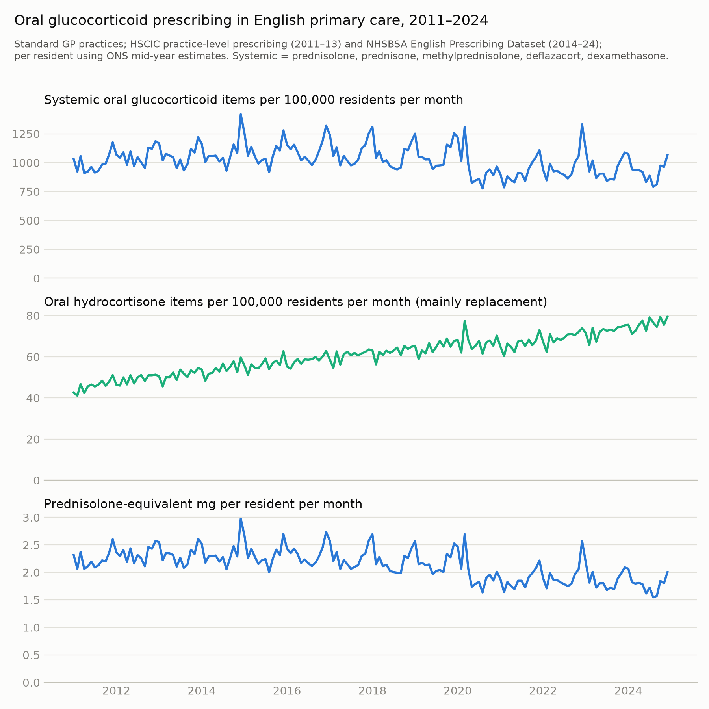

# Supplementary material

Study: Can open prescribing data detect effects of medicines on tuberculosis? An ecological study of primary care and hospital prescribing and TB notifications in England, 2011-2024.

## Supplementary tables

**Table 3. Hospital medicines (SCMD) and TB notifications, 2019–2024**

| Level | Drug group | Cross-sectional, adjusted (per SD) | Within-area, same year (per 10%) | Elasticity (same year) | Within-area, previous year (per 10%) | Previous year, SE clustered by principal trust | Following year (joint with previous) |
|:---|---:|---:|---:|---:|---:|---:|---:|
| UTLA | Active-TB treatment (pyrazinamide DDD, including fixed-dose combinations; positive control) | 1.225 (1.101–1.362) | 1.035 (1.009–1.061) | 0.36 | 1.001 (0.993–1.010) | 1.001 (0.993–1.010) | 0.997 (0.986–1.007) |
| UTLA | Rifamycin/isoniazid (active and latent TB, other infections) | 1.158 (1.038–1.292) | 1.036 (1.021–1.050) | 0.37 | 1.005 (0.993–1.018) | 1.005 (0.993–1.018) | 1.018 (0.996–1.041) |
| UTLA | TNF inhibitors | 0.957 (0.907–1.010) | 0.996 (0.979–1.013) | -0.05 | 0.989 (0.972–1.007) | 0.989 (0.970–1.009) | 0.978 (0.949–1.008) |
| UTLA | IL-6 inhibitors and abatacept | 0.971 (0.923–1.022) | 1.000 (0.990–1.010) | -0.00 | 1.001 (0.992–1.009) | 1.001 (0.993–1.009) | 1.001 (0.984–1.018) |
| UTLA | JAK inhibitors (rheumatology) | 0.972 (0.916–1.031) | 0.993 (0.987–0.999) | -0.07 | 0.994 (0.987–1.002) | 0.994 (0.986–1.003) | 0.998 (0.984–1.011) |
| UTLA | Rituximab | 0.942 (0.886–1.002) | 0.992 (0.978–1.005) | -0.09 | 0.998 (0.984–1.012) | 0.998 (0.987–1.009) | 1.006 (0.989–1.024) |
| UTLA | Calcineurin/mTOR inhibitors | 1.049 (0.995–1.106) | 0.994 (0.985–1.004) | -0.06 | 1.008 (0.996–1.020) | 1.008 (0.996–1.020) | 0.985 (0.966–1.005) |
| UTLA | Antiproliferatives | 1.025 (0.970–1.082) | 0.993 (0.978–1.008) | -0.08 | 0.996 (0.978–1.014) | 0.996 (0.979–1.013) | 0.993 (0.974–1.012) |
| UTLA | Systemic glucocorticoids without dexamethasone/hydrocortisone (prednisolone-equivalent mg) | 0.970 (0.929–1.012) | 1.009 (0.986–1.032) | 0.09 | 1.024 (1.001–1.046) | 1.024 (0.999–1.049) | 0.991 (0.953–1.030) |
| UTLA | Dexamethasone and hydrocortisone (descriptive) | 0.934 (0.893–0.976) | 1.005 (0.977–1.034) | 0.05 | 1.008 (0.980–1.036) | 1.008 (0.979–1.037) | 0.994 (0.943–1.047) |
| UTLA | Low-TB-risk biologics (negative control) | 1.014 (0.961–1.070) | 1.004 (0.990–1.019) | 0.05 | 1.002 (0.986–1.018) | 1.002 (0.983–1.021) | 1.010 (0.982–1.040) |
| UTLA | Levetiracetam (negative control) | 1.017 (0.970–1.066) | 0.998 (0.975–1.021) | -0.03 | 1.014 (0.986–1.042) | 1.014 (0.986–1.042) | 0.987 (0.948–1.028) |
| LTLA | Active-TB treatment (pyrazinamide DDD, including fixed-dose combinations; positive control) | 1.154 (1.080–1.232) | 1.039 (1.013–1.065) | 0.40 | 1.000 (0.991–1.008) | 1.000 (0.992–1.008) | 0.995 (0.985–1.005) |
| LTLA | Rifamycin/isoniazid (active and latent TB, other infections) | 1.065 (1.000–1.135) | 1.038 (1.025–1.052) | 0.39 | 1.004 (0.992–1.016) | 1.004 (0.992–1.016) | 1.018 (0.997–1.040) |
| LTLA | TNF inhibitors | 0.968 (0.927–1.012) | 0.994 (0.979–1.010) | -0.06 | 0.992 (0.976–1.008) | 0.992 (0.976–1.008) | 0.975 (0.946–1.006) |
| LTLA | IL-6 inhibitors and abatacept | 0.944 (0.906–0.984) | 1.001 (0.991–1.011) | 0.01 | 1.001 (0.993–1.010) | 1.001 (0.993–1.010) | 0.997 (0.981–1.013) |
| LTLA | JAK inhibitors (rheumatology) | 0.948 (0.905–0.992) | 0.994 (0.988–0.999) | -0.06 | 0.995 (0.989–1.002) | 0.995 (0.988–1.003) | 0.998 (0.984–1.012) |
| LTLA | Rituximab | 0.974 (0.929–1.021) | 0.990 (0.976–1.004) | -0.10 | 1.001 (0.986–1.016) | 1.001 (0.988–1.014) | 1.005 (0.988–1.023) |
| LTLA | Calcineurin/mTOR inhibitors | 1.002 (0.959–1.046) | 0.994 (0.985–1.003) | -0.07 | 1.008 (0.997–1.020) | 1.008 (0.998–1.019) | 0.983 (0.961–1.005) |
| LTLA | Antiproliferatives | 0.983 (0.936–1.031) | 0.997 (0.983–1.012) | -0.03 | 0.997 (0.982–1.013) | 0.997 (0.980–1.015) | 0.993 (0.974–1.012) |
| LTLA | Systemic glucocorticoids without dexamethasone/hydrocortisone (prednisolone-equivalent mg) | 0.976 (0.945–1.008) | 1.008 (0.990–1.026) | 0.08 | 1.021 (1.000–1.043) | 1.021 (0.999–1.044) | 0.986 (0.952–1.020) |
| LTLA | Dexamethasone and hydrocortisone (descriptive) | 0.978 (0.938–1.019) | 1.008 (0.980–1.037) | 0.08 | 1.010 (0.984–1.036) | 1.010 (0.982–1.037) | 0.989 (0.940–1.041) |
| LTLA | Low-TB-risk biologics (negative control) | 0.991 (0.948–1.036) | 1.005 (0.991–1.019) | 0.05 | 1.003 (0.988–1.019) | 1.003 (0.988–1.019) | 1.012 (0.985–1.040) |
| LTLA | Levetiracetam (negative control) | 1.016 (0.979–1.054) | 1.003 (0.981–1.025) | 0.03 | 1.013 (0.988–1.039) | 1.013 (0.989–1.037) | 0.992 (0.955–1.031) |

Exposure: DDD-years per 1,000 residents (positive control: pyrazinamide DDD including fixed-dose combinations; systemic glucocorticoids: prednisolone-equivalent mg, without dexamethasone and hydrocortisone), apportioned by 2024 acute trust catchments. Cross-sectional: negative binomial regression of 2019–24 notifications on the standardised log mean rate (per SD), adjusted for % born outside the UK, age structure, in-migration, HIV and diabetes prevalence. Within-area: Poisson PML with area and year fixed effects and time-varying covariates, per 10% increase; SEs clustered by area unless stated. Elasticity: log IRR per log unit of exposure in the same-year model, shown for all groups but interpretable as linkage attenuation only for the positive control. Following year: for the positive control an association is possible because treatment continues into the next year; for candidate drugs it is a falsification test.

**Table S1. Sensitivity analyses, LTLA panel (residence apportionment): IRR per 10% increase (95% CI)**

| Drug group | primary (t-1) | FE only (t-1) | prior 3 years (t-3..t-1) | + area trends (t-1) | population covariate (t-1) | + LTBI programme (t-1) | + asylum support (t-1) | exclude COVID years (t-1) | outcome years 2018-2024 (t-1) | EPD exposure only (t-1) | ADQ measure (t-1) |
|:---|---:|---:|---:|---:|---:|---:|---:|---:|---:|---:|---:|
| Antituberculosis (descriptive) | 1.000 (0.997–1.003) | 1.001 (0.998–1.005) | 1.001 (0.997–1.006) | 0.999 (0.996–1.003) | 1.000 (0.997–1.004) | 1.000 (0.997–1.003) | 1.001 (0.997–1.004) | 1.000 (0.996–1.004) | 1.001 (0.998–1.005) | 1.001 (0.997–1.004) | — |
| Systemic oral glucocorticoids | 0.969 (0.929–1.012) | 0.964 (0.917–1.014) | 0.976 (0.930–1.025) | 0.985 (0.932–1.042) | 0.972 (0.931–1.014) | 0.971 (0.929–1.015) | 0.982 (0.938–1.028) | 0.974 (0.932–1.018) | 0.983 (0.941–1.028) | 0.979 (0.939–1.021) | — |
| Oral hydrocortisone | 0.998 (0.985–1.011) | 0.995 (0.980–1.010) | 0.995 (0.979–1.012) | 0.999 (0.982–1.017) | 1.000 (0.987–1.012) | 0.998 (0.986–1.011) | 0.992 (0.979–1.006) | 0.997 (0.982–1.012) | 0.994 (0.978–1.011) | 0.994 (0.982–1.006) | — |
| Oral dexamethasone | 1.003 (0.992–1.014) | 1.005 (0.993–1.018) | 1.007 (0.992–1.022) | 0.995 (0.985–1.005) | 1.003 (0.992–1.014) | 1.003 (0.993–1.014) | 1.002 (0.991–1.014) | 1.007 (0.996–1.018) | 0.998 (0.986–1.010) | 1.003 (0.992–1.013) | — |
| Inhaled corticosteroids | 0.966 (0.920–1.014) | 0.940 (0.892–0.990) | 0.983 (0.929–1.039) | 1.033 (0.981–1.087) | 0.969 (0.922–1.018) | 0.967 (0.921–1.016) | 0.948 (0.905–0.993) | 0.961 (0.916–1.009) | 0.938 (0.892–0.985) | 0.954 (0.912–0.997) | 0.972 (0.951–0.993) |
| Conventional DMARDs | 1.002 (0.983–1.021) | 1.004 (0.983–1.024) | 1.003 (0.982–1.024) | 1.015 (0.979–1.053) | 1.001 (0.982–1.020) | 1.001 (0.983–1.021) | 0.996 (0.979–1.014) | 1.004 (0.985–1.023) | 1.003 (0.979–1.026) | 1.000 (0.983–1.016) | — |
| Transplant immunosuppressants | 0.999 (0.993–1.005) | 0.997 (0.991–1.003) | 1.000 (0.993–1.007) | 1.000 (0.993–1.008) | 0.999 (0.993–1.005) | 0.998 (0.993–1.004) | 0.999 (0.993–1.005) | 1.001 (0.994–1.007) | 1.001 (0.994–1.008) | 1.000 (0.994–1.006) | — |
| Proton pump inhibitors | 0.996 (0.955–1.039) | 0.968 (0.921–1.018) | 0.997 (0.954–1.042) | 0.962 (0.903–1.024) | 0.998 (0.955–1.042) | 1.002 (0.960–1.046) | 0.982 (0.939–1.027) | 0.992 (0.952–1.035) | 0.936 (0.885–0.991) | 0.984 (0.943–1.028) | 0.980 (0.917–1.047) |
| Statins | 0.992 (0.952–1.034) | 0.968 (0.924–1.013) | 0.993 (0.950–1.037) | 0.973 (0.919–1.029) | 0.991 (0.951–1.033) | 0.998 (0.957–1.040) | 1.000 (0.956–1.045) | 0.983 (0.944–1.024) | 0.986 (0.929–1.047) | 0.999 (0.958–1.041) | 0.983 (0.946–1.023) |
| Metformin | 0.966 (0.934–0.998) | 0.947 (0.914–0.981) | 0.970 (0.934–1.007) | 0.947 (0.906–0.990) | 0.967 (0.935–0.999) | 0.971 (0.938–1.005) | 0.971 (0.935–1.009) | 0.963 (0.932–0.994) | 0.975 (0.926–1.027) | 0.970 (0.937–1.005) | 0.982 (0.931–1.037) |
| Insulins | 0.966 (0.929–1.005) | 0.964 (0.923–1.007) | 0.974 (0.931–1.018) | 1.016 (0.945–1.093) | 0.971 (0.931–1.013) | 0.969 (0.930–1.008) | 0.968 (0.921–1.017) | 0.962 (0.923–1.002) | 0.979 (0.912–1.051) | 0.973 (0.930–1.017) | — |
| Fluoroquinolones | 1.005 (0.992–1.017) | 1.008 (0.994–1.023) | 1.007 (0.993–1.020) | 1.006 (0.991–1.020) | 1.006 (0.993–1.019) | 1.004 (0.992–1.017) | 1.003 (0.990–1.017) | 1.000 (0.987–1.013) | 0.993 (0.973–1.012) | 1.002 (0.989–1.015) | 1.001 (0.988–1.013) |
| All antibacterials | 0.996 (0.955–1.039) | 1.001 (0.952–1.052) | 1.009 (0.963–1.058) | 0.979 (0.940–1.020) | 1.000 (0.959–1.041) | 0.993 (0.950–1.037) | 0.990 (0.950–1.033) | 1.011 (0.965–1.059) | 0.951 (0.909–0.995) | 0.992 (0.953–1.033) | 0.990 (0.952–1.029) |
| Vitamin D | 1.007 (0.987–1.027) | 1.010 (0.988–1.033) | 1.008 (0.987–1.029) | 0.983 (0.959–1.007) | 1.009 (0.990–1.029) | 1.004 (0.984–1.025) | 1.006 (0.983–1.030) | 1.016 (0.995–1.037) | 0.990 (0.959–1.021) | 1.005 (0.985–1.026) | — |
| Levothyroxine (negative control) | 0.962 (0.933–0.992) | 0.943 (0.914–0.973) | 0.963 (0.933–0.995) | 0.954 (0.902–1.009) | 0.960 (0.930–0.990) | 0.967 (0.936–1.000) | 0.968 (0.935–1.002) | 0.961 (0.928–0.994) | 0.968 (0.924–1.014) | 0.968 (0.936–1.001) | 0.950 (0.909–0.994) |

**Table S2. Distributed lag model (t, t−1, t−2 in one model), LTLA residence**

| Drug group | t (same year) | t−1 | t−2 |
|:---|---:|---:|---:|
| Antituberculosis (descriptive) | 0.999 (0.996–1.003) | 1.001 (0.997–1.004) | 1.000 (0.997–1.003) |
| Systemic oral glucocorticoids | 0.974 (0.933–1.016) | 0.984 (0.933–1.038) | 1.006 (0.961–1.053) |
| Oral hydrocortisone | 1.009 (0.993–1.026) | 0.990 (0.970–1.010) | 1.001 (0.982–1.019) |
| Oral dexamethasone | 1.000 (0.991–1.009) | 1.003 (0.993–1.013) | 1.000 (0.990–1.010) |
| Inhaled corticosteroids | 0.922 (0.874–0.973) | 1.001 (0.927–1.082) | 1.037 (0.962–1.118) |
| Conventional DMARDs | 1.015 (0.978–1.053) | 0.981 (0.924–1.041) | 1.009 (0.966–1.054) |
| Transplant immunosuppressants | 1.001 (0.990–1.011) | 0.995 (0.983–1.008) | 1.004 (0.995–1.013) |
| Proton pump inhibitors | 1.002 (0.926–1.084) | 1.012 (0.928–1.103) | 0.981 (0.905–1.063) |
| Statins | 1.028 (0.946–1.118) | 0.978 (0.892–1.073) | 0.989 (0.920–1.064) |
| Metformin | 1.021 (0.952–1.096) | 0.955 (0.885–1.031) | 0.993 (0.940–1.049) |
| Insulins | 0.966 (0.901–1.035) | 0.988 (0.907–1.076) | 1.007 (0.943–1.076) |
| Fluoroquinolones | 1.002 (0.986–1.019) | 0.998 (0.981–1.016) | 1.005 (0.990–1.020) |
| All antibacterials | 1.032 (0.998–1.066) | 0.950 (0.908–0.994) | 1.030 (0.982–1.080) |
| Vitamin D | 1.017 (0.981–1.054) | 0.982 (0.937–1.030) | 1.011 (0.979–1.044) |
| Levothyroxine (negative control) | 1.006 (0.934–1.084) | 0.979 (0.894–1.072) | 0.976 (0.905–1.053) |

**Table S2b. Previous, same and following year in one model, LTLA residence: IRR per 10% (95% CI)**

| Drug group | t−1 | t (same year) | t+1 | p, t−1 vs t+1 | Correlation of t−1 and t+1 estimates |
|:---|---:|---:|---:|---:|---:|
| Antituberculosis (descriptive) | 1.000 (0.997–1.004) | 0.999 (0.995–1.003) | 1.002 (0.999–1.006) | 0.434 | 0.11 |
| Systemic oral glucocorticoids | 0.980 (0.926–1.036) | 1.021 (0.971–1.073) | 0.943 (0.898–0.990) | 0.337 | -0.11 |
| Oral hydrocortisone | 0.989 (0.969–1.010) | 1.012 (0.990–1.034) | 1.001 (0.982–1.020) | 0.421 | -0.05 |
| Oral dexamethasone | 1.002 (0.991–1.012) | 1.001 (0.991–1.011) | 1.003 (0.993–1.012) | 0.905 | 0.01 |
| Inhaled corticosteroids | 1.036 (0.965–1.111) | 1.043 (0.965–1.127) | 0.861 (0.809–0.917) | 0.000 | 0.04 |
| Conventional DMARDs | 0.985 (0.949–1.022) | 1.051 (1.005–1.100) | 0.964 (0.920–1.010) | 0.487 | -0.06 |
| Transplant immunosuppressants | 0.999 (0.988–1.011) | 1.000 (0.990–1.010) | 0.999 (0.990–1.008) | 0.954 | -0.07 |
| Proton pump inhibitors | 0.974 (0.911–1.041) | 1.128 (1.035–1.229) | 0.910 (0.835–0.991) | 0.246 | -0.12 |
| Statins | 0.956 (0.891–1.026) | 1.085 (0.999–1.179) | 0.953 (0.874–1.039) | 0.962 | -0.16 |
| Metformin | 0.945 (0.883–1.012) | 1.047 (0.971–1.128) | 0.976 (0.904–1.053) | 0.585 | -0.23 |
| Insulins | 0.991 (0.924–1.062) | 1.079 (1.000–1.164) | 0.888 (0.829–0.950) | 0.039 | -0.14 |
| Fluoroquinolones | 1.001 (0.984–1.019) | 1.019 (0.999–1.039) | 0.985 (0.968–1.001) | 0.180 | -0.02 |
| All antibacterials | 0.969 (0.924–1.015) | 1.065 (1.012–1.122) | 0.967 (0.926–1.010) | 0.962 | 0.17 |
| Vitamin D | 0.995 (0.961–1.030) | 1.012 (0.966–1.061) | 1.000 (0.963–1.038) | 0.842 | 0.12 |
| Levothyroxine (negative control) | 0.954 (0.897–1.015) | 1.065 (0.973–1.166) | 0.941 (0.856–1.034) | 0.818 | -0.19 |

**Table S3. Hospital medicines: minimum detectable effects (previous-year exposure) versus illustrative expected effects**

| Level | Drug group | Scenario (illustrative RR) | Prevalence (SCMD DDD-years per resident) | Expected change per 10% | MDE | MDE ÷ expected | MDE ÷ expected, attenuated by positive-control elasticity |
|:---|---:|---:|---:|---:|---:|---:|---:|
| UTLA | TNF inhibitors | RR 4 (illustrative, before LTBI screening) | 0.34% | 0.100% | 2.6% | 26 | 72 |
| UTLA | TNF inhibitors | RR 1.5 (illustrative, with LTBI screening; probably nearer 1, so favours detection) | 0.34% | 0.017% | 2.6% | 154 | 426 |
| UTLA | IL-6 inhibitors and abatacept | RR 2 | 0.02% | 0.002% | 1.2% | 520 | 1443 |
| UTLA | JAK inhibitors (rheumatology) | RR 2 | 0.04% | 0.004% | 1.0% | 235 | 652 |
| UTLA | Rituximab | RR 1.5 | 0.09% | 0.005% | 2.0% | 420 | 1165 |
| UTLA | Calcineurin/mTOR inhibitors | RR 10 (solid organ transplant) | 0.07% | 0.066% | 1.7% | 26 | 72 |
| UTLA | Antiproliferatives | RR 2 | 0.16% | 0.016% | 2.6% | 158 | 439 |
| LTLA | TNF inhibitors | RR 4 (illustrative, before LTBI screening) | 0.34% | 0.100% | 2.3% | 23 | 58 |
| LTLA | TNF inhibitors | RR 1.5 (illustrative, with LTBI screening; probably nearer 1, so favours detection) | 0.34% | 0.017% | 2.3% | 137 | 343 |
| LTLA | IL-6 inhibitors and abatacept | RR 2 | 0.02% | 0.002% | 1.2% | 522 | 1305 |
| LTLA | JAK inhibitors (rheumatology) | RR 2 | 0.04% | 0.004% | 1.0% | 218 | 544 |
| LTLA | Rituximab | RR 1.5 | 0.09% | 0.005% | 2.2% | 470 | 1174 |
| LTLA | Calcineurin/mTOR inhibitors | RR 10 (solid organ transplant) | 0.07% | 0.066% | 1.6% | 25 | 61 |
| LTLA | Antiproliferatives | RR 2 | 0.16% | 0.016% | 2.2% | 138 | 345 |

Relative risks are illustrative values, not estimates. DDD-years per resident approximate the proportion treated only for continuous maintenance therapy. The attenuated column divides the expected effect by the positive control's same-year elasticity (UTLA 0.36, 95% CI 0.10–0.62; LTLA 0.40, 95% CI 0.14–0.66). This assumes the same linkage attenuation for previous-year exposure and for drugs with other supply routes (homecare, specialist centres), and the elasticity also reflects variation in drug volume per person treated, so the attenuated ratios are illustrative.

**Table S3b. Hospital medicines: sensitivity analyses, IRR per 10% increase (95% CI)**

| Level | Drug group | lag (t-1) | lag (t-1), excluding outcome years 2020-21 | lag (t-1), elective catchments | concurrent (t) | concurrent (t), clustered by principal trust | concurrent (t), elective catchments |
|:---|---:|---:|---:|---:|---:|---:|---:|
| UTLA | Active-TB treatment (pyrazinamide DDD, including fixed-dose combinations; positive control) | 1.001 (0.993–1.010) | 1.000 (0.986–1.013) | 1.001 (0.993–1.010) | 1.035 (1.009–1.061) | 1.035 (1.009–1.062) | 1.035 (1.009–1.062) |
| UTLA | Rifamycin/isoniazid (active and latent TB, other infections) | 1.005 (0.993–1.018) | 1.000 (0.979–1.022) | 1.006 (0.993–1.019) | 1.036 (1.021–1.050) | 1.036 (1.020–1.051) | 1.036 (1.022–1.050) |
| UTLA | TNF inhibitors | 0.989 (0.972–1.007) | 0.970 (0.928–1.013) | 0.990 (0.972–1.008) | 0.996 (0.979–1.013) | 0.996 (0.980–1.012) | 0.996 (0.979–1.013) |
| UTLA | IL-6 inhibitors and abatacept | 1.001 (0.992–1.009) | 0.993 (0.976–1.011) | 1.001 (0.993–1.009) | 1.000 (0.990–1.010) | 1.000 (0.991–1.009) | 1.000 (0.990–1.010) |
| UTLA | JAK inhibitors (rheumatology) | 0.994 (0.987–1.002) | 0.978 (0.961–0.996) | 0.995 (0.987–1.002) | 0.993 (0.987–0.999) | 0.993 (0.987–1.000) | 0.993 (0.987–0.999) |
| UTLA | Rituximab | 0.998 (0.984–1.012) | 0.986 (0.959–1.015) | 0.999 (0.985–1.013) | 0.992 (0.978–1.005) | 0.992 (0.979–1.004) | 0.992 (0.979–1.006) |
| UTLA | Calcineurin/mTOR inhibitors | 1.008 (0.996–1.020) | 1.012 (0.989–1.035) | 1.008 (0.996–1.020) | 0.994 (0.985–1.004) | 0.994 (0.985–1.004) | 0.994 (0.985–1.004) |
| UTLA | Antiproliferatives | 0.996 (0.978–1.014) | 1.004 (0.973–1.036) | 0.996 (0.978–1.015) | 0.993 (0.978–1.008) | 0.993 (0.978–1.008) | 0.993 (0.978–1.009) |
| UTLA | Systemic glucocorticoids without dexamethasone/hydrocortisone (prednisolone-equivalent mg) | 1.024 (1.001–1.046) | 1.018 (0.969–1.069) | 1.025 (1.003–1.048) | 1.009 (0.986–1.032) | 1.009 (0.985–1.033) | 1.010 (0.987–1.034) |
| UTLA | Systemic glucocorticoids, oral forms only (sensitivity) | 1.011 (0.991–1.032) | 1.014 (0.965–1.065) | 1.013 (0.992–1.034) | 0.997 (0.979–1.016) | 0.997 (0.979–1.016) | 0.999 (0.980–1.018) |
| UTLA | Dexamethasone and hydrocortisone (descriptive) | 1.008 (0.980–1.036) | 1.021 (0.963–1.082) | 1.009 (0.981–1.039) | 1.005 (0.977–1.034) | 1.005 (0.975–1.036) | 1.008 (0.979–1.038) |
| UTLA | Low-TB-risk biologics (negative control) | 1.002 (0.986–1.018) | 0.999 (0.958–1.042) | 1.002 (0.985–1.018) | 1.004 (0.990–1.019) | 1.004 (0.990–1.019) | 1.004 (0.989–1.019) |
| UTLA | Levetiracetam (negative control) | 1.014 (0.986–1.042) | 1.035 (0.978–1.096) | 1.014 (0.986–1.044) | 0.998 (0.975–1.021) | 0.998 (0.974–1.022) | 0.999 (0.976–1.022) |
| LTLA | Active-TB treatment (pyrazinamide DDD, including fixed-dose combinations; positive control) | 1.000 (0.991–1.008) | 0.998 (0.984–1.012) | 1.000 (0.991–1.009) | 1.039 (1.013–1.065) | 1.039 (1.012–1.066) | 1.039 (1.013–1.066) |
| LTLA | Rifamycin/isoniazid (active and latent TB, other infections) | 1.004 (0.992–1.016) | 0.996 (0.976–1.016) | 1.005 (0.992–1.017) | 1.038 (1.025–1.052) | 1.038 (1.023–1.054) | 1.039 (1.026–1.052) |
| LTLA | TNF inhibitors | 0.992 (0.976–1.008) | 0.976 (0.935–1.019) | 0.993 (0.977–1.009) | 0.994 (0.979–1.010) | 0.994 (0.979–1.009) | 0.995 (0.979–1.011) |
| LTLA | IL-6 inhibitors and abatacept | 1.001 (0.993–1.010) | 0.996 (0.980–1.012) | 1.002 (0.994–1.010) | 1.001 (0.991–1.011) | 1.001 (0.991–1.011) | 1.001 (0.991–1.011) |
| LTLA | JAK inhibitors (rheumatology) | 0.995 (0.989–1.002) | 0.980 (0.963–0.998) | 0.996 (0.989–1.003) | 0.994 (0.988–0.999) | 0.994 (0.988–1.000) | 0.994 (0.989–1.000) |
| LTLA | Rituximab | 1.001 (0.986–1.016) | 0.989 (0.963–1.016) | 1.002 (0.986–1.017) | 0.990 (0.976–1.004) | 0.990 (0.977–1.003) | 0.991 (0.977–1.005) |
| LTLA | Calcineurin/mTOR inhibitors | 1.008 (0.997–1.020) | 1.015 (0.994–1.036) | 1.008 (0.997–1.020) | 0.994 (0.985–1.003) | 0.994 (0.985–1.003) | 0.994 (0.985–1.003) |
| LTLA | Antiproliferatives | 0.997 (0.982–1.013) | 1.008 (0.982–1.035) | 0.997 (0.981–1.013) | 0.997 (0.983–1.012) | 0.997 (0.986–1.009) | 0.998 (0.983–1.013) |
| LTLA | Systemic glucocorticoids without dexamethasone/hydrocortisone (prednisolone-equivalent mg) | 1.021 (1.000–1.043) | 1.022 (0.979–1.068) | 1.022 (1.001–1.044) | 1.008 (0.990–1.026) | 1.008 (0.988–1.027) | 1.009 (0.991–1.028) |
| LTLA | Systemic glucocorticoids, oral forms only (sensitivity) | 1.015 (0.994–1.036) | 1.023 (0.975–1.073) | 1.017 (0.996–1.038) | 1.001 (0.982–1.019) | 1.001 (0.981–1.020) | 1.002 (0.983–1.021) |
| LTLA | Dexamethasone and hydrocortisone (descriptive) | 1.010 (0.984–1.036) | 1.019 (0.970–1.070) | 1.011 (0.984–1.039) | 1.008 (0.980–1.037) | 1.008 (0.979–1.038) | 1.011 (0.982–1.040) |
| LTLA | Low-TB-risk biologics (negative control) | 1.003 (0.988–1.019) | 0.996 (0.959–1.036) | 1.003 (0.988–1.019) | 1.005 (0.991–1.019) | 1.005 (0.989–1.020) | 1.004 (0.991–1.018) |
| LTLA | Levetiracetam (negative control) | 1.013 (0.988–1.039) | 1.021 (0.970–1.074) | 1.013 (0.988–1.040) | 1.003 (0.981–1.025) | 1.003 (0.980–1.027) | 1.004 (0.982–1.027) |

**Table S4. Permutation-based power simulation (systemic oral glucocorticoids, exposure t−1)**

| Level | Scenario | Replicates | Two-sided rejection | Power, correct direction (95% MC interval) | Analytic power at real-data SE | Median estimated IRR per 10% | Median replicate SE | Null empirical SD | Real-data SE |
|:---|---:|---:|---:|---:|---:|---:|---:|---:|---:|
| LTLA | No effect | 500 | 7.8% | 3.8% (±1.7) | 5.1% | 1.002 | 0.0161 | 0.0166 | 0.0218 |
| LTLA | Published RR 4.9 | 300 | 8.3% | 6.0% (±2.7) | 5.2% | 1.003 | 0.0161 | 0.0166 | 0.0218 |
| LTLA | RR 25 | 300 | 17.7% | 17.7% (±4.3) | 12.2% | 1.017 | 0.0161 | 0.0166 | 0.0218 |
| LTLA | RR 100 | 300 | 71.0% | 71.0% (±5.1) | 52.1% | 1.045 | 0.0161 | 0.0166 | 0.0218 |
| LTLA | IRR 1.02 per 10% | 300 | 21.7% | 21.7% (±4.7) | 14.3% | 1.019 | 0.0161 | 0.0166 | 0.0218 |
| LTLA | IRR 1.05 per 10% | 300 | 83.0% | 83.0% (±4.3) | 64.6% | 1.052 | 0.0161 | 0.0166 | 0.0218 |
| LTLA | IRR 1.10 per 10% | 300 | 100.0% | 100.0% (±0.0) | 99.4% | 1.102 | 0.0161 | 0.0166 | 0.0218 |
| LTLA | IRR 1.05 per 10%, acting via concurrent year | 300 | 61.7% | 61.7% (±5.5) | 41.0% | 1.039 | 0.0161 | 0.0166 | 0.0218 |
| LTLA | IRR 1.10 per 10%, acting via concurrent year | 300 | 99.3% | 99.3% (±0.9) | 94.2% | 1.080 | 0.0161 | 0.0166 | 0.0218 |
| UTLA | No effect | 500 | 7.6% | 4.0% (±1.7) | 5.0% | 1.000 | 0.0167 | 0.0171 | 0.0249 |
| UTLA | Published RR 4.9 | 300 | 8.0% | 6.7% (±2.8) | 5.1% | 1.003 | 0.0167 | 0.0171 | 0.0249 |
| UTLA | RR 25 | 300 | 20.0% | 19.3% (±4.5) | 11.5% | 1.019 | 0.0167 | 0.0171 | 0.0249 |
| UTLA | RR 100 | 300 | 66.7% | 66.7% (±5.3) | 46.2% | 1.047 | 0.0167 | 0.0171 | 0.0249 |
| UTLA | IRR 1.02 per 10% | 300 | 24.7% | 24.7% (±4.9) | 13.8% | 1.022 | 0.0167 | 0.0171 | 0.0249 |
| UTLA | IRR 1.05 per 10% | 300 | 78.0% | 78.0% (±4.7) | 51.0% | 1.051 | 0.0167 | 0.0171 | 0.0249 |
| UTLA | IRR 1.10 per 10% | 300 | 100.0% | 100.0% (±0.0) | 96.9% | 1.100 | 0.0167 | 0.0171 | 0.0249 |
| UTLA | IRR 1.05 per 10%, acting via concurrent year | 300 | 65.7% | 65.7% (±5.4) | 38.9% | 1.043 | 0.0167 | 0.0171 | 0.0249 |
| UTLA | IRR 1.10 per 10%, acting via concurrent year | 300 | 99.3% | 99.3% (±0.9) | 90.7% | 1.085 | 0.0167 | 0.0171 | 0.0249 |

Within the simulation, replicate SEs matched the spread of null estimates, so the test was approximately calibrated (slightly anti-conservative). Real-data SEs were larger than in the simulation, probably because permuting exposure trajectories across areas breaks their alignment with each area's own notification trends; simulated power is therefore optimistic. Analytic power uses the median simulated estimate as the effect and the real-data SE.

**Table S5. Regional models (9 regions): TB notifications by place of birth and age vs primary care prescribing**

| Outcome | Exposure | Analysis | Lag (years; negative = lead) | IRR per 10% (t(8) 95% CI) | p (cluster t8) | p (randomisation) | MDE per 10% |
|:---|---:|---:|---:|---:|---:|---:|---:|
| TB, UK born | oral_glucocorticoids | lagged exposure | 1 | 1.19 (0.87–1.62) | 0.233 | 0.254 | 53% |
| TB, UK born | oral_glucocorticoids | lagged exposure | 2 | 1.20 (0.80–1.80) | 0.323 | 0.386 | 75% |
| TB, UK born | oral_glucocorticoids | lagged exposure | 3 | 1.10 (0.67–1.79) | 0.678 | 0.714 | 98% |
| TB, UK born | oral_glucocorticoids | lagged, excluding 2020-21 | 1 | 1.19 (0.87–1.63) | 0.244 | 0.280 | 55% |
| TB, UK born | oral_glucocorticoids | lagged, excluding 2020-21 | 2 | 1.20 (0.80–1.80) | 0.323 | 0.372 | 75% |
| TB, UK born | oral_glucocorticoids | lagged, excluding 2020-21 | 3 | 1.09 (0.67–1.78) | 0.686 | 0.714 | 97% |
| TB, UK born | oral_glucocorticoids | lead (falsification) | -1 | 1.20 (0.78–1.84) | 0.356 | 0.374 | 81% |
| TB, UK born | oral_glucocorticoids | lead (falsification) | -2 | 1.09 (0.67–1.78) | 0.695 | 0.686 | 97% |
| TB, UK born | oral_glucocorticoids | lead (falsification) | -3 | 1.09 (0.83–1.44) | 0.484 | 0.536 | 47% |
| TB, UK born | mg_pred_equivalent | lagged exposure | 1 | 1.25 (0.95–1.65) | 0.097 | 0.122 | 46% |
| TB, UK born | mg_pred_equivalent | lagged exposure | 2 | 1.33 (0.96–1.84) | 0.077 | 0.162 | 57% |
| TB, UK born | mg_pred_equivalent | lagged exposure | 3 | 1.33 (0.94–1.89) | 0.098 | 0.238 | 63% |
| TB, UK born | mg_pred_equivalent | lagged, excluding 2020-21 | 1 | 1.27 (0.94–1.72) | 0.105 | 0.114 | 52% |
| TB, UK born | mg_pred_equivalent | lagged, excluding 2020-21 | 2 | 1.32 (0.97–1.80) | 0.072 | 0.140 | 53% |
| TB, UK born | mg_pred_equivalent | lagged, excluding 2020-21 | 3 | 1.30 (0.91–1.85) | 0.134 | 0.286 | 64% |
| TB, UK born | mg_pred_equivalent | lead (falsification) | -1 | 1.17 (0.85–1.60) | 0.292 | 0.274 | 55% |
| TB, UK born | mg_pred_equivalent | lead (falsification) | -2 | 0.91 (0.70–1.19) | 0.446 | 0.436 | 44% |
| TB, UK born | mg_pred_equivalent | lead (falsification) | -3 | 0.92 (0.82–1.03) | 0.120 | 0.084 | 17% |
| TB, UK born | levothyroxine | lagged exposure | 1 | 0.96 (0.85–1.08) | 0.407 | 0.518 | 18% |
| TB, UK born | levothyroxine | lagged exposure | 2 | 0.91 (0.80–1.03) | 0.127 | 0.246 | 19% |
| TB, UK born | levothyroxine | lagged exposure | 3 | 0.90 (0.77–1.04) | 0.139 | 0.258 | 23% |
| TB, UK born | levothyroxine | lagged, excluding 2020-21 | 1 | 0.95 (0.84–1.08) | 0.366 | 0.478 | 19% |
| TB, UK born | levothyroxine | lagged, excluding 2020-21 | 2 | 0.91 (0.80–1.04) | 0.152 | 0.288 | 21% |
| TB, UK born | levothyroxine | lagged, excluding 2020-21 | 3 | 0.90 (0.76–1.05) | 0.154 | 0.282 | 25% |
| TB, UK born | levothyroxine | lead (falsification) | -1 | 0.93 (0.81–1.07) | 0.293 | 0.428 | 22% |
| TB, UK born | levothyroxine | lead (falsification) | -2 | 0.97 (0.82–1.14) | 0.636 | 0.710 | 26% |
| TB, UK born | levothyroxine | lead (falsification) | -3 | 0.96 (0.80–1.15) | 0.624 | 0.720 | 28% |
| TB, Non-UK born | oral_glucocorticoids | lagged exposure | 1 | 0.95 (0.72–1.25) | 0.678 | 0.716 | 47% |
| TB, Non-UK born | oral_glucocorticoids | lagged exposure | 2 | 1.00 (0.81–1.23) | 0.982 | 0.974 | 33% |
| TB, Non-UK born | oral_glucocorticoids | lagged exposure | 3 | 1.03 (0.83–1.28) | 0.725 | 0.766 | 35% |
| TB, Non-UK born | oral_glucocorticoids | lagged, excluding 2020-21 | 1 | 0.98 (0.72–1.32) | 0.853 | 0.874 | 51% |
| TB, Non-UK born | oral_glucocorticoids | lagged, excluding 2020-21 | 2 | 1.03 (0.84–1.26) | 0.785 | 0.812 | 33% |
| TB, Non-UK born | oral_glucocorticoids | lagged, excluding 2020-21 | 3 | 1.06 (0.86–1.32) | 0.523 | 0.600 | 34% |
| TB, Non-UK born | oral_glucocorticoids | lead (falsification) | -1 | 1.13 (0.88–1.44) | 0.306 | 0.358 | 41% |
| TB, Non-UK born | oral_glucocorticoids | lead (falsification) | -2 | 1.33 (1.00–1.76) | 0.049 | 0.070 | 48% |
| TB, Non-UK born | oral_glucocorticoids | lead (falsification) | -3 | 1.49 (1.17–1.89) | 0.005 | 0.012 | 39% |
| TB, Non-UK born | mg_pred_equivalent | lagged exposure | 1 | 0.99 (0.77–1.26) | 0.906 | 0.934 | 41% |
| TB, Non-UK born | mg_pred_equivalent | lagged exposure | 2 | 1.08 (0.91–1.27) | 0.343 | 0.544 | 26% |
| TB, Non-UK born | mg_pred_equivalent | lagged exposure | 3 | 1.11 (0.94–1.30) | 0.179 | 0.384 | 25% |
| TB, Non-UK born | mg_pred_equivalent | lagged, excluding 2020-21 | 1 | 1.02 (0.78–1.33) | 0.884 | 0.918 | 45% |
| TB, Non-UK born | mg_pred_equivalent | lagged, excluding 2020-21 | 2 | 1.07 (0.92–1.26) | 0.327 | 0.542 | 25% |
| TB, Non-UK born | mg_pred_equivalent | lagged, excluding 2020-21 | 3 | 1.13 (0.94–1.35) | 0.158 | 0.378 | 28% |
| TB, Non-UK born | mg_pred_equivalent | lead (falsification) | -1 | 1.15 (0.91–1.46) | 0.208 | 0.332 | 39% |
| TB, Non-UK born | mg_pred_equivalent | lead (falsification) | -2 | 1.31 (0.94–1.83) | 0.101 | 0.168 | 59% |
| TB, Non-UK born | mg_pred_equivalent | lead (falsification) | -3 | 1.29 (1.03–1.60) | 0.030 | 0.040 | 36% |
| TB, Non-UK born | levothyroxine | lagged exposure | 1 | 1.02 (0.90–1.16) | 0.695 | 0.778 | 19% |
| TB, Non-UK born | levothyroxine | lagged exposure | 2 | 1.02 (0.88–1.17) | 0.767 | 0.854 | 22% |
| TB, Non-UK born | levothyroxine | lagged exposure | 3 | 1.01 (0.88–1.17) | 0.835 | 0.866 | 22% |
| TB, Non-UK born | levothyroxine | lagged, excluding 2020-21 | 1 | 1.02 (0.90–1.16) | 0.682 | 0.798 | 19% |
| TB, Non-UK born | levothyroxine | lagged, excluding 2020-21 | 2 | 1.02 (0.88–1.17) | 0.771 | 0.844 | 22% |
| TB, Non-UK born | levothyroxine | lagged, excluding 2020-21 | 3 | 1.01 (0.88–1.17) | 0.835 | 0.860 | 22% |
| TB, Non-UK born | levothyroxine | lead (falsification) | -1 | 1.00 (0.86–1.15) | 0.947 | 0.964 | 23% |
| TB, Non-UK born | levothyroxine | lead (falsification) | -2 | 1.01 (0.88–1.16) | 0.839 | 0.878 | 21% |
| TB, Non-UK born | levothyroxine | lead (falsification) | -3 | 1.10 (0.91–1.31) | 0.279 | 0.476 | 28% |
| TB, UK born aged 65+ | oral_glucocorticoids | lagged exposure | 1 | 1.05 (0.75–1.46) | 0.750 | 0.790 | 58% |
| TB, UK born aged 65+ | oral_glucocorticoids | lagged exposure | 2 | 1.06 (0.75–1.50) | 0.714 | 0.712 | 62% |
| TB, UK born aged 65+ | oral_glucocorticoids | lagged exposure | 3 | 0.85 (0.48–1.51) | 0.539 | 0.578 | 119% |
| TB, UK born aged 65+ | oral_glucocorticoids | lagged, excluding 2020-21 | 1 | 1.09 (0.80–1.49) | 0.524 | 0.592 | 53% |
| TB, UK born aged 65+ | oral_glucocorticoids | lagged, excluding 2020-21 | 2 | 1.10 (0.79–1.53) | 0.512 | 0.472 | 58% |
| TB, UK born aged 65+ | oral_glucocorticoids | lagged, excluding 2020-21 | 3 | 0.88 (0.53–1.45) | 0.572 | 0.572 | 100% |
| TB, UK born aged 65+ | oral_glucocorticoids | lead (falsification) | -1 | 1.27 (0.88–1.85) | 0.173 | 0.198 | 68% |
| TB, UK born aged 65+ | oral_glucocorticoids | lead (falsification) | -2 | 1.68 (1.04–2.70) | 0.036 | 0.044 | 93% |
| TB, UK born aged 65+ | oral_glucocorticoids | lead (falsification) | -3 | 1.53 (0.93–2.54) | 0.086 | 0.108 | 101% |
| TB, UK born aged 65+ | mg_pred_equivalent | lagged exposure | 1 | 1.06 (0.76–1.48) | 0.679 | 0.712 | 59% |
| TB, UK born aged 65+ | mg_pred_equivalent | lagged exposure | 2 | 1.13 (0.83–1.54) | 0.388 | 0.478 | 54% |
| TB, UK born aged 65+ | mg_pred_equivalent | lagged exposure | 3 | 0.94 (0.56–1.58) | 0.803 | 0.844 | 105% |
| TB, UK born aged 65+ | mg_pred_equivalent | lagged, excluding 2020-21 | 1 | 1.12 (0.77–1.61) | 0.513 | 0.566 | 67% |
| TB, UK born aged 65+ | mg_pred_equivalent | lagged, excluding 2020-21 | 2 | 1.12 (0.80–1.56) | 0.452 | 0.490 | 59% |
| TB, UK born aged 65+ | mg_pred_equivalent | lagged, excluding 2020-21 | 3 | 0.88 (0.49–1.60) | 0.640 | 0.618 | 127% |
| TB, UK born aged 65+ | mg_pred_equivalent | lead (falsification) | -1 | 1.28 (0.89–1.85) | 0.151 | 0.204 | 65% |
| TB, UK born aged 65+ | mg_pred_equivalent | lead (falsification) | -2 | 1.58 (0.92–2.73) | 0.089 | 0.086 | 113% |
| TB, UK born aged 65+ | mg_pred_equivalent | lead (falsification) | -3 | 1.30 (0.78–2.19) | 0.271 | 0.320 | 105% |
| TB, UK born aged 65+ | levothyroxine | lagged exposure | 1 | 1.23 (1.00–1.51) | 0.051 | 0.074 | 33% |
| TB, UK born aged 65+ | levothyroxine | lagged exposure | 2 | 1.19 (0.95–1.48) | 0.111 | 0.168 | 36% |
| TB, UK born aged 65+ | levothyroxine | lagged exposure | 3 | 1.06 (0.89–1.27) | 0.463 | 0.534 | 28% |
| TB, UK born aged 65+ | levothyroxine | lagged, excluding 2020-21 | 1 | 1.22 (0.99–1.50) | 0.055 | 0.068 | 33% |
| TB, UK born aged 65+ | levothyroxine | lagged, excluding 2020-21 | 2 | 1.20 (0.96–1.50) | 0.098 | 0.152 | 36% |
| TB, UK born aged 65+ | levothyroxine | lagged, excluding 2020-21 | 3 | 1.09 (0.91–1.30) | 0.304 | 0.406 | 28% |
| TB, UK born aged 65+ | levothyroxine | lead (falsification) | -1 | 1.38 (1.05–1.80) | 0.025 | 0.038 | 45% |
| TB, UK born aged 65+ | levothyroxine | lead (falsification) | -2 | 1.20 (0.85–1.71) | 0.262 | 0.382 | 63% |
| TB, UK born aged 65+ | levothyroxine | lead (falsification) | -3 | 1.29 (0.85–1.97) | 0.195 | 0.308 | 79% |

Randomisation p-values compare the cluster-robust t statistic with 499 permutations of whole regional exposure histories across regions, valid under exchangeability of those histories; p = (1 + count)/(1 + 499), so the minimum is 0.002.

**Table S6. Regional models: lag 2 and lead 2 estimated jointly**

| Outcome | Exposure | Regions excluded | Years | IRR lag (per 10%) | IRR lead (per 10%) | Lag ÷ lead | p difference | p randomisation (lag) |
|:---|---:|---:|---:|---:|---:|---:|---:|---:|
| TB, UK born | oral_glucocorticoids | none | 2013-2022 | 1.26 | 0.95 | 1.33 | 0.151 | 0.460 |
| TB, UK born | oral_glucocorticoids | London | 2013-2022 | 0.99 | 0.97 | 1.02 | 0.919 | 0.964 |
| TB, UK born | mg_pred_equivalent | none | 2013-2022 | 1.45 | 0.88 | 1.65 | 0.035 | 0.232 |
| TB, UK born | mg_pred_equivalent | London | 2013-2022 | 1.12 | 0.90 | 1.25 | 0.430 | 0.730 |
| TB, UK born | levothyroxine | none | 2013-2022 | 0.94 | 0.91 | 1.03 | 0.953 | 0.830 |
| TB, UK born | levothyroxine | London | 2013-2022 | 1.20 | 1.23 | 0.97 | 0.945 | 0.634 |
| TB, Non-UK born | oral_glucocorticoids | none | 2013-2022 | 0.98 | 1.38 | 0.71 | 0.181 | 0.916 |
| TB, Non-UK born | mg_pred_equivalent | none | 2013-2022 | 1.14 | 1.27 | 0.89 | 0.653 | 0.502 |
| TB, Non-UK born | levothyroxine | none | 2013-2022 | 0.95 | 1.00 | 0.94 | 0.903 | 0.830 |
| TB, UK born aged 65+ | oral_glucocorticoids | none | 2013-2022 | 0.87 | 1.79 | 0.49 | 0.065 | 0.506 |
| TB, UK born aged 65+ | mg_pred_equivalent | none | 2013-2022 | 1.08 | 1.57 | 0.69 | 0.306 | 0.786 |
| TB, UK born aged 65+ | levothyroxine | none | 2013-2022 | 1.00 | 1.09 | 0.91 | 0.833 | 1.000 |

**Table S7. Hospital medicines: share of DDD from trusts matched to catchments directly, via successor trusts, or unmatched**

| Drug group | Year | Direct | Successor | Unmatched |
|:---|---:|---:|---:|---:|
| Antiproliferatives | 2019 | 90.9% | 8.4% | 0.7% |
| Antiproliferatives | 2020 | 93.8% | 4.8% | 1.4% |
| Antiproliferatives | 2021 | 96.4% | 2.4% | 1.2% |
| Antiproliferatives | 2022 | 97.7% | 0.7% | 1.6% |
| Antiproliferatives | 2023 | 97.6% | 0.5% | 1.9% |
| Antiproliferatives | 2024 | 97.7% | 0.4% | 1.9% |
| Active-TB treatment (pyrazinamide DDD, including fixed-dose combinations; positive control) | 2019 | 90.9% | 8.9% | 0.3% |
| Active-TB treatment (pyrazinamide DDD, including fixed-dose combinations; positive control) | 2020 | 94.2% | 5.7% | 0.1% |
| Active-TB treatment (pyrazinamide DDD, including fixed-dose combinations; positive control) | 2021 | 97.4% | 2.5% | 0.1% |
| Active-TB treatment (pyrazinamide DDD, including fixed-dose combinations; positive control) | 2022 | 98.8% | 1.1% | 0.0% |
| Active-TB treatment (pyrazinamide DDD, including fixed-dose combinations; positive control) | 2023 | 98.9% | 1.0% | 0.0% |
| Active-TB treatment (pyrazinamide DDD, including fixed-dose combinations; positive control) | 2024 | 97.4% | 1.1% | 1.5% |
| Rifamycin/isoniazid (active and latent TB, other infections) | 2019 | 90.6% | 9.0% | 0.3% |
| Rifamycin/isoniazid (active and latent TB, other infections) | 2020 | 95.1% | 4.6% | 0.3% |
| Rifamycin/isoniazid (active and latent TB, other infections) | 2021 | 97.7% | 2.1% | 0.2% |
| Rifamycin/isoniazid (active and latent TB, other infections) | 2022 | 99.0% | 0.8% | 0.2% |
| Rifamycin/isoniazid (active and latent TB, other infections) | 2023 | 99.0% | 0.8% | 0.2% |
| Rifamycin/isoniazid (active and latent TB, other infections) | 2024 | 99.2% | 0.6% | 0.1% |
| Dexamethasone and hydrocortisone (descriptive) | 2019 | 91.5% | 8.1% | 0.4% |
| Dexamethasone and hydrocortisone (descriptive) | 2020 | 95.2% | 4.4% | 0.4% |
| Dexamethasone and hydrocortisone (descriptive) | 2021 | 97.5% | 2.1% | 0.4% |
| Dexamethasone and hydrocortisone (descriptive) | 2022 | 98.6% | 1.0% | 0.3% |
| Dexamethasone and hydrocortisone (descriptive) | 2023 | 99.0% | 0.7% | 0.3% |
| Dexamethasone and hydrocortisone (descriptive) | 2024 | 99.2% | 0.5% | 0.3% |
| IL-6 inhibitors and abatacept | 2019 | 90.1% | 8.7% | 1.2% |
| IL-6 inhibitors and abatacept | 2020 | 93.9% | 4.9% | 1.2% |
| IL-6 inhibitors and abatacept | 2021 | 96.3% | 2.8% | 0.9% |
| IL-6 inhibitors and abatacept | 2022 | 97.8% | 1.0% | 1.2% |
| IL-6 inhibitors and abatacept | 2023 | 97.9% | 0.5% | 1.5% |
| IL-6 inhibitors and abatacept | 2024 | 97.8% | 0.4% | 1.8% |
| JAK inhibitors (rheumatology) | 2019 | 90.1% | 8.9% | 0.9% |
| JAK inhibitors (rheumatology) | 2020 | 94.8% | 4.4% | 0.9% |
| JAK inhibitors (rheumatology) | 2021 | 97.1% | 2.5% | 0.4% |
| JAK inhibitors (rheumatology) | 2022 | 98.5% | 1.1% | 0.4% |
| JAK inhibitors (rheumatology) | 2023 | 98.9% | 0.4% | 0.7% |
| JAK inhibitors (rheumatology) | 2024 | 98.4% | 0.3% | 1.3% |
| Low-TB-risk biologics (negative control) | 2019 | 91.9% | 7.9% | 0.2% |
| Low-TB-risk biologics (negative control) | 2020 | 96.0% | 3.9% | 0.1% |
| Low-TB-risk biologics (negative control) | 2021 | 97.9% | 2.0% | 0.1% |
| Low-TB-risk biologics (negative control) | 2022 | 99.1% | 0.8% | 0.1% |
| Low-TB-risk biologics (negative control) | 2023 | 99.5% | 0.4% | 0.1% |
| Low-TB-risk biologics (negative control) | 2024 | 99.6% | 0.2% | 0.2% |
| Levetiracetam (negative control) | 2019 | 87.6% | 7.5% | 4.9% |
| Levetiracetam (negative control) | 2020 | 91.3% | 4.2% | 4.5% |
| Levetiracetam (negative control) | 2021 | 93.5% | 2.3% | 4.2% |
| Levetiracetam (negative control) | 2022 | 94.7% | 1.2% | 4.0% |
| Levetiracetam (negative control) | 2023 | 94.8% | 0.9% | 4.3% |
| Levetiracetam (negative control) | 2024 | 95.0% | 0.7% | 4.3% |
| Rituximab | 2019 | 91.2% | 8.4% | 0.4% |
| Rituximab | 2020 | 95.1% | 4.4% | 0.5% |
| Rituximab | 2021 | 97.5% | 2.1% | 0.5% |
| Rituximab | 2022 | 98.7% | 0.8% | 0.5% |
| Rituximab | 2023 | 99.0% | 0.4% | 0.5% |
| Rituximab | 2024 | 99.2% | 0.2% | 0.6% |
| Systemic glucocorticoids without dexamethasone/hydrocortisone (prednisolone-equivalent mg) | 2019 | 89.8% | 9.5% | 0.7% |
| Systemic glucocorticoids without dexamethasone/hydrocortisone (prednisolone-equivalent mg) | 2020 | 94.1% | 5.1% | 0.8% |
| Systemic glucocorticoids without dexamethasone/hydrocortisone (prednisolone-equivalent mg) | 2021 | 97.1% | 2.3% | 0.6% |
| Systemic glucocorticoids without dexamethasone/hydrocortisone (prednisolone-equivalent mg) | 2022 | 98.2% | 1.1% | 0.6% |
| Systemic glucocorticoids without dexamethasone/hydrocortisone (prednisolone-equivalent mg) | 2023 | 98.6% | 0.8% | 0.6% |
| Systemic glucocorticoids without dexamethasone/hydrocortisone (prednisolone-equivalent mg) | 2024 | 98.8% | 0.5% | 0.6% |
| Systemic glucocorticoids, oral forms only (sensitivity) | 2019 | 89.6% | 9.6% | 0.8% |
| Systemic glucocorticoids, oral forms only (sensitivity) | 2020 | 93.9% | 5.2% | 0.9% |
| Systemic glucocorticoids, oral forms only (sensitivity) | 2021 | 97.0% | 2.3% | 0.7% |
| Systemic glucocorticoids, oral forms only (sensitivity) | 2022 | 98.2% | 1.1% | 0.7% |
| Systemic glucocorticoids, oral forms only (sensitivity) | 2023 | 98.5% | 0.8% | 0.7% |
| Systemic glucocorticoids, oral forms only (sensitivity) | 2024 | 98.8% | 0.5% | 0.7% |
| TNF inhibitors | 2019 | 91.2% | 8.2% | 0.6% |
| TNF inhibitors | 2020 | 95.3% | 4.1% | 0.6% |
| TNF inhibitors | 2021 | 97.6% | 2.0% | 0.4% |
| TNF inhibitors | 2022 | 98.5% | 0.9% | 0.6% |
| TNF inhibitors | 2023 | 98.6% | 0.4% | 0.9% |
| TNF inhibitors | 2024 | 98.9% | 0.3% | 0.9% |
| Calcineurin/mTOR inhibitors | 2019 | 92.3% | 7.6% | 0.1% |
| Calcineurin/mTOR inhibitors | 2020 | 96.2% | 3.6% | 0.1% |
| Calcineurin/mTOR inhibitors | 2021 | 99.2% | 0.6% | 0.1% |
| Calcineurin/mTOR inhibitors | 2022 | 99.8% | 0.1% | 0.1% |
| Calcineurin/mTOR inhibitors | 2023 | 99.9% | 0.0% | 0.1% |
| Calcineurin/mTOR inhibitors | 2024 | 99.9% | 0.0% | 0.1% |

**Table S8. Original panel design (UTLA; Fingertips three-year notification windows; practice-postcode assignment; original drug groups): IRR per 10% increase (95% CI)**

| Drug group | primary: t-5..t-3 | lag: t-3 only | concurrent: t-2..t | lead (falsification): t+1..t+3 |
|:---|---:|---:|---:|---:|
| Antituberculosis (descriptive) | 1.006 (0.999–1.012) | 1.002 (0.998–1.005) | 1.000 (0.996–1.004) | 0.999 (0.994–1.005) |
| oral_corticosteroids | 1.001 (0.951–1.055) | 0.999 (0.958–1.040) | 0.978 (0.931–1.028) | 0.992 (0.946–1.040) |
| Inhaled corticosteroids | 1.013 (0.944–1.086) | 1.011 (0.962–1.064) | 0.963 (0.918–1.011) | 0.971 (0.916–1.029) |
| immunosuppressants | 1.006 (0.978–1.034) | 1.007 (0.987–1.027) | 1.009 (0.988–1.031) | 1.003 (0.976–1.030) |
| Proton pump inhibitors | 1.007 (0.941–1.077) | 1.002 (0.957–1.048) | 1.000 (0.953–1.049) | 1.040 (0.985–1.098) |
| Statins | 1.031 (0.963–1.104) | 1.008 (0.963–1.055) | 1.001 (0.956–1.049) | 1.022 (0.966–1.082) |
| Metformin | 0.998 (0.940–1.060) | 0.974 (0.933–1.018) | 0.970 (0.933–1.007) | 1.010 (0.960–1.063) |
| Insulins | 1.041 (0.973–1.114) | 1.009 (0.965–1.056) | 0.971 (0.927–1.018) | 0.962 (0.908–1.020) |
| Fluoroquinolones | 1.014 (0.996–1.032) | 1.005 (0.992–1.018) | 1.000 (0.984–1.016) | 0.990 (0.971–1.009) |
| All antibacterials | 1.030 (0.983–1.080) | 1.017 (0.983–1.052) | 0.993 (0.958–1.031) | 1.008 (0.971–1.047) |
| Vitamin D | 1.018 (0.993–1.044) | 1.008 (0.988–1.028) | 1.003 (0.981–1.025) | 1.028 (1.002–1.055) |
| Levothyroxine (negative control) | 0.982 (0.942–1.024) | 0.972 (0.939–1.006) | 0.963 (0.928–1.000) | 0.979 (0.932–1.029) |

Poisson PML with area and year fixed effects and time-varying covariates. Drug groups follow the original definitions, before revision after peer review, so they are not directly comparable with Table 1.

**Table S9. Primary care drug group definitions (regular expressions applied to BNF chemical substance names and BNF codes; drug_groups.py)**

| Drug group | Rule |
|:---|---:|
| Antituberculosis (descriptive) | code: `^0501090` |
| Systemic oral glucocorticoids | code: `^0603020`; name: `^(?:prednisolone\|prednisone\|methylprednisolone\|deflazacort\|dexamethasone)`; exclude: `inj\|infusion\|amp\|vial\|syringe\|pre-filled\|prefilled\|intra-articular\|suspension for injection` |
| Oral hydrocortisone | code: `^0603020`; name: `^hydrocortisone`; exclude: `inj\|infusion\|amp\|vial\|syringe\|pre-filled\|prefilled\|intra-articular\|suspension for injection` |
| Oral dexamethasone | code: `^0603020`; name: `^dexamethasone`; exclude: `inj\|infusion\|amp\|vial\|syringe\|pre-filled\|prefilled\|intra-articular\|suspension for injection` |
| Inhaled corticosteroids | code: `^0302000` |
| Conventional DMARDs | name: `^(?:methotrexate\|leflunomide\|azathioprine\|mercaptopurine)`; code: `^(?:1001030\|0802010\|0801030L0)` |
| Transplant immunosuppressants | name: `^(?:tacrolimus\|ciclosporin\|mycophenol\|sirolimus\|everolimus)`; code: `^0802` |
| Proton pump inhibitors | code: `^0103050` |
| Statins | code: `^0212000`; name: `statin` |
| Metformin | name: `metformin` |
| Insulins | code: `^060101` |
| Fluoroquinolones | name: `^(?:ciprofloxacin\|levofloxacin\|moxifloxacin\|ofloxacin)` |
| All antibacterials | code: `^0501` |
| Vitamin D | name: `^(?:colecalciferol\|ergocalciferol)` |
| Levothyroxine (negative control) | name: `^levothyroxine` |

BNF chapters 11–13 (eye, ear and nose, skin) are excluded unless a code rule applies; injectable presentations are excluded from oral groups. Prednisolone-equivalent factors: prednisolone and prednisone 1, methylprednisolone 1.25, deflazacort 0.83, dexamethasone 6.67. The SCMD product classification with DDDs is in outputs/hospital/vmp_classification.csv.

## Supplementary figures

**Figure S1.** Oral glucocorticoid prescribing in English primary care, 2011-2024.

**Figure S2.** Oral glucocorticoid prescribing and UK-born TB notification rates by region, indexed to 2014 = 100.

## Reporting checklist

The completed RECORD checklist (paper/submission/record_checklist.md) is uploaded as a separate file.